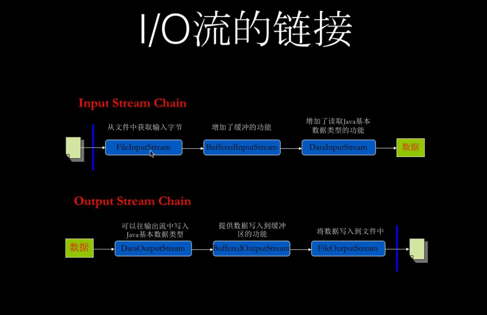
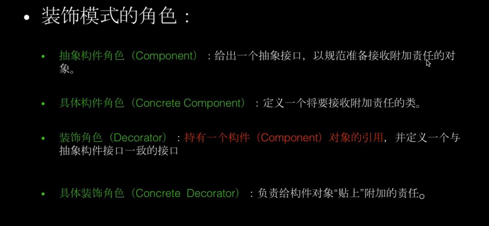
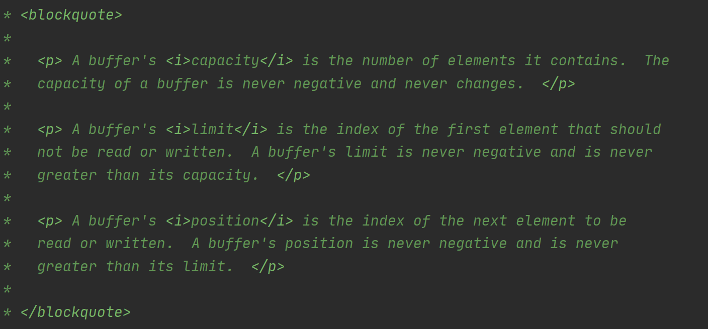
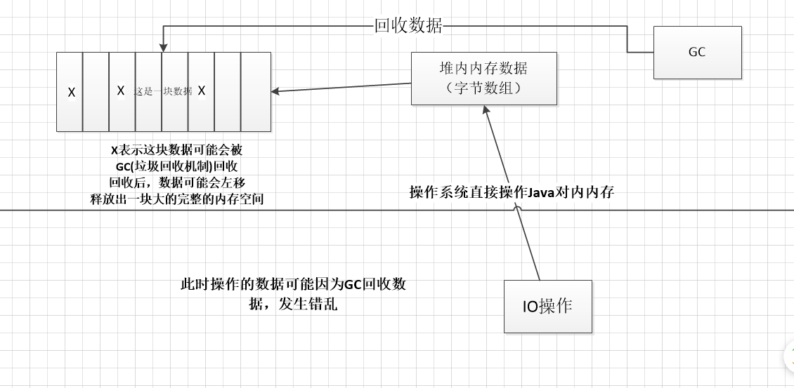
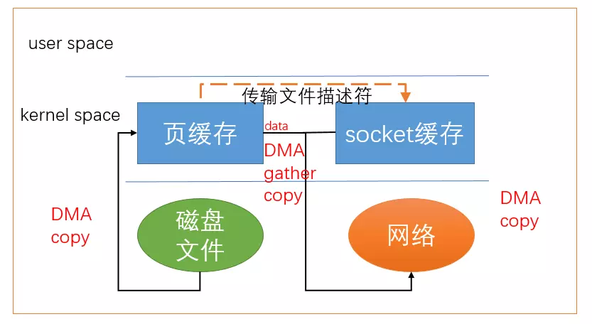
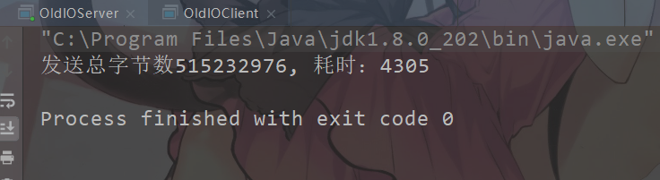

# NIO

- Java NIO (New IO，Non-Blocking IO)是从Java 1.4版本开始引入的一套新的IO API，可以替代标准的Java IO AP。
- NIO与原来的IO同样的作用和目的，但是使用的方式完全不同，NIO支持面向缓冲区的(IO是面向流的)、基于通道的IO操作。
- NIO将以更加高效的方式进行文件的读写操作。
- JDK 7.0对NIO进行了极大的扩展，增强了对文件处理和文件系统特性的支持，称他为 NIO.2。

```
Java API中提供了两套NIO，一套是针对标准输入输出NIO，另一套就是网络编程NIO
|-----java.nio.channels.Channel
      |---- FileChannel：处理本地文件
      |---- SocketChannel：TCP网络编程的客户端的Channel
      |---- ServerSocketChannel：TCP网络编程的服务器端的Channel
      |---- DatagramChannel：UDP网络编程中发送端和接收端的Channel
```

## 1  IO体系架构内容

1. **理解Java I/O系统**
2. **熟练使用java.io包**
3. **掌握I/O设计原则和使用的设计模式**

**流是数据的抽象，载体**
**输入/输出流，流入程序输入流，从程序流出的是输出流**

### 1.1  **字节流/字符流**

**InputStream/OutputStream**
**Reader/Writer**
**基本流程：**

```java
try (InputStream is = new FileInputStream(new File("path"));){
    byte[] arr = new byte[1024];
    int len;
    while((len=is.read(arr))!=-1){
        String str = new String(arr, 0, len);
        System.out.println(str);
    }
}catch(Excepetion e){
    e.printStackTrace();
}
```

### 1.2  **节点流//过滤流**

**过滤流包装节点流（装饰模式）**



**装饰模式**

以透明的方式包装被装饰对象，以扩展对象功能，不用继承实现子类



- **抽象构件角色：InputStream**
- **具体构件角色：FileInputStream**
- **装饰角色：FilterInputStream**
- **具体装饰角色：bufferedInputStream**


**编码实现装饰模式**

1. 抽象构件角色（Componnet）

```java
/**
 * 抽象构件角色（Componnet）
 * 比如InputStream
 */
public interface Componnet {
    void doSomething();
}
```

2. 具体构件角色（Concrete Component）

```java
/**
 * 具体构件角色（Concrete Component）
 * 例如FileInputStream
 */
public class ConcreteComponnet implements Componnet {
    @Override
    public void doSomething() {
        System.out.println("功能A");
    }
}
```

3. 装饰角色（Decorator）

```java
/**
 * 装饰角色（Decorator）
 * 比如FilterInputStream
 */
public class Decorator implements Componnet{

    Componnet componnet;

    public Decorator(Componnet componnet) {
        this.componnet = componnet;
    }
    @Override
    public void doSomething() {
        componnet.doSomething();
    }
}
```

4. 具体装饰角色_1（Concrete Decorator）

```java
/**
 * 具体装饰角色_1（Concrete Decorator）
 * 比如 BufferedInputStream
 */
public class ConcreteDecorator_1 extends Decorator {
    
    public ConcreteDecorator_1(Componnet componnet) {
        super(componnet);
    }

    @Override
    public void doSomething() {

        super.doSomething();
        this.doOtherThing();
    }

    private void doOtherThing(){
        System.out.println("功能B");
    }
}
```

5. 具体装饰角色_2（Concrete Decorator）

```java
package com.zhangtianyi.nio.Decorator;

/**
 * 具体装饰角色_2（Concrete Decorator）
 * 比如 DataInputStream
 */
public class ConcreteDecorator_2 extends Decorator {

    public ConcreteDecorator_2(Componnet componnet) {
        super(componnet);
    }

    @Override
    public void doSomething() {
        super.doSomething();
        this.doOtherThing();
    }

    private void doOtherThing() {
        System.out.println("功能C");
    }
}
```

6. 测试类

```java
/**
 * 测试类
 */
public class Client {


    public static void main(String[] args) {
        //未装饰
        new ConcreteComponnet().doSomething();
        System.out.println("----------------------------");
        //装饰一次
        Componnet componnet = new ConcreteDecorator_1(new ConcreteComponnet());
        componnet.doSomething();
        System.out.println("----------------------------");
        //装饰2次
        Componnet componnet2 = new ConcreteDecorator_2(new ConcreteDecorator_1(new ConcreteComponnet()));
        componnet2.doSomething();
        System.out.println("----------------------------");
    }
    
}
```

**装饰模式适用性：**

- 透明的增加给对象增加功能，不影响其他对象
- 给对象增加的功能未来可能改变
- 给子类扩展功能不实际的情况下


## 2	NIO深入详解与体系分析

- **java.io**

- **java.nio**

**java.io中最核心的概念是流（Stream），面向流的编程。**

**读写分离，输入/输出流**

**java.nio中三个核心，面向块（block）或者缓冲区（buffer）编程。**


**Selector**

选择器提供选择执行已经就绪的任务的能力，这使得多元 I/O 成为可能，就绪选择和多元执行使得单线程能够有效率地同时管理多个 I/O 通道(channels)。

**Channel**

Channel类似与流，指的是可以向其中写入/读取数据的对象。

所有的数据都是通过Buffer读写，不会出现直接读取Channel。

Channel是双向的，可以读写，Stream是单向的。由于是双向的，可以更好的反映底层操作系统的真实情况，比如linux底层就是双向操作的。

**Buffer**

Buffer本身就是一个内存，底层由数组实现的，数据的读写都是通过Buffer实现的。数据从Channel中读，将数据从Channel读取到Buffer中。

读写状态切换需要调用

```java
buffer.flip();//状态翻转，切换读写状态（标致变化）
```

除了数组之外，Buffer还提供了对于数据的结构化的访问方式，并且可以追踪到系统的读写过程。

java中的8中数据类型中除了boolean没有，其他数据都有其对应的Buffer


## 3  NIO-Buffer


**Buffer线程不安全的**



**1.position**

下一个可读写的位置（下一个可读写元素索引），不能超过limit

**2.limit**

第一个不能被读写的元素索引（最后一个可以读写的下一个元素），不能超过capacity

**3.capacity**

容量大小

**4.mark**

标记点

**5.reset()**

调用后position=mark

**6.flip()**

翻转状态，将position赋给limit，position(可读写的元素索引)置为0，mark为-1

```java
public final Buffer flip() {
    limit = position;
    position = 0;
    mark = -1;
    return this;
}
```

**7.clear()**

```java
public final Buffer clear() {
    position = 0;
    limit = capacity;
    mark = -1;
    return this;
}//position=0,limit=capacity
```

**8.rewind()**

```java
public final Buffer rewind() {
    position = 0;
    mark = -1;
    return this;
}//position=0,limit不变
```

**Buffer基本操作**

```java
public class NioTest_1 {
    public static void main(String[] args) {
        IntBuffer buffer = IntBuffer.allocate(10);//分配10个长度的缓冲区

        for (int i=0;i<buffer.capacity();i++){
            int randomNumber = new SecureRandom().nextInt(20);//生成20以内的随机数
            buffer.put(randomNumber);//放入缓冲区，写入
        }

        buffer.flip();//状态翻转，切换读写状态（标致变化）

        while (buffer.hasRemaining()){//循环取出，读取
            System.out.println(buffer.get());
        }
    }
}
```

**Buffer读文件操作**

```java
public class NioTest_2 {
    public static void main(String[] args) throws Exception {
        try (
                FileInputStream fileInputStream = new FileInputStream("src/main/java/com/zhangtianyi/nio/resource/NioTest_2.txt");
             ){
            FileChannel fileChannel = fileInputStream.getChannel();

            ByteBuffer byteBuffer = ByteBuffer.allocate(512);

            fileChannel.read(byteBuffer);

            byteBuffer.flip();

            while (byteBuffer.remaining()>0){
                byte b = byteBuffer.get();
                System.out.println("Character:"+(char)b);
            }

        }
    }
}
```

**Buffer写文件操作**

```java
public class NioTest_3 {
    public static void main(String[] args) throws Exception{

        try(
                FileOutputStream fileOutputStream = new FileOutputStream("src/main/java/com/zhangtianyi/nio/resource/NioTest_3.txt");
            ){
            FileChannel fileChannel = fileOutputStream.getChannel();
            ByteBuffer byteBuffer = ByteBuffer.allocate(512);
            byte[] bytes = "hello nio,ni hao".getBytes(Charset.defaultCharset());

            for (int i = 0; i < bytes.length; i++) {
                byteBuffer.put(bytes[i]);
            }

            byteBuffer.flip();
            fileChannel.write(byteBuffer);
        }
    }
}
```

**Buffer关键属性测试**

```java
public class NioTest_1 {
    public static void main(String[] args) {
        IntBuffer buffer = IntBuffer.allocate(10);//分配10个长度的缓冲区

        for (int i=0;i<5;i++){
            int randomNumber = new SecureRandom().nextInt(20);//生成20以内的随机数
            buffer.put(randomNumber);//放入缓冲区，写入
        }
        System.out.println("翻转前limit:"+buffer.limit());
        buffer.flip();//状态翻转，切换读写状态（标致变化）
        System.out.println("翻转后limit:"+buffer.limit());

        while (buffer.hasRemaining()){//循环取出，读取
            System.out.println("position:"+buffer.position());
            System.out.println("limit:"+buffer.limit());
            System.out.println("capacity:"+buffer.capacity());

            System.out.println(buffer.get());
        }
    }
}
```


## 4	NIO-文件通道详解FileChannel

**通过NIO读取文件三个步骤：**

1. **从FileInputStream中读取FileChannel对象。**
2. **创建Buffer**
3. **将数据从FileChannel读取到Buffer中**

**绝对方法和相对方法：**

1. **相对方法：limit和position的值在操作时会被考虑到。**
2. **绝对方法：完全忽略掉limit和position的值。**

```java
/**
 * @ClassName: NioTest4
 * @Description: nio文件通道
 * @author zhangtainyi
 * @date 2019/6/24 8:38
 *
 */
public class NioTest4 {
    public static void main(String[] args) {
        try(
                FileInputStream inputStream = new FileInputStream("src/main/java/com/zhangtianyi/nio/resource/input.txt");
                FileOutputStream outputStream = new FileOutputStream("src/main/java/com/zhangtianyi/nio/resource/output.txt");
                FileChannel inputChannel = inputStream.getChannel();
                FileChannel outputChannel = outputStream.getChannel();
                ){
            ByteBuffer buffer = ByteBuffer.allocate(1024);
            while (true){
                buffer.clear();//必须清空,把position置为0
                int read = inputChannel.read(buffer);
                System.out.println("read:"+read);
                if(-1 == read){
                    break;
                }
                buffer.flip();
                outputChannel.write(buffer);
            }
        }catch (Exception e){
            e.printStackTrace();
        }
    }
}
```

根据上述代码，流程就是循环读写，先读再写，必须调用**buffer.clear()**方法将limit和position恢复到初始值,不然有以下流程：

> buffer的capacity为1024，inputChannel可读为30；
>
> 第一次read后：position=30，limit=1024，capacity=1024
>
> 此时read=30
>
> 第一次调用flip：position=0，limit=30，capacity=1024
>
> 第一次write后：position=30，limit=30，capacity=1024
>
> 没有调用buffer.clear()
>
> 第二次read后：position=30，limit=30，capacity=1024
>
> 此时read=0（因为position=limit，position不能大于limit，无法再读取了），不满足read==-1
>
> 第二次调用flip：position=0，limit=30，capacity=1024
>
> 第二次调用write：position=30，limit=30，capacity=1024
>
> **.....后续都和第二次一样**


## 5  NIO-Buffer深入详

> ## 1.**ByteBuffer**类型化的**put**和**get**方法

```java
ublic class NIOTest5 {
    public static void main(String[] args) {

        ByteBuffer buffer = ByteBuffer.allocate(64);

        buffer.putInt(15);
        buffer.putLong(500000000L);
        buffer.putDouble(14.123456);
        buffer.putChar('你');
        buffer.putShort((short)2);
        buffer.putChar('我');

        buffer.flip();

        System.out.println(buffer.getInt());
        System.out.println(buffer.getLong());
        System.out.println(buffer.getDouble());
        System.out.println(buffer.getChar());
        System.out.println(buffer.getShort());
        System.out.println(buffer.getChar());
    }
}
```

> **2.buffer.slice(类似分割)**

调用slice方法返回一个新的Buffer，sliceBuffer和buffer的position和limit互不相关，相互独立，但是底层共享数据(数组)。

```java
public class NioTest6 {
    public static void main(String[] args) {
        ByteBuffer buffer = ByteBuffer.allocate(10);

        for (int i = 0; i < buffer.capacity(); ++i) {
            buffer.put((byte) i);
        }
        buffer.position(2);
        buffer.limit(6);
        ByteBuffer sliceBuffer = buffer.slice();
        for (int i = 0; i < sliceBuffer.capacity(); ++i) {
            byte b = sliceBuffer.get();
            b *= 2;
            sliceBuffer.put(i, b);
        }
        //sliceBuffer和buffer的position和limit互不相干,是独立的
        System.out.println("buffer的position："+buffer.position());
        System.out.println("buffer的limit："+buffer.limit());
        System.out.println("sliceBuffer的position："+sliceBuffer.position());
        System.out.println("sliceBuffer的limit："+sliceBuffer.limit());

        buffer.position(0);
        buffer.limit(buffer.capacity());
        //sliceBuffer和buffer底层共享数据(底层数组)
        while (buffer.remaining()>0){
            System.out.println(buffer.get());
        }
    }
}
```

> **3.buffer.asReadOnlyBuffer()**

任何一个buffer可以调用asReadOnlyBuffer()可以返回一个只读buffer，反过来不可以。

```java
public class NioTest7 {
    public static void main(String[] args) {
        ByteBuffer buffer = ByteBuffer.allocate(10);
        System.out.println(buffer.getClass());
        for (int i = 0; i < buffer.capacity(); i++) {
            buffer.put((byte) i);
        }
        ByteBuffer readonlyBuffer = buffer.asReadOnlyBuffer();
        System.out.println(readonlyBuffer.getClass());
        readonlyBuffer.position(0);
        System.out.println(readonlyBuffer.put((byte)2)));//会抛出异常
    }
}
```

## 6	NIO-堆外内存与零拷贝深入理解

**DirectByteBuffer**

直接缓冲,直接操作本地空间数据，不再java内存空间内

见**Buffer**中的address属性

// Used only by direct buffers // NOTE: hoisted here for speed in JNI GetDirectBufferAddress long address;

只能被DirectBuffer使用

之所以放在Buffer中，是为了JNI调用时提升速率

address表示堆外内存的数据地址

HeapBuffer在JVM模型内，堆内空间，DirectBuffer在也在堆内空间，但是address属性表示堆外空间地址。


对于操作系统来说，IO操作并不是直接操。

**HeapBuffer(堆缓冲区)**

比如HeapBuffer实在堆内空间存放数据（字节数组），操作系统需要在堆外空间在开辟一块空间，然后将堆内内存数据拷贝到堆外内存数据。然后在再通过IO操作操作数据，

**DirectBuffer(直接缓冲区)**

DirectBuffer通过Address(表示堆外内存地址)属性直接操作堆外内存数据（存放数据直接存放在堆外而不是堆内内存复制到堆外内存），此时IO操作直接操作堆外数据

**直接内存模型(零拷贝)：零拷贝，address维护堆外内存地址，address销毁，堆外内存释放**

**非直接(间接)内存模型：需要拷贝到间接缓冲区**

严格来说，操作系统可以操作所有内存(堆外堆内都行)，通过原生操作方法操作java堆内内存，可能出现问题，如图



直接操作java堆内内存，gc调用时候数据会错误。

> 解决方法：
>
> 1.关闭GC，即不回收(不可取)
>
> 2.堆内内存数据拷贝到堆外内存(**拷贝过程中不会调用GC**)，拷贝过程需要开销
>
> 3.零拷贝，java直接操作堆外内存通过native修饰的本地方法

## 7	NIO-Scattering与Gathering深度解析

### **7.1  MappedByteBuffer**

内存映射文件，磁盘文件内容已经被映射到内存中，直接操作内存，修改的数据会同步到磁盘文件中，这个同步操作是操作系统来做的，简单来说直接操作内存（**堆外内存**）就可以操作磁盘文件数据。

```java
public class NioTest9 {
    public static void main(String[] args) throws Exception{
        RandomAccessFile randomAccessFile = new RandomAccessFile("src/main/java/com/zhangtianyi/nio/resource/NioTest9.txt","rw");
        FileChannel fileChannel = randomAccessFile.getChannel();
        //映射模式，起始位置，映射长度
        MappedByteBuffer mappedByteBuffer = fileChannel.map(FileChannel.MapMode.READ_WRITE, 0, 5);
        mappedByteBuffer.put(0, (byte)'a');
        mappedByteBuffer.put(3, (byte)'b');
        randomAccessFile.close();
    }
}
```

### **7.2  文件锁(共享锁和排他锁)**

```java
public class NioTest10 {
    public static void main(String[] args) throws Exception {
        RandomAccessFile randomAccessFile = new RandomAccessFile("src/main/java/com/zhangtianyi/nio/resource/NioTest9.txt","rw");
        FileChannel fileChannel = randomAccessFile.getChannel();
        //起始位置，锁长度，true表示共享锁，flase表示排他锁
        FileLock fileLock = fileChannel.lock(3, 6, true);
        System.out.println("valid:"+fileLock.isValid());
        System.out.println("lock type:"+fileLock.isShared());

        fileLock.release();//释放锁
        fileChannel.close();
    }
}
```

### **7.3.关于Buffer的Scattering和Gathering**

Scattering总是把按顺序把channel的字节数据读到多个buffer，读满一个buffer在读到下一个buffer

Gathering总是按顺序把多个buffer的字节数据写入到channel，写完一个buffer在写下一个buffer

> **服务端**

```java
public class NioTest11 {
    public static void main(String[] args) throws Exception {
        ServerSocketChannel serverSocketChannel = ServerSocketChannel.open();
        InetSocketAddress address = new InetSocketAddress(8899);
        serverSocketChannel.socket().bind(address);

        int messageLength = 2 + 3 + 4;
        ByteBuffer[] buffers = new ByteBuffer[3];
        buffers[0] = ByteBuffer.allocate(2);
        buffers[1] = ByteBuffer.allocate(3);
        buffers[2] = ByteBuffer.allocate(4);
        SocketChannel socketChannel = serverSocketChannel.accept();

        while (true){

            int bytesRead = 0;
            while (bytesRead < messageLength){
                long r = socketChannel.read(buffers);
                bytesRead += r;

                System.out.println("bytesRead:"+bytesRead);

                Arrays.asList(buffers).stream()
                        .map(buffer -> "position:" + buffer.position() + ",limit:" + buffer.limit())
                        .forEach(System.out::println);
            }

            Arrays.asList(buffers).forEach(buffer -> {
                buffer.flip();
            });

            long bytesWritten = 0;
            while (bytesWritten < messageLength){
                long r = socketChannel.write(buffers);
                bytesWritten += r;
            }

            Arrays.asList(buffers).forEach(buffer -> {
                buffer.clear();
            });
            System.out.println("bytesRead:" + bytesRead + ", bytesWritten:" + bytesWritten + ", messageLength:" + messageLength);
        }
    }
}
```

> **客户端**

```java
public class NioTest11_Client {
    public static void main(String[] args) throws Exception {

        SocketChannel socketChannel = SocketChannel.open();
        socketChannel.connect(new InetSocketAddress("localhost", 8899));
        System.out.println("连接是否已经建立："+socketChannel.isConnected());

        ByteBuffer buffer = ByteBuffer.allocate(9);
        buffer.put("welcomeXX".getBytes(Charset.defaultCharset()));
//        System.out.println("position:"+buffer.position()+",limit"+buffer.limit());
        buffer.flip();
//        System.out.println("position:"+buffer.position()+",limit"+buffer.limit());
        socketChannel.write(buffer);
//        System.out.println("position:"+buffer.position()+",limit"+buffer.limit());
        buffer.flip();
//        System.out.println("position:"+buffer.position()+",limit"+buffer.limit());
        socketChannel.read(buffer);
//        System.out.println("position:"+buffer.position()+",limit"+buffer.limit());
        buffer.flip();
        byte[] bytes = new byte[9];
        buffer.get(bytes);
        System.out.println(new String(bytes, Charset.defaultCharset()));

    }
}
```

## 8  NIO-Selector源码分析

### **8.1  传统IO的编程模型**

在客户端连接较多的时候，线程切换开销极其巨大，服务端力不从心


> **服务端**

```java
public class NioTest12_IO {
    public static void main(String[] args) throws Exception {
        ServerSocket serverSocket = new ServerSocket(8899);

        while (true){
            Socket socket = serverSocket.accept();
            new Thread(new MySocket(socket)).start();
        }
    }
}
class MySocket implements Runnable{
    private Socket socket;

    protected MySocket(Socket socket){
        this.socket = socket;
    }

    @Override
    public void run() {
        try (
                OutputStream outputStream = socket.getOutputStream();
                InputStream inputStream = socket.getInputStream();
        ){
            outputStream.write(("welcome,Thread-" + Thread.currentThread().getName()).getBytes(Charset.defaultCharset()));
            outputStream.flush();
            byte[] bs = new byte[1024];
            inputStream.read(bs);
            System.out.println(new String(bs, Charset.defaultCharset()).trim());
        } catch (IOException e) {
            e.printStackTrace();
        }
    }
}
```

> **客户端**

```java
public class NioTest12_Client_IO {
    public static void main(String[] args) {
        try (Socket socket = new Socket("localhost", 8899)) {
            byte[] bs = new byte[1024];
            socket.getInputStream().read(bs);
            System.out.println(new String(bs, Charset.defaultCharset()).trim());
            socket.getOutputStream().write("hello,Server".getBytes(Charset.defaultCharset()));

        } catch (Exception e) {
            e.printStackTrace();
        }
    }
}
```

### **8.2  NIO的编程模型**

一个线程处理N多个客户端。


channel注册在selector中，注册标识通过SelectionKey维护，一个selector维护一个有三个SelectionKey的集合。

**SelectionKey(判断一些event，如连接建立，已经读完等等)**

1.key set（所有的key集合）

​	keys()

2.selected-key set(key set子集)

​	selectedKeys()

3.cancel-key(key set子集)

**刚创建的selector的key set为空**

### **8.3  Selector**

**选择器提供选择执行已经就绪的任务的能力**，这使得多元 I/O 成为可能，就绪选择和多元执行使得**单线程能够有效率地同时管理多个 I/O 通道(channels)**。 C/C++代码的工具箱中，许多年前就已经有 select()和 poll()这两个POSIX（可移植性操作系统接口）系统调用可供使用了。许多操作系统也提供相似的功能，但对Java 程序员来说，就绪选择功能直到 JDK 1.4 才成为可行的方案。对于主要的工作经验都是基于Java 环境的开发的程序员来说，之前可能还没有碰到过这种 I/O 模型。

#### **8.3.1  选择器基础** 

我们需要将之前创建的一个或多个可选择的**`Channel`**注册到**`Selector`**对象中，一个键**(`SelectionKey`)**将会被返回。`SelectionKey `会记住您关心的通道。它们也会追踪对应的通道是否已经就绪。

##### **8.3.1.1 创建选择器**

Selector 对象是通过调用静态工厂方法 open( )来实例化的。选择器不是像通道或流(stream)那样的基本 I/O 对象：数据从来没有通过它们进行传递。类方法 open( )向 SPI 发出请求，通过默认的 SelectorProvider 对象获取一个新的实例。通过调用一个自定义的 SelectorProvider对象的 openSelector( )方法来创建一个 Selector 实例也是可行的。您可以通过调用 provider( )方法来决定由哪个 SelectorProvider 对象来创建给定的 Selector 实例。大多数情况下，您不需要关心 SPI;只需要调用 open( )方法来创建新的 Selector 对象。

```java
//方式一：
Selector selector = Selector.open( );
//方式二：
SelectorProvider provider = SelectorProvider.provider();
Selector abstractSelector = provider.openSelector();		
```

##### **8.3.1.2 注册通道到选择器上**

注册通道到选择器上，是通过register方法进行的。

通道在被注册到一个选择器上之前，必须先设置为非阻塞模式（通过调用 **`configureBlocking(false)`**）。

如果您试图注册一个处于阻塞状态的通道， `register( )`将抛出未检查的 `IllegalBlockingModeException `异常。此外，通道一旦被注册，就不能回到阻塞状态。试图这么做的话，将在调用 `configureBlocking( )`方法时将抛出**`IllegalBlockingModeException`** 异常。并且，理所当然地，试图注册一个已经关闭的 `SelectableChannel `实例的话，也将抛出`ClosedChannelException `异常，就像方法原型指示的那样。

> 注册通道的案例代码：

```java
ServerSocketChannel ssc=ServerSocketChannel.open();
ssc.socket().bind(new InetSocketAddress("localhost",80));
ssc.configureBlocking(false);
Selector selector = Selector.open();
SelectionKey sscSelectionKey = ssc.register(selector, SelectionKey.OP_ACCEPT);//注册ServerSocketChannel
while(true){
    SocketChannel sc = ssc.accept();
    if(sc==null){
        continue;
    }
    sc.configureBlocking(false);
    //注册SocketChannel
    SelectionKey scselectionKey = sc.register(selector, SelectionKey.OP_ACCEPT | SelectionKey.OP_WRITE);
    //...其他操作
}
```

`register( )`方法接受一个 Selector 对象作为参数，以及一个名为ops 的整数参数。第二个参数表示所关心的通道操作，返回值是一个`SelectionKey`。

```java
public final SelectionKey register(Selector sel, int ops)
```

ops值在 SelectonKey 类中被定义为 public static 字段。

```java
public abstract class SelectionKey {
...
public static final int OP_READ = 1 << 0;
public static final int OP_WRITE = 1 << 2;
public static final int OP_CONNECT = 1 << 3;
public static final int OP_ACCEPT = 1 << 4;
...
}
```

**可以看到有四种被定义的可选择操作：读(read)，写(write)，连接(connect)和接受(accept)。**

并非所有的操作都在所有的可选择通道上被支持。例如， SocketChannel 不支持 accept。试图注册不支持的操作将导致 IllegalArgumentException。可以通过调用通道的 validOps( )方法来获取特定的通道所支持的操作集合。

SocketChannel支持的**vaildType**：

```java
public abstract class SocketChannel...{
....
public final int validOps() {
    return (SelectionKey.OP_READ
            | SelectionKey.OP_WRITE
            | SelectionKey.OP_CONNECT);
}
....
}
```

ServerSocketChannel的**validOps**

```java
public abstract class ServerSocketChannel..{
...
public final int validOps() {
    return SelectionKey.OP_ACCEPT;
}
...
}
```

**一个通道可以被注册到多个选择器上，但对每个选择器而言，最好只注册一次。**如果一个Selector上多次注册同一个Channel，返回的SelectionKey总是同一个实例，后注册的感兴趣的操作类型会覆盖之前的感兴趣的操作类型。 一个channel在不同的selector上注册， **每次返回的selectorKey都是一个不同的实例**。

##### **8.3.1.3 选择键(SelectionKey)**

SelectionKey对象被register( )方法 返回，并提供了方法来表示表示这种注册关系。

```java
public abstract SelectableChannel channel( ); //获得这个SelectionKey关联的channel
public abstract Selector selector( ); //获得这个selectionKey关联的Selector
```

**同时选择键包含指示了该注册关系所关心的通道操作，以及通道已经准备好的操作。**

```java
public abstract int interestOps( );//感兴趣兴趣的操作
public abstract int readyOps( );//感兴趣的操作中，已经准备就绪的操作
```

可以通过调用键的 `readyOps( )`方法来获取相关的通道的已经就绪的操作。 ready 集合是 interest集合的子集 。当前的 interest 集合可以通过调用键对象的` interestOps( )`方法来获取。最初，这应该是通道被注册时传进来的值。这个 interset 集合永远不会被选择器改变，用户可以通过调用 带参数的interestOps方法，并传入一个新的比特掩码参数来改变它。 

```java
public abstract void interestOps (int ops);
```

检查操作是否就绪 

```java
if ((key.readyOps( ) & SelectionKey.OP_READ) != 0{
    myBuffer.clear( );
    key.channel( ).read (myBuffer);
    doSomethingWithBuffer (myBuffer.flip( ));
}
```

就像之前提到过的那样，有四个通道操作可以被用于测试就绪状态。您可以像上面的代码那样，通过测试比特掩码来检查这些状态，但 SelectionKey 类定义了四个便于使用的布尔方法来为您测试这些比特值： `isReadable( )， isWritable( )， isConnectable( )， 和 isAcceptable( )`。每一个方法都与使用特定掩码来测试 readyOps( )方法的结果的效果相同。例如：

```java
if (key.isWritable( ))
//等价于：
if ((key.readyOps( ) & SelectionKey.OP_WRITE) != 0)
```

这四个方法在任意一个 SelectionKey 对象上都能安全地调用。

需要注意的是，通过相关的选择键的 readyOps( )方法返回的就绪状态指示只是一个提示，不是保证。底层的通道在任何时候都会不断改变。其他线程可能在通道上执行操作并影响它的就绪状态。同时，操作系统的特点也总是需要考虑的。

SelectionKey对象表示了一种特定的注册关系。当应该终结这种关系的时候，可以调用 SelectionKey对象的 cancel( )方法。 当键被取消时，它将被放在相关的选择器的已取消的键的集合里。注册不会立即被取消，但键会立即失效。当再次调用 select( )方法时（或者一个正在进行的 select()调用结束时），已取消的键的集合中的被取消的键将被清理掉，并且相应的注销也将完成。

通道会被注销，而新的SelectionKey 将被返回。

当**通道关闭时，所有相关的键会自动取消（记住，一个通道可以被注册到多个选择器上）。当选择器关闭时，所有被注册到该选择器的通道都将被注销，并且相关的键将立即被无效化（取消）**。一旦键被无效化，调用它的与选择相关的方法就将抛出 CancelledKeyException。

#### **8.3.2 使用选择器**

既然我们已经很好地掌握了了各种不同类以及它们之间的关联，那么现在让我们进一步了解Selector 类，也就是就绪选择的核心。这里是 Selector 类的可用的 API。在之前，我们已经看到如何创建新的选择器，那么那些方法还剩下：

```java
public abstract class Selector
{
// This is a partial API listing
public abstract Set keys( );
public abstract Set selectedKeys( );
public abstract int select( ) throws IOException;
public abstract int select (long timeout) throws IOException;
public abstract int selectNow( ) throws IOException;
public abstract void wakeup( );
}
```

##### **8.3.2.1 选择过程**

在详细了解 API 之前，您需要知道一点和 Selector 内部工作原理相关的知识。就像上面探讨的那样，选择器维护着注册过的通道的集合，并且这些注册关系中的任意一个都是封装在SelectionKey 对象中的。**每一个 Selector 对象维护三个键的集合**：

> **已注册的键的集合(Registered key set)**

与选择器关联的已经注册的键的集合。并不是所有注册过的键都仍然有效。这个集合通过keys( )方法返回，并且可能是空的。这个已注册的键的集合不是可以直接修改的；试图这么做的话将引 java.lang.UnsupportedOperationException。

> **已选择的键的集合(Selected key set)**

已注册的键的集合的子集。这个集合的每个成员都是相关的通道被选择器（在前一个选择操作中）判断为已经准备好的，并且包含于键的 interest 集合中的操作。这个集合通过 selectedKeys( )方法返回（并有可能是空的）。

不要将已选择的键的集合与 ready 集合弄混了。这是一个键的集合，每个键都关联一个已经准备好至少一种操作的通道。每个键都有一个内嵌的 ready 集合，指示了所关联的通道已经准备好的操作。(readyOps，一个通道可能对多个操作感兴趣，ready的可能只是其中某个操作)。SelectionKey可以直接从这个集合中移除，但不能添加。试图向已选择的键的集合中添加元素将抛出java.lang.UnsupportedOperationException。

> **已取消的键的集合(Cancelled key set)**

已注册的键的集合的子集，这个集合包含了 cancel( )方法被调用过的键（这个键已经被无效 化），但它们还没有被注销。这个集合是选择器对象的私有成员，因而无法直接访问。

```java
public abstract class AbstractSelector
    extends Selector
{
...
private final Set<SelectionKey> cancelledKeys = new HashSet<SelectionKey>();//取消的keys
...
}
 
public abstract class SelectorImpl extends AbstractSelector {
    protected Set<SelectionKey> selectedKeys = new HashSet();//选择的key
    protected HashSet<SelectionKey> keys = new HashSet();//注册的keys
.....
}
```

在一个刚初始化的 Selector 对象中，这三个集合都是空的。

Selector 类的核心是选择过程。这个名词您已经在之前看过多次了——现在应该解释一下了。基本上来说，选择器是对 select( )、 poll( )等本地调用(native call)或者类似的操作系统特定的系统调用的一个包装。**但是 Selector 所作的不仅仅是简单地向本地代码传送参数。它对每个选择操作应用了特定的过程。对这个过程的理解是合理地管理键和它们所表示的状态信息的基础。**

> **Selector 类的 select( )方法有以下三种不同的形式：**

```java
public abstract int select( ) throws IOException;
public abstract int select (long timeout) throws IOException;
public abstract int selectNow( ) throws IOException;
```

这三种 select 的形式，仅仅在它们在所注册的通道当前都没有就绪时，是否阻塞的方面有所不同。最简单的没有参数的形式可以用如下方式调用：

1. **select()，**这种调用在没有通道就绪时将无限阻塞。一旦至少有一个已注册的通道就绪，选择器的选择键就会被更新，并且每个就绪的通道的 ready 集合也将被更新。返回值将会是已经确定就绪的通道的数目。正常情况下， 这些方法将返回一个非零的值，因为直到一个通道就绪前它都会阻塞。但是它也可以返回非 0 值，如果选择器的 wakeup( )方法被其他线程调用。
2. **select (long timeout)** ：有时您会想要限制线程等待通道就绪的时间。这种情况下，可以使用一个接受一个超时参数的select( long timeout)方法的重载形式：这种调用与之前的例子完全相同，除了如果在您提供的超时时间（以毫秒计算）内没有通道就绪时，它将返回 0。如果一个或者多个通道在时间限制终止前就绪，键的状态将会被更新，并且方法会在那时立即返回。将超时参数指定为 0 表示将无限期等待，那么它就在各个方面都等同于使用无参数版本的 select( )了。
3. **select (long timeout)** ：就绪选择的第三种也是最后一种形式是完全非阻塞的：

```java
 int n = selector.selectNow( );
```

selectNow()方法执行就绪检查过程，但不阻塞。如果当前没有通道就绪，它将立即返回 0。

选择操作是当三种形式的 select( )中的任意一种被调用时，由选择器执行的。不管是哪一种形式的调用，下面步骤将被执行：

 **1**、已取消的键的集合将会被检查。如果它是非空的，每个已取消的键的集合中的键将从另外两个集合中移除，并且相关的通道将被注销。这个步骤结束后，已取消的键的集合将是空的。

 2、已注册的键的集合中的键的 interest 集合将被检查。在这个步骤中的检查执行过后，对interest 集合的改动不会影响剩余的检查过程。一旦就绪条件被定下来，底层操作系统将会进行查询，以确定每个通道所关心的操作的真实就绪状态。依赖于特定的 select( )方法调用，如果没有通道已经准备好，线程可能会在这时阻塞，通常会有一个超时值。 直到系统调用完成为止，这个过程可能会使得调用线程睡眠一段时间，然后当前每个通道的就绪状态将确定下来。对于那些还没准备好的通道将不会执行任何的操作。对于那些操作系统指示至少已经准备好 interest 集合中的一种操作的通道，将执行以下两种操作中的一种：

  a.如果通道的键还没有处于已选择的键的集合中，那么键的 ready 集合将被清空，然后表示操作系统发现的当前通道已经准备好的操作的比特掩码将被设置。

  b.否则，也就是键在已选择的键的集合中。键的 ready 集合将被表示操作系统发现的当前已经准备好的操作的比特掩码更新。所有之前的已经不再是就绪状态的操作不会被清除。事实上，所有的比特位都不会被清理。由操作系统决定的 ready 集合是与之前的 ready 集合按位分离的，一旦键被放置于选择器的已选择的键的集合中，它的 ready 集合将是累积的。比特位只会被设置，不会被清理。

 **3.**步骤 2 可能会花费很长时间，特别是所激发的线程处于休眠状态时。与该选择器相关的键可能会同时被取消。当步骤 2 结束时，步骤 1 将重新执行，以完成任意一个在选择进行的过程中，键已经被取消的通道的注销。

 **4**.select 操作返回的值是 ready 集合在步骤 2 中被修改的键的数量，而不是已选择的键的集合中的通道的总数。返回值不是已准备好的通道的总数，而是从上一个 select( )调用之后进入就绪状态的通道的数量。之前的调用中就绪的，并且在本次调用中仍然就绪的通道不会被计入，而那些在前一次调用中已经就绪但已经不再处于就绪状态的通道也不会被计入。这些通道可能仍然在已选择的键的集合中，但不会被计入返回值中。返回值可能是 0。

使用内部的已取消的键的集合来延迟注销，是一种防止线程在取消键时阻塞，并防止与正在进行的选择操作冲突的优化。注销通道是一个潜在的代价很高的操作，这可能需要重新分配资源（请记住，键是与通道相关的，并且可能与它们相关的通道对象之间有复杂的交互）。清理已取消的键，并在选择操作之前和之后立即注销通道，可以消除它们可能正好在选择的过程中执行的潜在棘手问题。这是另一个兼顾健壮性的折中方案。

##### 8.3.2.2  **停止选择过程**

Selector 的 API 中的最后一个方法， wakeup( )，提供了使线程从被阻塞的 select( )方法中优雅地退出的能力：

```java
public abstract void wakeup( );
```

有三种方式可以唤醒在 select( )方法中睡眠的线程：

**调用 wakeup( )**

调用 Selector 对象的 wakeup( )方法将使得选择器上的第一个还没有返回的选择操作立即返回。如果当前没有在进行中的选择，那么下一次对 select( )方法的一种形式的调用将立即返回。后续的选择操作将正常进行。在选择操作之间多次调用 wakeup( )方法与调用它一次没有什么不同。

有时这种延迟的唤醒行为并不是您想要的。您可能只想唤醒一个睡眠中的线程，而使得后续的选择继续正常地进行。您可以通过在调用 wakeup( )方法后调用 selectNow( )方法来绕过这个问题。尽管如此，如果您将您的代码构造为合理地关注于返回值和执行选择集合，那么即使下一个 select( )方法的调用在没有通道就绪时就立即返回，也应该不会有什么不同。不管怎么说，您应该为可能发生的事件做好准备。

**调用 close( )**

如果Selector的 close( )方法被调用，那么任何一个在选择操作中阻塞的线程都将被唤醒，就像wakeup( )方法被调用了一样。与选择器相关的通道将被注销， 而键将被取消。

**调用 interrupt( )**

如果睡眠中的线程的 interrupt( )方法被调用，它的返回状态将被设置。如果被唤醒的线程之后将试图在通道上执行 I/O 操作，通道将立即关闭，然后线程将捕捉到一个异常。这是由于在第三章中已经探讨过的通道的中断语义。使用 wakeup( )方法将会优雅地将一个在 select( )方法中睡眠的线程唤醒。如果您想让一个睡眠的线程在直接中断之后继续执行，需要执行一些步骤来清理中断状态（参见 Thread.interrupted( )的相关文档）。Selector 对象将捕捉 InterruptedException 异常并调用 wakeup( )方法。请注意这些方法中的任意一个都不会关闭任何一个相关的通道。中断一个选择器与中断一个通道是不一样的。选择器不会改变任意一个相关的通道，它只会检查它们的状态。当一个在 select( )方法中睡眠的线程中断时，对于通道的状态而言，是不会产生歧义的。

##### 8.3.2.3 管理选择键

既然我们已经理解了问题的各个部分是怎样结合在一起的，那么是时候看看它们在正常的使用中是如何交互的了。为了有效地利用选择器和键提供的信息，合理地管理键是非常重要的。

选择是累积的。一旦一个选择器将一个键添加到它的已选择的键的集合中，它就不会移除这个键。并且，一旦一个键处于已选择的键的集合中，这个键的 readyOPS将只会被设置，而不会被清理。乍一看，这好像会引起麻烦，因为选择操作可能无法表现出已注册的通道的正确状态。它提供了极大的灵活性，但把合理地管理键以确保它们表示的状态信息不会变得陈旧的任务交给了程序员。

合理地使用选择器的秘诀是理解选择器维护的选择键集合所扮演的角色。（参见 4.3.1 小节，特别是选择过程的第二步。）最重要的部分是当键已经不再在已选择的键的集合中时将会发生什么。当Channel上的至少一个感兴趣的操作就绪时，SelectionKey的 readyOps就会被清空，并且当前已经就绪的操作将会被添加到 readyOps中。该键之后将被添加到已选择的键的集合中。

清理一个 SelectKey 的 readyOps的方式是将这个键从已选择的键的集合中移除(例如一个读操作准备好，读取完数据后，这个通道就不再是读操作准备好)。选择键的就绪状态只有在选择器对象在选择操作过程中才会修改。处理思想是只有在已选择的键的集合中的键才被认为是包含了合法的就绪信息的。这些信息将在键中长久地存在，直到键从已选择的键的集合中移除，以通知选择器您已经看到并对它进行了处理。如果下一次通道的一些感兴趣的操作发生时，键将被重新设置以反映当时通道的状态并再次被添加到已选择的键的集合中。

这种框架提供了很多灵活性。通常的做法是在选择器上调用一次 select 操作(这将更新已选择的键的集合)，然后遍历 selectKeys( )方法返回的键的集合。在按顺序进行检查每个键的过程中，相关的通道也根据键的就绪集合进行处理。然后键将从已选择的键的集合中被移除（通过在 Iterator对象上调用 remove( )方法），然后检查下一个键。完成后，通过再次调用 select( )方法重复这个循环。例 4-1 中的代码是典型的服务器的例子。

**使用 select( )来为多个通道提供服务**

```java
package selector;
 
/**
 * Created by TIANSHOUZHI336 on 2016/7/12.
 */
 
import java.nio.ByteBuffer;
import java.nio.channels.ServerSocketChannel;
import java.nio.channels.SocketChannel;
import java.nio.channels.Selector;
import java.nio.channels.SelectionKey;
import java.nio.channels.SelectableChannel;
import java.net.Socket;
import java.net.ServerSocket;
import java.net.InetSocketAddress;
import java.util.Iterator;
 
/**
 * Simple echo-back server which listens for incoming stream connections and
 * echoes back whatever it reads. A single Selector object is used to listen to
 * the server socket (to accept new connections) and all the active socket
 * channels.
 *
 * @author Ron Hitchens (ron@ronsoft.com)
 */
public class SelectSockets {
    public static int PORT_NUMBER = 1234;
 
    public static void main(String[] argv) throws Exception {
        new SelectSockets().go(argv);
    }
 
    public void go(String[] argv) throws Exception {
        int port = PORT_NUMBER;
        if (argv.length > 0) { // Override default listen port
            port = Integer.parseInt(argv[0]);
        }
        System.out.println("Listening on port " + port);
// Allocate an unbound server socket channel
        ServerSocketChannel serverChannel = ServerSocketChannel.open();
// Get the associated ServerSocket to bind it with
        ServerSocket serverSocket = serverChannel.socket();
// Create a new Selector for use below
        Selector selector = Selector.open();
// Set the port the server channel will listen to
        serverSocket.bind(new InetSocketAddress(port));
// Set nonblocking mode for the listening socket
        serverChannel.configureBlocking(false);
// Register the ServerSocketChannel with the Selector
        SelectionKey selectionKey = serverChannel.register(selector, SelectionKey.OP_ACCEPT);
        while (true) {// This may block for a long time. Upon returning, the
// selected set contains keys of the ready channels.
            int n = selector.select();
            if (n == 0) {//什么情况下会返回0？
                continue; // nothing to do
            }
// Get an iterator over the set of selected keys
            Iterator it = selector.selectedKeys().iterator();
// Look at each key in the selected set
            while (it.hasNext()) {
                SelectionKey key = (SelectionKey) it.next();
// Is a new connection coming in?
                if (key.isAcceptable()) {//对应SelectionKey.OP_ACCEPT操作
                    ServerSocketChannel server = (ServerSocketChannel) key.channel();
                    SocketChannel channel = server.accept();
                    registerChannel(selector, channel,SelectionKey.OP_READ);
                    sayHello(channel);
                }
// Is there data to read on this channel?
//对应SelectionKey.OP_READ操作，注意这个key是ServerSocketChannel的SelectionKey
                if (key.isReadable()) {
                    readDataFromSocket(key);
                }
// Remove key from selected set; it's been handled
                it.remove();
            }
        }
    }
// ----------------------------------------------------------
 
    /**
     * Register the given channel with the given selector for the given
     * operations of interest
     */
    protected void registerChannel(Selector selector,
                                   SelectableChannel channel, int ops) throws Exception {
        if (channel == null) {
            return; // could happen
        }
// Set the new channel nonblocking
        channel.configureBlocking(false);
// Register it with the selector
        channel.register(selector, ops);
    }
 
    // ----------------------------------------------------------
// Use the same byte buffer for all channels. A single thread is
// servicing all the channels, so no danger of concurrent acccess.
    private ByteBuffer buffer = ByteBuffer.allocateDirect(1024);
 
    /**
     * Sample data handler method for a channel with data ready to read.
     *
     * @param key A SelectionKey object associated with a channel determined by
     *            the selector to be ready for reading. If the channel returns
     *            * an EOF condition, it is closed here, which automatically
     *            invalidates the associated key. The selector will then
     *            de-register the channel on the next select call.
     */
    protected void readDataFromSocket(SelectionKey key) throws Exception {
        SocketChannel socketChannel = (SocketChannel) key.channel();
        int count;
        buffer.clear(); // Empty buffer
// Loop while data is available; channel is nonblocking
        while ((count = socketChannel.read(buffer)) > 0) {
            buffer.flip(); // Make buffer readable
// Send the data; don't assume it goes all at once
            while (buffer.hasRemaining()) {
                socketChannel.write(buffer);
            }
// WARNING: the above loop is evil. Because
// it's writing back to the same nonblocking
// channel it read the data from, this code can
// potentially spin in a busy loop. In real life
// you'd do something more useful than this.
            buffer.clear(); // Empty buffer
        }
        if (count < 0) {
// Close channel on EOF, invalidates the key
            socketChannel.close();
        }
    }
// ----------------------------------------------------------
 
    /**
     * Spew a greeting to the incoming client connection.
     *
     * @param channel The newly connected SocketChannel to say hello to.
     */
    private void sayHello(SocketChannel channel) throws Exception {
        buffer.clear();
        buffer.put("Hi there!\r\n".getBytes());
        buffer.flip();
        channel.write(buffer);
    }
}
```

上例实现了一个简单的服务器。它创建了 ServerSocketChannel 和 Selector 对象，并将通道注册到选择器上。我们不在注册的键中保存服务器 socket 的引用，因为它永远不会被注销。这个无限循环在最上面先调用了 select( )，这可能会无限期地阻塞。当选择结束时，就遍历选择键并检查已经就绪的通道。

如果一个键指示与它相关的通道已经准备好执行一个 accecpt( )操作，我们就通过键获取关联的通道，并将它转换为 SeverSocketChannel 对象。我们都知道这么做是安全的，因为只有ServerSocketChannel 支持 OP_ACCEPT 操作。我们也知道我们的代码只把对一个单一的ServerSocketChannel 对象的 OP_ACCEPT 操作进行了注册。通过对服务器 socket 通道的引用，我们调用了它的 accept( )方法，来获取刚到达的 socket 的句柄。返回的对象的类型是SocketChannel，也是一个可选择的通道类型。这时，与创建一个新线程来从新的连接中读取数据不同，我们只是简单地将 socket 同多注册到选择器上。我们通过传入 OP_READ 标记，告诉选择器我们关心新的 socket 通道什么时候可以准备好读取数据。

如果键指示通道还没有准备好执行 accept( )，我们就检查它是否准备好执行 read( )。任何一个这么指示的 socket 通道一定是之前 ServerSocketChannel 创建的 SocketChannel 对象之一，并且被注册为只对读操作感兴趣。对于每个有数据需要读取的 socket 通道，我们调用一个公共的方法来读取并处理这个带有数据的 socket。需要注意的是这个公共方法需要准备好以非阻塞的方式处理 socket 上的不完整的数据。它需要迅速地返回，以其他带有后续输入的通道能够及时地得到处理。例 4-1 中只是简单地对数据进行响应，将数据写回 socket，传回给发送者。

在循环的底部，我们通过调用 Iterator（迭代器）对象的 remove()方法，将键从已选择的键的集合中移除。键可以直接从 selectKeys()返回的 Set 中移除，但同时需要用 Iterator 来检查集合，您需要使用迭代器的 remove()方法来避免破坏迭代器内部的状态。

### 8.4 并发性

选择器对象是线程安全的，但它们包含的键集合不是。

```java
protected Set<SelectionKey> selectedKeys = new HashSet();
protected HashSet<SelectionKey> keys = new HashSet();
private final Set<SelectionKey> cancelledKeys = new HashSet<SelectionKey>();
```

可以看到选择键的集合是HashSet类型，HashSet是线程不安全。

 通过 keys( )和 selectKeys( )返回的键的集合是 Selector 对象内部的私有的 Set 对象集合的直接引用。这些集合可能在任意时间被改变。已注册的键的集合是只读的。如果您试图修它 ， 那么您得到的奖品将是一个java.lang.UnsupportedOperationException。

但是当您在观察它们的时候，它们可能发生了改变的话，您仍然会遇到麻烦。 Iterator 对象是快速失败的(fail-fast)：如果底层的 Set 被改变了，它们将会抛出 java.util.ConcurrentModificationException，因此如果您期望在多个线程间共享选择器和/或键，请对此做好准备。您可以直接修改选择键，但请注意您这么做时可能会彻底破坏另一个线程的 Iterator。

如果在多个线程并发地访问一个选择器的键的集合的时候存在任何问题，您可以采取一些步骤来合理地同步访问。在执行选择操作时，选择器在 Selector 对象上进行同步，然后是已注册的键的集合，最后是已选择的键的集合，按照这样的顺序。已取消的键的集合也在选择过程的的第 1步和第 3 步之间保持同步（当与已取消的键的集合相关的通道被注销时）。

在多线程的场景中，如果您需要对任何一个键的集合进行更改，不管是直接更改还是其他操作带来的副作用，您都需要首先以相同的顺序，在同一对象上进行同步。锁的过程是非常重要的。如果竞争的线程没有以相同的顺序请求锁，就将会有死锁的潜在隐患。如果您可以确保否其他线程不会同时访问选择器，那么就不必要进行同步了。

 Selector 类的 close( )方法与 select( )方法的同步方式是一样的，因此也有一直阻塞的可能性。在选择过程还在进行的过程中，所有对 close( )的调用都会被阻塞，直到选择过程结束，或者执行选择的线程进入睡眠。在后面的情况下，执行选择的线程将会在执行关闭的线程获得锁是立即被唤醒，并关闭选择器 。

### 8.5 异步关闭能力

任何时候都有可能关闭一个通道或者取消一个选择键。除非您采取步骤进行同步，否则键的状态及相关的通道将发生意料之外的改变。一个特定的键的集合中的一个键的存在并不保证键仍然是有效的，或者它相关的通道仍然是打开的。

关闭通道的过程不应该是一个耗时的操作。 NIO 的设计者们特别想要阻止这样的可能性：一个线程在关闭一个处于选择操作中的通道时，被阻塞于无限期的等待。当一个通道关闭时，它相关的键也就都被取消了。这并不会影响正在进行的 select( )，但这意味着在您调用 select( )之前仍然是有效的键，在返回时可能会变为无效。您总是可以使用由选择器的 selectKeys( )方法返回的已选择的键的集合：请不要自己维护键的集合。理解 之前描述的选择过程，对于避免遇到问题而言是非常重要的。

如果您试图使用一个已经失效的键，大多数方法将抛出 CancelledKeyException。但是，您可以安全地从从已取消的键中获取通道的句柄。如果通道已经关闭时，仍然试图使用它的话，在大多数情况下将引发 ClosedChannelException。

### 8.6 选择过程的可扩展性

我多次提到选择器可以简化用单线程同时管理多个可选择通道的实现。使用一个线程来为多个通道提供服务，通过消除管理各个线程的额外开销，可能会降低复杂性并可能大幅提升性能。但只使用一个线程来服务所有可选择的通道是否是一个好主意呢？这要看情况。

对单 CPU 的系统而言这可能是一个好主意，因为在任何情况下都只有一个线程能够运行。通过消除在线程之间进行上下文切换带来的额外开销，总吞吐量可以得到提高。但对于一个多 CPU的系统呢？在一个有 n 个 CPU 的系统上，当一个单一的线程线性地轮流处理每一个线程时，可能有 n-1 个 cpu 处于空闲状态。

那么让不同道请求不同的服务类的办法如何？想象一下，如果一个应用程序为大量的分布式的传感器记录信息。每个传感器在服务线程遍历每个就绪的通道时需要等待数秒钟。这在响应时间不重要时是可以的。但对于高优先级的连接（如操作命令），如果只用一个线程为所有通道提供服务，将不得不在队列中等待。不同的应用程序的要求也是不同的。您采用的策略会受到您尝试解决的问题的影响。

在第一个场景中，如果您想要将更多的线程来为通道提供服务，请抵抗住使用多个选择器的欲望。在大量通道上执行就绪选择并不会有很大的开销，大多数工作是由底层操作系统完成的。管理多个选择器并随机地将通道分派给它们当中的一个并不是这个问题的合理的解决方案。这只会形成这个场景的一个更小的版本。

一个更好的策略是对所有的可选择通道使用一个选择器，并将对就绪通道的服务委托给其他线程。您只用一个线程监控通道的就绪状态并使用一个协调好的工作线程池来处理共接收到的数据。根据部署的条件，线程池的大小是可以调整的（或者它自己进行动态的调整）。对可选择通道的管理仍然是简单的，而简单的就是好的。

第二个场景中，某些通道要求比其他通道更高的响应速度，可以通过使用两个选择器来解决：一个为命令连接服务，另一个为普通连接服务。但这种场景也可以使用与第一个场景十分相似的办法来解决。与将所有准备好的通道放到同一个线程池的做法不同，通道可以根据功能由不同的工作线程来处理。它们可能可以是日志线程池，命令/控制线程池，状态请求线程池，等等。

由于执行选择过程的线程将重新循环并几乎立即再次调用 select( )，键的 interest 集合将	被修改，并将 interest（感兴趣的操作）从读取就绪(read-rreadiness)状态中移除。这将防止选择器重复地调用 readDataFromSocket( )（因为通道仍然会准备好读取数据，直到工作线程从它那里读取数据）。当工作线程结束为通道提供的服务时，它将再次更新键的 ready 集合，来将 interest 重新放到读取就绪集合中。它也会在选择器上显式地嗲用 wakeup( )。如果主线程在 select( )中被阻塞，这将使它继续执行。这个选择循环会再次执行一个轮回（可能什么也没做）并带着被更新的键重新进入select( )。

## 9  NIO-网络编程实例剖析

简单的服务端和客户端代码，5个服务端监听了5个端口，都注册在Selector中，每一个服务端都接受客户端访问，将已连接通道都注册到selector。

> **服务端**

```java
public class NioTest12 {
    public static void main(String[] args) throws Exception {
        int[] ports = new int[5];

        ports[0] = 5000;
        ports[1] = 5001;
        ports[2] = 5002;
        ports[3] = 5003;
        ports[4] = 5004;

        Selector selector = Selector.open();

//        System.out.println(SelectorProvider.provider().getClass());
//        System.out.println(sun.nio.ch.DefaultSelectorProvider.create().getClass());
        for (int i = 0; i < ports.length; i++) {
            ServerSocketChannel serverSocketChannel = ServerSocketChannel.open();
            serverSocketChannel.configureBlocking(false);//调整阻塞模式，false不阻塞
            InetSocketAddress address = new InetSocketAddress(ports[i]);
            serverSocketChannel.bind(address);//监听端口
            //注册accept事件到selector
            serverSocketChannel.register(selector, SelectionKey.OP_ACCEPT);

            System.out.println("监听端口：" + ports[i]);
        }
        while (true){
            int numbers = selector.select();//获取所有selectKey键
            System.out.println("number:" + numbers);

            Set<SelectionKey> selectionKeys = selector.selectedKeys();
            System.out.println("selectionKeys:" + selectionKeys);

            Iterator<SelectionKey> iterator = selectionKeys.iterator();
            while (iterator.hasNext()){
                SelectionKey selectionKey = iterator.next();
                if(selectionKey.isAcceptable()){
                    ServerSocketChannel serverSocketChannel = (ServerSocketChannel) selectionKey.channel();
                    SocketChannel socketChannel = serverSocketChannel.accept();//等待连接连上
                    socketChannel.configureBlocking(false);

                    socketChannel.register(selector, SelectionKey.OP_READ);//将连接注册到selector上，关注事件是读

                    iterator.remove();//事件用完必须要移除掉,不然会异常

                    System.out.println("获得客户端连接：" + socketChannel);
                }else if(selectionKey.isReadable()){//读事件被选取
                    SocketChannel socketChannel = (SocketChannel) selectionKey.channel();
                    //进行读操作
                    int bytesRead = 0;
                    while (true){
                        ByteBuffer byteBuffer = ByteBuffer.allocate(512);

                        byteBuffer.clear();

                        int read = socketChannel.read(byteBuffer);

                        if(read <= 0){
                            break;
                        }

                        byteBuffer.flip();

                        socketChannel.write(byteBuffer);

                        bytesRead += read;
                    }
                    System.out.println("读取" + bytesRead + ", 来自于" + socketChannel);

                    iterator.remove();//事件用完必须要移除掉
                }
            }
        }
    }
}
public class NioTest12 {
    public static void main(String[] args) throws Exception {
        int[] ports = new int[5];

        ports[0] = 5000;
        ports[1] = 5001;
        ports[2] = 5002;
        ports[3] = 5003;
        ports[4] = 5004;

        Selector selector = Selector.open();
	}
}
```

> **客户端**

```java
public class NioTest12_Client {
    public static void main(String[] args) throws Exception{
        try {
            SocketChannel socketChannel = SocketChannel.open(new InetSocketAddress("localhost", 5000));
            socketChannel.configureBlocking(false);
            ByteBuffer byteBuffer = ByteBuffer.allocate(512);
            byteBuffer.put("hello,server! I am client.".getBytes(Charset.defaultCharset()));
            byteBuffer.flip();
            socketChannel.write(byteBuffer);
        }finally {
        }
    }
}
```

> 第二种服务端

只有一个线程接受客户端多连接，互发消息。

```java
public class NioServer {
    private static Map<String, SocketChannel> clientMap = new HashMap<>();//维护所有客户端对信息

    public static void main(String[] args) throws Exception {
        //固定模板代码
        ServerSocketChannel serverSocketChannel = ServerSocketChannel.open();
        serverSocketChannel.configureBlocking(false);
        ServerSocket serverSocket = serverSocketChannel.socket();
        serverSocket.bind(new InetSocketAddress(8899));
        //服务端注册到选择器
        Selector selector = Selector.open();
        serverSocketChannel.register(selector, SelectionKey.OP_ACCEPT);

        //服务端监听
        while (true){
            try {
                selector.select();//这种调用在没有通道就绪时将无限阻塞,有感兴趣事件发生时通过

                Set<SelectionKey> selectionKeys = selector.selectedKeys();//获取selectionKeys集合
                selectionKeys.forEach(selectionKey -> {
                    final SocketChannel client;
                    try {
                        if(selectionKey.isAcceptable()){//判断是否有客户端连接
                            ServerSocketChannel server = (ServerSocketChannel) selectionKey.channel();//获得server对象
                            client = server.accept();//获取对应的客户端对象client
                            client.configureBlocking(false);//配置成非阻塞
                            client.register(selector, SelectionKey.OP_READ);//注册到selector，感兴趣事件为读
//                            client.register(selector, SelectionKey.OP_WRITE);

                            String key = "[" + client.getRemoteAddress() + "]";//设置地址为键
                            System.out.println(key + "已连接");
                            clientMap.put(key, client);//放入map
                        }else if(selectionKey.isReadable()){//读事件触发
                            client = (SocketChannel)selectionKey.channel();//获取client对象
                            ByteBuffer byteBuffer = ByteBuffer.allocate(1024);

                            int count = client.read(byteBuffer);//读取
                            if(count > 0){
                                byteBuffer.flip();

                                String receiveMessage = String.valueOf(Charset.defaultCharset().decode(byteBuffer).array());//获取返回消息
                                System.out.println(client + ":" + receiveMessage);

                                String senderKey = "[" + client.getRemoteAddress() + "]";//组织返回消息的key

                                clientMap.entrySet().forEach(entry -> {
                                    ByteBuffer wirteBuffer = ByteBuffer.allocate(1024);
                                    String sendMessage = "来自" + senderKey + "的消息：" + receiveMessage;//组织返回消息
                                    wirteBuffer.put(sendMessage.getBytes(Charset.defaultCharset()));
                                    wirteBuffer.flip();

                                    SocketChannel curClient = entry.getValue();//获取当前被选中的client

                                    try {
                                        curClient.write(wirteBuffer);//写入
                                    } catch (IOException e) {
                                        e.printStackTrace();
                                    }
                                });
                            }
                        }
                    }catch (Exception e){
                        e.printStackTrace();
                    }
                });
                selectionKeys.clear();//当次循环完，清空集合

            }catch (Exception e){
                e.printStackTrace();
            }
        }
    }
}
```

> **第二种客户端**

```java
public class NioClient {
    public static void main(String[] args) {
        try {
            SocketChannel socketChannel = SocketChannel.open();
            socketChannel.configureBlocking(false);

            Selector selector = Selector.open();
            socketChannel.register(selector, SelectionKey.OP_CONNECT);//注册

            socketChannel.connect(new InetSocketAddress("localhost", 8899));

            while (true){
                selector.select();
                Set<SelectionKey> selectionKeys = selector.selectedKeys();

                selectionKeys.forEach(selectionKey -> {
                    if(selectionKey.isConnectable()){
                        SocketChannel client = (SocketChannel)selectionKey.channel();//获取client对象
                        if(client.isConnectionPending()){//判断连接是否就绪
                            try {
                                client.finishConnect();//完成连接
                                ByteBuffer writeBuffer = ByteBuffer.allocate(1024);
                                writeBuffer.put((LocalDateTime.now()+"已经连接").getBytes(Charset.defaultCharset()));
                                writeBuffer.flip();
                                client.write(writeBuffer);
                                //JDK5自带线程池，单个线程
                                ExecutorService executorService = Executors.newSingleThreadExecutor(Executors.defaultThreadFactory());
                                executorService.submit(()->{
                                    while (true){
                                        try {
                                            writeBuffer.clear();
                                            InputStreamReader inputStream = new InputStreamReader(System.in);
                                            BufferedReader br = new BufferedReader(inputStream);
                                            String sendMessage = br.readLine();
                                            writeBuffer.put(sendMessage.getBytes(Charset.defaultCharset()));
                                            writeBuffer.flip();
                                            client.write(writeBuffer);
                                        }catch (Exception e){
                                            e.printStackTrace();
                                        }
                                    }
                                });


                            } catch (IOException e) {
                                e.printStackTrace();
                            }
                        }
                        try {
                            client.register(selector, SelectionKey.OP_READ);//注册read事件
                        } catch (ClosedChannelException e) {
                            e.printStackTrace();
                        }
                    }else if(selectionKey.isReadable()){
                        SocketChannel client = (SocketChannel) selectionKey.channel();

                        ByteBuffer readBuffer = ByteBuffer.allocate(1024);

                        try {
                            int count = client.read(readBuffer);
                            if(count > 0){
                                String receiveMessage = new String(readBuffer.array(), 0, count);
                                System.out.println(receiveMessage);
                            }
                        } catch (IOException e) {
                            e.printStackTrace();
                        }
                    }
                });
                selectionKeys.clear();//循环结束清空selectionKeys
            }
        }catch (Exception e){
            e.printStackTrace();
        }
    }
}
```

## 10  java字符集深度解析

> 文件存储在磁盘都有其编码
>
> 例如：文件本身是**UTF-8**的编码
>
> 通过**UTF-8**解码文件内容，不会乱码
>
> 在通过**UTF-8**编码数据，不会乱码

**ASCII(****American Standard Code for Information Interchange，美国信息交换标准代码****)**

**128个**

标准ASCII 码也叫基础ASCII码，使用7 位[二进制数](https://baike.baidu.com/item/二进制数)（剩下的1位二进制为0）来表示所有的大写和小写字母，数字0 到9、标点符号，以及在美式英语中使用的特殊[控制字符](https://baike.baidu.com/item/控制字符)。	

**iso-8859-1**	

**256个字符**

8个bit表示一个字符，用**一个字节（byte）（8bit）**表示一个字符，共计可以表示256字符

**unicode**

采用2个字节表示一个字符，全球通用，存储太大

**UTF(Unicode Translation Format)**

unicode是一种编码方式，utf是存储方式；utf-8是unicode的一种实现方式

**UTF-16LE（little endian）小端,UTF-16BE（big endian）大端**

也是采用 2个字节表示一个字符**，定长字节**

开头会加上不存在的字符：

zero width no-break space；

0XFEFF（BE）

0XFFFF（LE）

**UTF-8**

**变长字节表示**

一般来说，UTF-8用3个字符表示一个中文

**BOM（Byte Order Mark）**

开头大小端

**gb2312**

2个字节表示一个汉字

**gbk（是gb2312的超集）**

gbk加入了一些生僻字，兼容gb2312

**gb18030（是gbk的超级）**

兼容gbk

**big5**

台湾使用的繁体字编码

**对于汉字：****你好**

使用iso-8859-1解码，出现乱码

```java
Charset charset = Charset.forName("iso-8859-1");
CharsetDecoder charsetDecoder = charset.newDecoder();//字节数组转字符串,解码

CharBuffer charBuffer = charsetDecoder.decode(inputData);
System.out.println(new String(charBuffer.array()));
```

结果：**ä½ å¥½**

iso-8859-1是一个字节表示一个字符，文件是UTF-8的三个字节表示一个汉字，汉字“**你好**”的你被分成三个字符“**ä½** ”，好被分成三个字符“**好**”。

但如果你解码的时候还是使用iso-8859-1；

**生成的文件以UTF-8编码，**

这六个字符又被组装成你好

```java
public class NioTest13 {
    public static void main(String[] args) throws Exception{
        String inputFile = "src/main/java/com/zhangtianyi/nio/resource/NioTest13_In.txt";
        String outputFile = "src/main/java/com/zhangtianyi/nio/resource/NioTest13_Out.txt";
        RandomAccessFile inputRandomAccessFile = new RandomAccessFile(inputFile, "r");
        RandomAccessFile outputRandomAccessFile = new RandomAccessFile(outputFile, "rw");

        long fileLenth = new File(inputFile).length();

        FileChannel inputChannel = inputRandomAccessFile.getChannel();
        FileChannel outputChannel = outputRandomAccessFile.getChannel();
        //内存映射文件
        MappedByteBuffer inputData = inputChannel.map(FileChannel.MapMode.READ_ONLY, 0, fileLenth);

        System.out.println("*************************");
        Charset.availableCharsets().entrySet().forEach(entry -> {
            System.out.println(entry.getKey() + ":" + entry.getValue());
        });
        System.out.println("*************************");


//        Charset charset = Charset.forName("Utf-8");
        Charset charset = Charset.forName("iso-8859-1");
        CharsetDecoder charsetDecoder = charset.newDecoder();//字节数组转字符串,解码
        CharsetEncoder charsetEncoder = charset.newEncoder();//字符串转字节数组,编码

        CharBuffer charBuffer = charsetDecoder.decode(inputData);
        System.out.println(new String(charBuffer.array()));
        for (int i = 0; i < charBuffer.array().length; i++) {
            System.out.println(charBuffer.array()[i]);
        }

        ByteBuffer outputData = charsetEncoder.encode(charBuffer);

        outputChannel.write(outputData);

        inputChannel.close();
        outputChannel.close();

    }
}

```

## 11 零拷贝深度剖析

### **11.1 传统操作拷贝**


**User space：用户空间**

**Kemel space：内核空间**

**Hardware：磁盘空间**

**read：**

用户空间通过调用native方法调用底层库方法（根据操作系统，大多都是c文件），从用户空间切换到内核空间（**上下文切换一次**），调用操作系统的read(),内核空间从磁盘copy数据到内核缓冲区内存空间（**拷贝一次数据**），再将内核空间缓冲区的数据copy到用户空间缓冲区（**拷贝一次数据**），内核空间也需要切换到用户空间（**上下文切换一次**），一次read操作执行了**两次上下文切换，两次拷贝数据**。

**write：**

用户空间缓冲区copy到内核空间socket缓冲区（**上下文切换一次**），用户空间切换到内核空间（**拷贝一次数据**），内核空间写数据到磁盘空间（**拷贝一次数据**），内核空间切换到用户空间（**上下文切换一次**），一次write操作执行了**两次上下文切换，两次拷贝数据**。

一次读写操作执行了**四次次上下文切换，四次拷贝数据**。

### **11.2  零拷贝（操作系统意义上）**


**操作系统意义上的零拷贝，没有内核空间copy到用户空间**

所有的操作都是在内核空间中进行操作，没有内核和用户之间的拷贝过程

但是在内核空间中有拷贝（内核缓冲区拷贝到socket缓冲区）过程



**此时数据进行了三次拷贝，两次是内核空间到磁盘文件，一次是内核空间到socket缓存**

### **11.3  零拷贝（直接操作磁盘空间）**


**不需要从内核缓冲区拷贝到socket缓冲区**

**用户只能发送指令，无法参与修改文件。**

**此时就需要通过****内存映射文件****加以实现**

MappedByteBuffer


此时不需要copy文件到socket缓存，只需要将文件描述符传输到socket缓存（**文件长度，文件在内存空间地址**），此时只需要拷贝2次，磁盘到内核，内核到磁盘，真正实现了零拷贝，用户空间通过socket缓存的文件描述符操作文件。

### **11.4  比较传统io和新io操作效率比较**

> **传统服务端**

```java
public class OldIOServer {
    public static void main(String[] args) throws Exception{
        ServerSocket serverSocket = new ServerSocket(8899);

        while (true){
            Socket socket = serverSocket.accept();

            DataInputStream dataInputStream = new DataInputStream(socket.getInputStream());

            try {
                byte[] byteArray = new byte[4096];
                long totalCount = 0;
                while (true){
                    int readCount = dataInputStream.read(byteArray, 0, byteArray.length);
                    totalCount += readCount;
                    System.out.println("当次读取" + readCount + "字节...");
                    System.out.println("总共读取" + totalCount + "字节...");
                }
            }catch (Exception e){
                e.printStackTrace();
            }
        }
    }
}
```

> **传统客户端**

```java
public class OldIOClient {
    public static void main(String[] args) throws Exception{


        String filePath = "D:\\BaiduNetdiskDownload\\cn_visio_2010_x64_516562.exe";//测试用文件大约500MB

        try (Socket client = new Socket("localhost", 8899);
             InputStream inputStream = new FileInputStream(filePath);
             DataOutputStream dataOutputStream = new DataOutputStream(client.getOutputStream()))
        {

            byte[] buffer = new byte[4096];
            long readCount;
            long totalCount = 0;

            long startTime = System.currentTimeMillis();

            while ((readCount = inputStream.read(buffer)) >= 0){
                totalCount += readCount;
                dataOutputStream.write(buffer);
            }
            System.out.println("发送总字节数" + totalCount + ", 耗时：" + (System.currentTimeMillis() - startTime));


        }catch (Exception e){
            e.printStackTrace();
        }
    }
}
```

> **新IO服务端**

```java
public class NewIOServer {
    public static void main(String[] args) throws Exception {
        InetSocketAddress address = new InetSocketAddress(8899);

        ServerSocketChannel serverSocketChannel = ServerSocketChannel.open();
        ServerSocket serverSocket = serverSocketChannel.socket();
        serverSocket.setReuseAddress(true);
        serverSocket.bind(address);

        ByteBuffer byteBuffer = ByteBuffer.allocate(4096);

        while (true){
            SocketChannel socketChannel = serverSocketChannel.accept();
            socketChannel.configureBlocking(true);

            int readCount = 0;
            while (readCount != -1){
                try {
                    readCount = socketChannel.read(byteBuffer);
                }catch (Exception e){
                    e.printStackTrace();
                }
                byteBuffer.rewind();
            }

        }
    }
}
```

> **新IO客户端**

```java
public class NewIOClient {
    public static void main(String[] args) throws Exception{
        InetSocketAddress address = new InetSocketAddress("localhost", 8899);
        SocketChannel socketChannel = SocketChannel.open();
        socketChannel.connect(address);
        socketChannel.configureBlocking(true);

        String filePath = "D:\\BaiduNetdiskDownload\\cn_visio_2010_x64_516562.exe";//测试用文件大约500MB
        FileChannel fileChannel = new FileInputStream(filePath).getChannel();

        long startTime = System.currentTimeMillis();
        //从0开始，写入整个长度，写到socketChannel
        /**
         * 会把长度设置为2147483647L也就是大概2GB的大小
         * 所以需要对FileChannel.size()返回值进行判断,当它返回值大于0时始终要执行transferTo方法
         * 因为transferTo单次只能处理2gb左右的长度,同时计算position偏移量
         */
        fileChannel.transferTo(0, fileChannel.size(), socketChannel);
        System.out.println("发送总字节数" + fileChannel.size() + ", 耗时：" + (System.currentTimeMillis() - startTime));
        fileChannel.close();
    }
}
```

> **比较结果**




> **需要注意点**
>
> transferTo()
>
> 方法需要注意**单次最大传输2G**即2147483647L
>
> 根据源码：

```java
public long transferTo(long var1, long var3, WritableByteChannel var5) throws IOException {
    this.ensureOpen();
    if (!var5.isOpen()) {
        throw new ClosedChannelException();
    } else if (!this.readable) {
        throw new NonReadableChannelException();
    } else if (var5 instanceof FileChannelImpl && !((FileChannelImpl)var5).writable) {
        throw new NonWritableChannelException();
    } else if (var1 >= 0L && var3 >= 0L) {
        long var6 = this.size();
        if (var1 > var6) {
            return 0L;
        } else {
            int var8 = (int)Math.min(var3, 2147483647L);
            if (var6 - var1 < (long)var8) {
                var8 = (int)(var6 - var1);
            }

            long var9;
            if ((var9 = this.transferToDirectly(var1, var8, var5)) >= 0L) {
                return var9;
            } else {
                return (var9 = this.transferToTrustedChannel(var1, (long)var8, var5)) >= 0L ? var9 : this.transferToArbitraryChannel(var1, var8, var5);
            }
        }
    } else {
        throw new IllegalArgumentException();
    }
}
```

