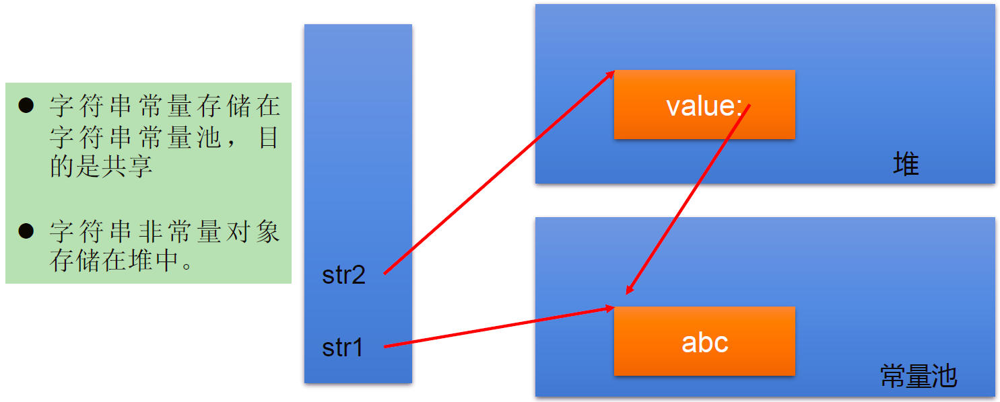
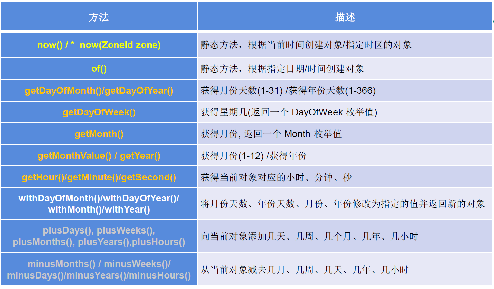

# Java常用类

# 一、字符串相关


## 1.String类

### 1.1 概述

- String类是一个final类，不能被继承，代表不可变的字符串序列
- 字符串是常量，在初始化后不能修改
- String对象的字符内存存储在一个char[]中

 * String 实现了Serializable接口，可序列化
 * String 实现了Comparable，可以比较大小

 - String代表不可变字符序列
   *  当对字符串重新赋值时需要重写指定内存区域赋值，不能使用原有的value进行赋值
   *  当对现有字符串进行连接操作的时候，也需要重新指定内存区域赋值，并将引用指向新的内存地址

 *  调用replace()方法修改制定字符或字符串时，也必须重新指定内存区域赋值
 *  通过字面量的形式（区别于new）给一个字符串赋值，此时额字符串声明在字符串常量中（方法区中）
 *  字符串常量池不会存储相同内容的字符串

### 1.2 String特性

 String类：代表字符串。Java程序中的所有字符串字面值（如"abc"）都作为此类的实例实现。 String是一个final类，代表不可变的字符序列。 字符串是常量，用双引号引起来表示。它们的值在创建之后不能更改。 String对象的字符内容是存储在一个字符数组vaue[]中的。 

```java
public final class String
    implements java.io.Serializable, Comparable<String>, CharSequence {
    /** The value is used for character storage. */
    private final char value[];

    /** Cache the hash code for the string */
    private int hash; // Default to 0
```

### 1.3 String的不可变性

1. 当对字符串重新赋值时，需要重写指定内存区域赋值，不能使用原有的value进行赋值。
2. 当对现的字符串进行连接操作时，也需要重新指定内存区域赋值，不能使用原有的value进行赋值。
3. 当调用String的replace()方法修改指定字符或字符串时，也需要重新指定内存区域赋值，不能使用原有的value进行赋值。

```java
String s1 = "abc";//通过字面量的定义方式
String s2 = "def";
s1 = "hello";

System.out.println(s1 == s2); //false 比较s1与s2的地址值

System.out.println(s1);//hello
System.out.println(s2);//def

System.out.println("-----------------------");

String s3 = "abc";
s3 += "def";
System.out.println(s3);//abcdef
System.out.println(s2);//def

System.out.println("-----------------------");

String s4 ="test";
String s5 = s4.replace("t","b");
System.out.println(s4);//test
System.out.println(s5);//besb
```

  

### 1.4 String的实例化

> 实例化方式

1. 通过字面量方式，常量池方法区（`String str = "abc"`）
   1. 常量池中创建一个`"abc"`的字符串常量
   2. 栈中新建一个str的引用，指针指向常量池的`"abc"`的内存地址
2. 通过new方式，堆中（`String str = new String("abc")`）
   1. 常量池中创建一个`"abc"`的字符串常量
   2. 堆中创建new结构对象，指针指向常量池的`"abc"`的内存地址
   3. 栈中新建一个str的引用，指针指向堆中的new对象的内存地址

> 面试题：`String str = new String("abc")`方式创建对象，在内存中创建了几个对象？

两个对象：一个是堆空间中的new结构，另一个是char[]对应的常量池中的`"abc"`。

>  String str1=“abc”;与 String str2= new String(“abc”);的区别? 

  

  

> 判断字符串

```java
public void test3(){
    String s1 = "JavaEE";
    String s2 = "hadoop";
    String s3 = "JavaEEhadoop";
    String s4 = "JavaEE" + "hadoop";
    String s5 = s1 + "hadoop";
    String s6 = "JavaEE" + s2;
    String s7 = s1 + s2;

    System.out.println(s3==s4);//true
    System.out.println(s3==s5);//false
    //intern方法返回常量池中的引用，s3是常量池"JavaEEhadoop"的引用地址，s5.intern()也返回常量池"JavaEEhadoop"的引用地址
    System.out.println(s3==s5.intern());//true
    System.out.println(s3==s6);//false
    System.out.println(s5==s6);//false
    System.out.println(s3==s7);//false
    System.out.println(s5==s7);//false
    System.out.println(s6==s7);//false
}
```

- 常量与常量的的拼接结果在常量池，且常量池中不会存在相同的结果
- 只要其中一个是变量，结果就在堆中
- 如果调用intern()方法，返回值常量池中的

> 测试题

```java
public class StringTest {
    String str = new String("good");
    char[] ch = {'t', 'e', 's', 't'};
    public void change(String str, char[] ch){
        str = "test ok";
        ch[0] = 'b';
    }
    public static void main(String[] args) {
        StringTest ex = new StringTest();
        ex.change(ex.str, ex.ch);
        System.out.print(ex.str + " and");
        System.out.println(ex.ch);//good andbest
    }
}
```

成员变量`str`传入形参`str`局部变量，此时两个str都指向`new String("good")`的地址，之后形参`str`的局部变量引用指向常量池的`test`的地址，但是成员变量的地址没变化，不改变，ch是数组，数组地址不变，修改数组的内部值生效，所以`t`改成`b`了。

> 关于String的内存结构，JDK1.7以前字符串常量池在方法区(**永久代实现**)中，JDK1.7，将字符串常量池移入heap(**堆中**)，JDK1.8又将常量池移入方法区(**元空间实现**)。

### 1.5 String常用API

- int length()：返回字符串长度 
- char charAt(int index)：返回某索引处的字符串
- boolean isEmpty()：判断是不是空字符串 length==0
- String toLowerCase()：将所有字符转化为小写
- String toUpperCase()：将所有字符转化未大写
- String trim()：返回字符串的副本，将前后空白忽略
- boolean equals(Object obj)：比较两个字符串内容是否相同
- boolean equalsIgnoreCase(String anoterString)：与equals类似，忽略大小写比较
- String concat(String str)：将指定的字符串连接到此字符串的尾部，等价于“+”
- int compareTo(String anoterString)：比较两个字符串的大小
- String subString(int beginIndex)：返回一个新的字符串，此字符串从beginIndex开始截取的副本
- String subString(int beginIndex, int endIndex)：返回与一个新的字符串，此字符串从beginIndex到endIndex截取的副本，不包含endIndex

## 2.StringBuilder类和StringBuffer类

- StringBuilder与StringBuffer都是是字符可变序列，String是字符不可变序列，底层都是数组
- StringBuilder是线程不安全的，效率高
- StringBuffer是线程安全的，效率相对低
- StringBuilder与StringBuffer的底层是一个长度为16的数组
- 扩容机制：当长度超过底层数组容量，扩容为原长度*2+2，同时将原数组的数据复制到新的数组中

### 2.1 常用方法


1. StringBuffer append(xxx)：提供了很多的append()方法，用于进行字符串拼接
2. StringBuffer delete(int start,int end)：删除指定位置的内容
3. StringBuffer replace(int start, int end, String str)：把[start,end)位置替换为str
4. StringBuffer insert(int offset, xxx)：在指定位置插入xxx
5. StringBuffer reverse() ：把当前字符序列逆转

当 append和insert时，如果原来vaue数组长度不够，可扩容。 如上这些方法支持方法链操作。 方法链的原理：

```java
@Override
public StringBuilder append(String str) {
    super.append(str);
    return this;
}
```

- public int indexOf(String str)：返回子串的下标
- public String substring(int start,int end):返回一个从start开始到end索引结束的左闭右开区间的子字符串
- public int length()：获取字符串的长度
- public char charAt(int n )：返回指定位置的字符
- public void setCharAt(int n ,char ch)：设置指定位置的字符

> **总结：**

增：append(xxx) ；

删：delete(int start,int end) ；

改：setCharAt(int n ,char ch) / replace(int start, int end, String str) ；

查：charAt(int n ) ；

插：insert(int offset, xxx) ；

长度：length();

遍历：for() + charAt() / toString()；

```java
@Test
public void stringBufferMethodTest(){
    StringBuffer s1 = new StringBuffer("abc");
    System.out.println(s1);

    System.out.println(s1.append("1"));//abc1
    System.out.println(s1.delete(0, 1));//bc1
    System.out.println(s1.replace(0, 1, "hello"));//helloc1
    System.out.println(s1.insert(3, "v"));//helvloc1
    System.out.println(s1.reverse());//1colvleh
}
```

### 2.2 String、StringBuffer、StringBuilder三者的对比

- String:不可变的字符序列；底层使用char[]存储；占用内存（会不断的创建和回收对象）
- StringBuffer:可变的字符序列；线程安全的，效率低；线程安全；底层使用char[]存储；
- StringBuilder:可变的字符序列；jdk5.0新增的，线程不安全的，效率高；线程不安全；底层使用char[]存储

> 注意：作为参数传递的话，方法内部String不会改变其值， StringBuffer和 StringBuilder会改变其值。

### 2.3 效率

 从高到低排列：StringBuilder > StringBuffer > String 

```java
@Test
public void test3(){
    //初始设置
    long startTime = 0L;
    long endTime = 0L;
    String text = "";
    StringBuffer buffer = new StringBuffer("");
    StringBuilder builder = new StringBuilder("");
    //开始对比
    startTime = System.currentTimeMillis();
    for (int i = 0; i < 20000; i++) {
        buffer.append(String.valueOf(i));
    }
    endTime = System.currentTimeMillis();
    System.out.println("StringBuffer的执行时间：" + (endTime - startTime));

    startTime = System.currentTimeMillis();
    for (int i = 0; i < 20000; i++) {
        builder.append(String.valueOf(i));
    }
    endTime = System.currentTimeMillis();
    System.out.println("StringBuilder的执行时间：" + (endTime - startTime));

    startTime = System.currentTimeMillis();
    for (int i = 0; i < 20000; i++) {
        text = text + i;
    }
    endTime = System.currentTimeMillis();
    System.out.println("String的执行时间：" + (endTime - startTime));

}
```

# 二、JDK8以前时间API

## 1. java.lang.System类

System类提供的 public static long currentTimeMillis()用来返回当前时间与1970年1月1日0时0分0秒之间以毫秒为单位的时间差。(时间戳) 此方法适于计算时间差。

> 计算世界时间的主要标准有：
>
> UTC（Coordinated Universal Time） GMT（Greenwich Mean Time） CST（Central Standard Time）

**代码示例：**

```java
//获取系统当前时间：System类中的currentTimeMillis()
long time = System.currentTimeMillis();
//返回当前时间与1970年1月1日0时0分0秒之间以毫秒为单位的时间差。
//称为时间戳
System.out.println(time);
```

## 2. java.util.Date类

 表示特定的瞬间，精确到毫秒 。

### 2.1 构造器

Date():使用无参的构造器创建对象可以获取本地当前时间

Date(long date)

### 2.2 常用方法

getTime()：返回自1970年1月1日00：00：00GMT以来此Date对象表示的毫秒数

tostring()：把此Date对象转换为以下形式的 String：

- dow mon dd
- hh: mm:ss zzz yyyy

其中：doW是一周中的某一天（Sun，Mon，Tue，Wed，Thu，Fri，Sat），zzz是时间标准。 其它很多方法都过时了。

### 2.3 java.util.Date类与java.sql.Date类

```java
|---java.util.Date类

|---java.sql.Date类
```

1.两个构造器的使用

- 构造器一：Date()：创建一个对应当前时间的Date对象
- 构造器二：创建指定毫秒数的Date对象

2.两个方法的使用

- toString():显示当前的年、月、日、时、分、秒
- getTime():获取当前Date对象对应的毫秒数。（时间戳）

3.java.sql.Date对应着数据库中的日期类型的变量

如何将java.util.Date对象转换为java.sql.Date对象

```java
@Test
public void dateTest(){
    //构造器一：Date()：创建一个对应当前时间的Date对象
    Date date1 = new Date();
    System.out.println(date1.toString());//Sun Apr 19 13:35:12 CST 2020
    System.out.println(date1.getTime());//1587274512876

    //构造器二：创建指定毫秒数的Date对象
    Date date2 = new Date(15872745176L);
    System.out.println(date2.toString());
    System.out.println("-----------------------");

    //创建java.sql.Date对象
    java.sql.Date date3 = new java.sql.Date(1587274512876L);
    System.out.println(date3.toString());

    //如何将java.util.Date对象转换为java.sql.Date对象
    Date date4 = new Date();
    //第一种方式，存在问题：java.util.Date cannot be cast to java.sql.Date
    //        java.sql.Date date6 = (java.sql.Date) date4;
    //        System.out.println(date6);
    //第二种方式
    java.sql.Date date5 = new java.sql.Date(date4.getTime());
    System.out.println(date5);
}
```

## 3.java.text.SimpleDateFormat类

Date类的API不易于国际化，大部分被废弃了， java.text.SimpleDateFormat类是一个不与语言环境有关的方式来格式化和解析日期的具体类。

它允许进行格式化：日期→文本、解析：文本→日期。

**格式化：**

SimpleDateFormat()：默认的模式和语言环境创建对象

public SimpleDateFormat(String pattern)：该构造方法可以用参数 pattern指定的格式创建一个对象，该对象调用：

public String format(Datedate)：方法格式化时间对象date

**解析**： public Date parse(String source)：从给定字符串的开始解析文本，以生成个日期。

### 3.1 SimpleDateFormat对日期Date类的格式化和解析

两个操作：

1. 格式化：日期 --->字符串
2. 解析：格式化的逆过程，字符串 ---> 日期

### 3.2 SimpleDateFormat的实例化:new + 构造器

照指定的方式格式化和解析：调用带参的构造器

```java
SimpleDateFormat sdf1 = new SimpleDateFormat("yyyyy.MMMMM.dd GGG hh:mm aaa");
```

**代码示例：**

```java
@Test
public void test2() throws ParseException {
    //实例化Date对象
    Date date1 = new Date();
    //实例化SimpleDateFormate对象，并设置显示格式
    SimpleDateFormat simpleDateFormat = new SimpleDateFormat("yyyy-MM-dd hh:mm:aaa");
    //格式化date对象
    String format = simpleDateFormat.format(date1);
    System.out.println(format.toString());//2020-09-19 02:09:下午
    //解析:要求字符串必须是符合SimpleDateFormat识别的格式(通过构造器参数体现),
    //否则，抛异常
    Date date2 = simpleDateFormat.parse("2020-04-20 14:20:下午");
    System.out.println(date2.toString());//Tue Jan 21 02:20:00 CST 2020
}
```


**小练习：**

将字符串"2020-09-08"转换为java.sql.Date格式的时间

```java
@Test
public void test3() throws ParseException {
    String brith = "1997-10-15";
    //新建SimpleDateFormat对象并设置时间格式
    SimpleDateFormat simpBrith = new SimpleDateFormat("yyyy-mm-dd");
    //将字符串格式的时间格式化为Date类
    Date brithday = simpBrith.parse(brith);
    //通过Date的getTime方法将Date对象转化为时间戳放到java.sql.date类的构造方法中
    java.sql.Date brithDate = new java.sql.Date(brithday.getTime());
    System.out.println(brithDate);
}
```

## 4. Calendar类：日历类、抽象类

Calendar是一个抽象基类，主用用于完成日期字段之间相互操作的功能。

- 获取 Calenda实例的方法 使用 Calendar.getInstance()方法 调用它的子类 GregorianCalendarl的构造器。
- 一个 Calendar的实例是系统时间的抽象表示，通过 get(int field)方法来取得想要的时间信息。 比如YEAR、MONTH、DAY_OF_WEEK、HOUR_OF_DAY、MINUTE、SECOND public void set(int field,int value) public void add(int field,int amount) public final Date get Time() public final void set Time(Date date)
- 注意 获取月份时：一月是0，二月是1，以此类推，12月是11 获取星期时：周日是1，周二是2，。。。周六是7

> 实例化

方式一：创建其子类(GregorianCalendar)的对象

方式二：调用其静态方法getInstance()

```java
Calendar calendar = Calendar.getInstance();
```

get():获取日期

set():设置日期

add():添加、修改日期

getTime:日历类-->Date

setTime:Date-->日历类

**代码示例：**

```java
Calendar calendar = Calendar.getInstance();
//        System.out.println(calendar.getClass());

//2.常用方法
//get()
int days = calendar.get(Calendar.DAY_OF_MONTH);//获取本月第几天
System.out.println(days);
System.out.println(calendar.get(Calendar.DAY_OF_YEAR));//获取本年第几天

//set()
//calendar可变性
calendar.set(Calendar.DAY_OF_MONTH,22);//设置本月第几天
days = calendar.get(Calendar.DAY_OF_MONTH);
System.out.println(days);

//add()
calendar.add(Calendar.DAY_OF_MONTH,-3);
days = calendar.get(Calendar.DAY_OF_MONTH);
System.out.println(days);

//getTime():日历类---> Date
Date date = calendar.getTime();
System.out.println(date);

//setTime():Date ---> 日历类
Date date1 = new Date();
calendar.setTime(date1);
days = calendar.get(Calendar.DAY_OF_MONTH);
System.out.println(days);
```

# 三、JDK8新日期时间类

### 1. 日期时间API的迭代：

- 第一代：jdk 1.0 Date类
- 第二代：jdk 1.1 Calendar类，一定程度上替换Date类
- 第三代：jdk 1.8 提出了新的一套API

### 2. 前两代的问题：

可变性：像日期和时间这样的类应该是不可变的。

偏移性：Date中的年份是从1900开始的，而月份都从0开始。

格式化：格式化只对Date用，Calendar则不行。 此外，它们也不是线程安全的；不能处理闰秒等。

> Java 8.0中新引入的java.time API:

Java 8.0吸收了Joda-Time的精华，以一个新的开始为Java创建优秀的APl。新的java.time中包含了所有关于本地日期(LocalDate)、本地时间(Localtime)、本地日期时间(LocalDate time)、时区(ZonedDate time)和持续时间(Duration)的类。历史悠久的Date类新增了tolnstant()方法用于把Date转换成新的表示形式。这些新增的本地化时间日期API大大简化了日期时间和本地化的管理。

### 3. Java 8.0中新的日期时间API涉及的包:


### 4. 本地日期、本地时间、本地日期时间的使用：

LocalDate / LocalTime / LocalDateTime

#### 4.1 说明

① 分别表示使用 ISO-8601日历系统的日期、时间、日期和时间。它们提供了简单的本地日期或时间，并不包含当前的时间信息，也不包含与时区相关的信息。

② LocalDateTime相较于LocalDate、LocalTime，使用频率要高

③ 类似于Calendar

#### 4.2 常用方法

  

> 示例

```java
@Test
public void test1(){
    //now():获取当前的日期、时间、日期时间
    LocalDate localDate = LocalDate.now();
    LocalTime localTime = LocalTime.now();
    LocalDateTime localDateTime = LocalDateTime.now();

    System.out.println(localDate);//2020-04-21
    System.out.println(localTime);//18:52:54.929
    System.out.println(localDateTime);//2020-04-21T18:52:54.929

    //of():设置指定的年、月、日、时、分、秒。没有偏移量
    LocalDateTime localDateTime1 = LocalDateTime.of(2020,10,6,12,13,12);
    System.out.println(localDateTime1);//2020-10-06T12:13:12

    //getXxx()：获取相关的属性
    System.out.println(localDateTime.getDayOfMonth());//21
    System.out.println(localDateTime.getDayOfWeek());//TUESDAY
    System.out.println(localDateTime.getMonth());//APRIL
    System.out.println(localDateTime.getMonthValue());//4
    System.out.println(localDateTime.getMinute());//52

    //体现不可变性
    //withXxx():设置相关的属性
    LocalDate localDate1 = localDate.withDayOfMonth(22);
    System.out.println(localDate);//2020-04-21
    System.out.println(localDate1);//2020-04-22

    LocalDateTime localDateTime2 = localDateTime.withHour(4);
    System.out.println(localDateTime);//2020-04-21T18:59:17.484
    System.out.println(localDateTime2);//2020-04-21T04:59:17.484

    //不可变性
    LocalDateTime localDateTime3 = localDateTime.plusMonths(3);
    System.out.println(localDateTime);//2020-04-21T18:59:17.484
    System.out.println(localDateTime3);//2020-07-21T18:59:17.484

    LocalDateTime localDateTime4 = localDateTime.minusDays(6);
    System.out.println(localDateTime);//2020-04-21T18:59:17.484
    System.out.println(localDateTime4);//2020-04-15T18:59:17.484
}
```

### 5.时间点：Instant


① 时间线上的一个瞬时点。 概念上讲，它只是简单的表示自1970年1月1日0时0分0秒（UTC开始的秒数。）

② 类似于 java.util.Date类


> 示例

```java
@Test
public void test2(){
    //now():获取本初子午线对应的标准时间
    Instant instant = Instant.now();
    System.out.println(instant);//2020-04-21T11:03:21.469Z

    //添加时间的偏移量
    OffsetDateTime offsetDateTime = instant.atOffset(ZoneOffset.ofHours(8));
    System.out.println(offsetDateTime);//2020-04-21T19:03:21.469+08:00

    //toEpochMilli():获取自1970年1月1日0时0分0秒（UTC）开始的毫秒数  ---> Date类的getTime()
    long milli = instant.toEpochMilli();
    System.out.println(milli);//1587467105795

    //ofEpochMilli():通过给定的毫秒数，获取Instant实例  -->Date(long millis)
    Instant instant1 = Instant.ofEpochMilli(1587467105795L);
    System.out.println(instant1);//2020-04-21T11:05:05.795Z
}
```

### 6.日期时间格式化类：DateTimeFormatter

#### 6.1 说明

① 格式化或解析日期、时间

② 类似于SimpleDateFormat

#### 6.2 常用方法：

1. 实例化方式： 预定义的标准格式。如：ISO_LOCAL_DATE_TIME;ISO_LOCAL_DATE;ISO_LOCAL_TIME 本地化相关的格式。如：ofLocalizedDateTime(FormatStyle.LONG) 自定义的格式。如：ofPattern(“yyyy-MM-dd hh:mm:ss”)

2. 常用方法：

   

   特别的：自定义的格式。如：ofPattern(“yyyy-MM-dd hh:mm:ss”)

   > 示例

   ```java
   @Test
   public void test3(){
       //        方式一：预定义的标准格式。
       //        如：ISO_LOCAL_DATE_TIME;ISO_LOCAL_DATE;ISO_LOCAL_TIME
       DateTimeFormatter formatter = DateTimeFormatter.ISO_LOCAL_DATE_TIME;
       //格式化:日期-->字符串
       LocalDateTime localDateTime = LocalDateTime.now();
       String str1 = formatter.format(localDateTime);
       System.out.println(localDateTime);//2020-04-21T19:13:13.530
       System.out.println(str1);//2020-04-21T19:13:13.53
   
       //解析：字符串 -->日期
       TemporalAccessor parse = formatter.parse("2000-04-21T19:13:13.53");
       System.out.println(parse);//{},ISO resolved to 2000-04-21T19:13:13.530
       //        方式二：
       //        本地化相关的格式。如：ofLocalizedDateTime()
       //        FormatStyle.LONG / FormatStyle.MEDIUM / FormatStyle.SHORT :适用于LocalDateTime
       DateTimeFormatter formatter1 = DateTimeFormatter.ofLocalizedDateTime(FormatStyle.LONG);
       //格式化
       String str2 = formatter1.format(localDateTime);
       System.out.println(str2);//2020年4月21日 下午07时16分57秒
   
       //      本地化相关的格式。如：ofLocalizedDate()
       //      FormatStyle.FULL / FormatStyle.LONG / FormatStyle.MEDIUM / FormatStyle.SHORT : 适用于LocalDate
       DateTimeFormatter formatter2 = DateTimeFormatter.ofLocalizedDate(FormatStyle.MEDIUM);
       //格式化
       String str3 = formatter2.format(LocalDate.now());
       System.out.println(str3);//2020-4-21
   
       //       重点： 方式三：自定义的格式。如：ofPattern(“yyyy-MM-dd hh:mm:ss”)
       DateTimeFormatter formatter3 = DateTimeFormatter.ofPattern("yyyy-MM-dd hh:mm:ss");
       String Str4 = formatter3.format(LocalDateTime.now());
       System.out.println(Str4);//2020-04-21 07:24:04
   
       TemporalAccessor accessor = formatter3.parse("2020-02-03 05:23:06");
       System.out.println(accessor);//{SecondOfMinute=6, HourOfAmPm=5, NanoOfSecond=0, MicroOfSecond=0, MinuteOfHour=23, MilliOfSecond=0},ISO resolved to 2020-02-03
   }
   ```

### 7.其它API的使用：


#### 7.1 带时区的日期时间：

ZonedDateTime / ZoneId

> **示例**

```java
// ZoneId:类中包含了所的时区信息
@Test
public void test1(){
    //getAvailableZoneIds():获取所的ZoneId
    Set<String> zoneIds = ZoneId.getAvailableZoneIds();
    for(String s : zoneIds){
        System.out.println(s);
    }
    System.out.println();

    //获取“Asia/Tokyo”时区对应的时间
    LocalDateTime localDateTime = LocalDateTime.now(ZoneId.of("Asia/Tokyo"));
    System.out.println(localDateTime);


}
//ZonedDateTime:带时区的日期时间
@Test
public void test2(){
    //now():获取本时区的ZonedDateTime对象
    ZonedDateTime zonedDateTime = ZonedDateTime.now();
    System.out.println(zonedDateTime);
    //now(ZoneId id):获取指定时区的ZonedDateTime对象
    ZonedDateTime zonedDateTime1 = ZonedDateTime.now(ZoneId.of("Asia/Tokyo"));
    System.out.println(zonedDateTime1);
}
```

#### 7.2 时间间隔：

Duration--用于计算两个“时间”间隔，以秒和纳秒为基准


> **示例**

```java
@Test
public void test3(){
    LocalTime localTime = LocalTime.now();
    LocalTime localTime1 = LocalTime.of(15, 23, 32);
    //between():静态方法，返回Duration对象，表示两个时间的间隔
    Duration duration = Duration.between(localTime1, localTime);
    System.out.println(duration);

    System.out.println(duration.getSeconds());
    System.out.println(duration.getNano());

    LocalDateTime localDateTime = LocalDateTime.of(2016, 6, 12, 15, 23, 32);
    LocalDateTime localDateTime1 = LocalDateTime.of(2017, 6, 12, 15, 23, 32);

    Duration duration1 = Duration.between(localDateTime1, localDateTime);
    System.out.println(duration1.toDays());

}
```

#### 7.3 日期间隔：

Period --用于计算两个“日期”间隔，以年、月、日衡量


**代码示例：**

```java
@Test
public void test4(){
    LocalDate localDate = LocalDate.now();
    LocalDate localDate1 = LocalDate.of(2028, 3, 18);

    Period period = Period.between(localDate, localDate1);
    System.out.println(period);

    System.out.println(period.getYears());
    System.out.println(period.getMonths());
    System.out.println(period.getDays());

    Period period1 = period.withYears(2);
    System.out.println(period1);

}
```

#### 7.4 日期时间校正器：TemporalAdjuster

**代码示例：**

```java
@Test
public void test5(){
    //获取当前日期的下一个周日是哪天？
    TemporalAdjuster temporalAdjuster = TemporalAdjusters.next(DayOfWeek.SUNDAY);

    LocalDateTime localDateTime = LocalDateTime.now().with(temporalAdjuster);
    System.out.println(localDateTime);

    //获取下一个工作日是哪天？
    LocalDate localDate = LocalDate.now().with(new TemporalAdjuster(){

        @Override
        public Temporal adjustInto(Temporal temporal) {
            LocalDate date = (LocalDate)temporal;
            if(date.getDayOfWeek().equals(DayOfWeek.FRIDAY)){
                return date.plusDays(3);
            }else if(date.getDayOfWeek().equals(DayOfWeek.SATURDAY)){
                return date.plusDays(2);
            }else{
                return date.plusDays(1);
            }

        }

    });

    System.out.println("下一个工作日是：" + localDate);
}
```

#### 7.5 新的日期API与原来API的转化问题：


# 四、Java比较器

## 1.使用背景

- Java中的对象，正常情况下，只能进行比较：== 或 != 。不能使用 > 或 < 的
- 但是在开发场景中，我们需要对多个对象进行排序，言外之意，就需要比较对象的大小。
- 如何实现？使用两个接口中的任何一个：Comparable（自然排序） 或 Comparator（定制排序）

## 2. 自然排序：使用Comparable接口

1. 像String、包装类等实现了Comparable接口，重写了compareTo(obj)方法，给出了比较两个对象大小的方式。
2. 像String、包装类重写compareTo()方法以后，进行了从小到大的排列
3. 重写compareTo(obj)的规则： 如果当前对象this大于形参对象obj，则返回正整数， 如果当前对象this小于形参对象obj，则返回负整数， 如果当前对象this等于形参对象obj，则返回零。
4. 对于自定义类来说，如果需要排序，我们可以让自定义类实现Comparable接口，重写compareTo(obj)方法。在compareTo(obj)方法中指明如何排序
5. Comparable的典型实现：(默认都是从小到大排列的) String：按照字符串中字符的Uincode值进行比较 Character：按照字符的 Unicode值来进行比较 数值类型对应的包装类以及 BigInteger、BigDecimal：按照它们对应的数值大小进行比较 Boolean：true对应的包装类实例大于false对应的包装类实例 Date、Time等：后面的日期时间比前面的日期时间大

> 重写compareTo(obj)

- 如果this大于obj，返回正整数
- 如果this小于obj，返回负整数
- 如果相等返回0

```java
public class ComparableTest {
    @Test
    public void test(){
        Good[] goods = new Good[4];
        goods[0] = new Good("apple", 100);
        goods[1] = new Good("xiaomi", 50);
        goods[2] = new Good("thinkpad", 60);
        goods[3] = new Good("dell", 80);
        Arrays.sort(goods);
        System.out.println(Arrays.toString(goods));
    }
}

class Good implements Comparable{
    String name;
    int price;

    public Good(String name, int price) {
        this.name = name;
        this.price = price;
    }

    @Override
    public int compareTo(Object o) {
        if(o instanceof Good){ // 根据价格判断大小
            return this.price -((Good) o).price;
        }else {
            throw new ClassCastException("不是good类型");
        }
    }

    @Override
    public String toString() {
        return "Good{" +
                "name='" + name + '\'' +
                ", price=" + price +
                '}';
    }
}
```

## 3. 定制排序：使用Comparator接口


> 背景

当元素的类型没实现java.lang.Comparable接口而又不方便修改代码，或者实现了java.lang.Comparable接口的排序规则不适合当前的操作，那么可以考虑使用 Comparator 的对象来排序

>  重写compare(Object o1,Object o2)方法，比较o1和o2的大小：

- 如果返回正整数，o1大于o2
- 如果返回负整数，o1小于o2
- 如果返回0，相等

```java
public class ComparatorTest {
    @Test
    public void test(){
        Good2[] goods = new Good2[4];
        goods[0] = new Good2("apple", 100);
        goods[1] = new Good2("xiaomi", 50);
        goods[2] = new Good2("thinkpad", 60);
        goods[3] = new Good2("dell", 80);
        Arrays.sort(goods, new Comparator<Good2>() {
            @Override
            public int compare(Good2 o1, Good2 o2) {
                return o1.price-o2.price;
            }
        });
        System.out.println(Arrays.toString(goods));
    }

}
class Good2 {
    String name;
    int price;

    public Good2(String name, int price) {
        this.name = name;
        this.price = price;
    }

    @Override
    public String toString() {
        return "Good2{" +
                "name='" + name + '\'' +
                ", price=" + price +
                '}';
    }
}
```

## 4. 两种排序方式对比

- Comparable接口的方式是一定的，保证Comparable接口实现类的对象在任何位置都可以比较大小。
- Comparator接口属于临时性的比较。

# 五、其他常用类

## 1.System类

- System类代表系统，系统级的很多属性和控制方法都放置在该类的内部。该类位于java.lang包。
- 由于该类的构造器是private的，所以无法创建该类的对象，也就是无法实例化该类。其内部的成员变量和成员方法都是static的，所以也可以很方便的进行调用。

**成员方法：**

- native long currentTimeMillis()：

  该方法的作用是返回当前的计算机时间，时间的表达格式为当前计算机时间和GMT时间（格林威治时间）1970年1月1号0时0分0秒所差的毫秒数。

- void exit(int status)

  该方法的作用是退出程序。其中 status的值为0代表正常退出，非零代表异常退出。使用该方法可以在图形界面编程中实现程序的退出功能等

- void gc()

  该方法的作用是请求系统进行垃圾回收。至于系统是否立刻回收，则取决于系统中垃圾回收算法的实现以及系统执行时的情况。

- String getProperty(String key)

  该方法的作用是获得系统中属性名为key的属性对应的值。系统中常见的属性名以及属性的作用如下表所示：

  

**代码示例：**

```java
@Test
public void test1() {
    String javaVersion = System.getProperty("java.version");
    System.out.println("java的version:" + javaVersion);

    String javaHome = System.getProperty("java.home");
    System.out.println("java的home:" + javaHome);

    String osName = System.getProperty("os.name");
    System.out.println("os的name:" + osName);

    String osVersion = System.getProperty("os.version");
    System.out.println("os的version:" + osVersion);

    String userName = System.getProperty("user.name");
    System.out.println("user的name:" + userName);

    String userHome = System.getProperty("user.home");
    System.out.println("user的home:" + userHome);

    String userDir = System.getProperty("user.dir");
    System.out.println("user的dir:" + userDir);

}
```

## 2.Math类

java.lang.Math提供了一系列静态方法用于科学计算。其方法的参数和返回值类型一般为double型。


## 3.BigInteger类、BigDecimal类


java.math包的BigInteger可以表示不可变的任意精度的整数。

BigInteger提供所有Java的基本整数操作符的对应物，并提供 java.lang.Math的所有相关方法。另外，BigInteger还提供以下运算：模算术、GCD计算、质数测试、素数生成、位操作以及一些其他操作。

构造器： BigInteger(String val)：根据字符串构建 BigInteger对象


**代码举例：**

```java
@Test
public void test2() {
    BigInteger bi = new BigInteger("1243324112234324324325235245346567657653");
    BigDecimal bd = new BigDecimal("12435.351");
    BigDecimal bd2 = new BigDecimal("11");
    System.out.println(bi);
    //         System.out.println(bd.divide(bd2));
    System.out.println(bd.divide(bd2, BigDecimal.ROUND_HALF_UP));
    System.out.println(bd.divide(bd2, 25, BigDecimal.ROUND_HALF_UP));

}
```

## 3.2 BigDecimal

要求数字精度比较高，用到java.math.BigDecimal类

BigDecimal类支持不可变的、任意精度的有符号十进制定点数。

**构造器：**

public BigDecimal(double val)

public BigDecimal(String val)

**常用方法：**

public BigDecimal add(BigDecimal augend)

public BigDecimal subtract(BigDecimal subtrahend)

public BigDecimal multiply(BigDecimal multiplicand)

public BigDecimal divide(BigDecimal divisor， int scale， int rounding Mode)

**代码举例：**

```java
@Test
public void test2() {
    BigInteger bi = new BigInteger("1243324112234324324325235245346567657653");
    BigDecimal bd = new BigDecimal("12435.351");
    BigDecimal bd2 = new BigDecimal("11");
    System.out.println(bi);
    //         System.out.println(bd.divide(bd2));
    System.out.println(bd.divide(bd2, BigDecimal.ROUND_HALF_UP));
    System.out.println(bd.divide(bd2, 25, BigDecimal.ROUND_HALF_UP));

}
```