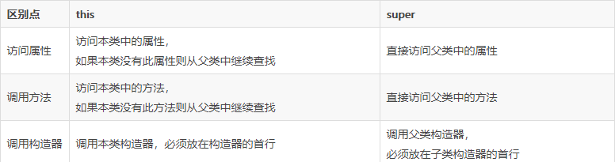
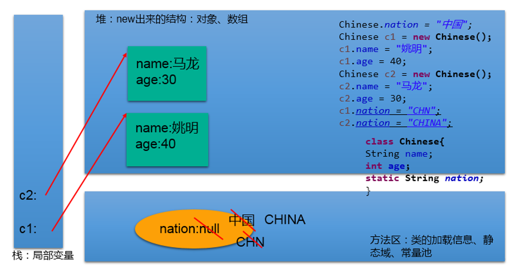

# 关键字

## 1.return--跳出

- 使用在方法体中，用于：① 结束方法② 针对于返回值类型的方法，使用"return 数据"方法返回所要的数据。
- return关键字后面不可以声明执行语句。
- 在异常处理中try-catch-finally的结构中，如果try或catch中的结构中写了return，但是finally中的结构仍会执行。

## 2.this--本类的

### 1.概述

this理解为：当前对象 或 当前正在创建的对象，可以调用的结构：***属性、方法；构造器***

### 2.使用

#### 2.1 this调用属性、方法：

- 在类的方法中，我们可以使用"this.属性"或"this.方法"的方式，调用当前对象属性或方法。但是，通常情况下，我们都择省略"this."。特殊情况下，如果***方法的形参和类的属性同名时***，我们必须显式的使用"this.变量"的方式，表明此变量是属性，而非形参。
- 在类的构造器中，我们可以使用"this.属性"或"this.方法"的方式，调用当前正在创建的对象属性或方法。但是，通常情况下，我们都择省略"this."。特殊情况下，如果***构造器的形参和类的属性同名***时，我们必须显式的使用"this.变量"的方式，表明此变量是属性，而非形参。

#### 2.2 this调用构造器：

① 我们在类的构造器中，可以显式的使用***"this(形参列表)"***方式，调用本类中指定的其他构造器

② 构造器中不能通过"this(形参列表)"方式调用自己

③ 如果一个类中有n个构造器，则最多有 n - 1构造器中使用了"this(形参列表)"

④ 规定："this(形参列表)"***必须声明在当前构造器的首行***

⑤ **构造器内部，最多只能声明一个"this(形参列表)"**，用来调用其他的构造器

## 3.super--父类的

### 1. 概述

super 关键字可以理解为：父类的，可以用来调用的结构：***属性、方法、构造器***

- 尤其当子父类出现同名成员时，可以用supe表明调用的是父类中的成员
- super的追溯不仅限于直接父类
- super和this的用法相像，this代表本类对象的引用， super代表父类的内存空间的标识

### 2.使用

#### 2.1super调用属性、方法：

与this关键字使用方式相同，只不过调用的是父类的属性

#### 2.2 在子类的方法或构造器中使用

通过使用"super.属性"或"super.方法"的方式，显式的调用父类中声明的属性或方法。但是，通常情况下，我们习惯省略"super."

**特殊情况**

- 当子类和父类中定义了同名的属性时，我们要想在子类中调用父类中声明的属性，则必须显式的使用"super.属性"的方式，表明调用的是父类中声明的属性。
- 当子类重写了父类中的方法以后，我们想在子类的方法中调用父类中被重写的方法时，则必须显式的使用"super.方法"的方式，表明调用的是父类中被重写的方法。

#### 2.3 super调用构造器：

- 我们可以在子类的构造器中显式的使用"super(形参列表)"的方式，调用父类中声明的指定的构造器
- "super(形参列表)"的使用，必须声明在子类构造器的首行！
- 我们在类的构造器中，针对于"this(形参列表)"或"super(形参列表)"只能二选一，不能同时出现
- 在构造器的首行，没显式的声明"this(形参列表)"或"super(形参列表)"，则默认调用的是父类中空参的构造器：super()
- 在类的多个构造器中，至少一个类的构造器中使用了"super(形参列表)"，调用父类中的构造器

### 3. this与super的区别



## 4.package/import

### 1. 概述

1. 为了更好的实现项目中类的管理，提供包的概念
2. 使用package声明类或接口所属的包，声明在源文件的首行
3. 包，属于标识符，遵循标识符的命名规则、规范(xxxyyyzzz)、“见名知意”
4. 每"."一次，就代表一层文件目录。

### 2. 包结构应用举例

**MVC设计模式**


### 3. JDK中的主要包

- java. lang--包含一些Java语言的核心类，如 String、Math、 integer、 System和Thread，提供常用功能
- java. net--包含执行与网络相关的操作的类和接口
- java.io--包含能提供多种输入/输出功能的类
- java util--包含一些实用工具类，如定义系统特性、接口的集合框架类、使用与日期日历相关的函数。
- java. text--包含了一些java格式化相关的类
- java.sql--包含了java进行JDBC数据库编程的相关类/接口
- java. awt--包含了构成抽象窗口工具集 (abstract window toolkits）的多个类，这些类被用来构建和管理应用程序的图形用户界面GU）。 B/S C/S

### 4. 使用

1. 在源文件中显式的使用import结构导入指定包下的类、接口
2. 声明在包的声明和类的声明之间
3. 如果需要导入多个结构，则并列写出即可
4. 可以使用"xxx.*"的方式，表示可以导入xxx包下的所结构
5. 如果使用的类或接口是java.lang包下定义的，则可以省略import结构
6. 如果使用的类或接口是本包下定义的，则可以省略import结构
7. 如果在源文件中，使用了不同包下的同名的类，则必须至少一个类需要以全类名的方式显示。
8. 使用"xxx.*"方式表明可以调用xxx包下的所结构。但是如果使用的是xxx子包下的结构，则仍需要显式导入
9. import static:导入指定类或接口中的静态结构:属性或方法。

## 5.static--静态的

### 1.概述

 主要用来修饰类的内部结构，如：属性、方法、代码块、内部类 。

### 2. 使用

#### 2.1static修饰属性：静态变量（或类变量）

属性是否使用static修饰，可分为：静态属性 vs 非静态属性(实例变量)

- 实例变量：我们创建了类的多个对象，每个对象都独立的拥一套类中的非静态属性。当修改其中一个对象中的非静态属性时，不会导致其他对象中同样的属性值的修改。
- 静态变量：我们创建了类的多个对象，多个对象共享同一个静态变量。当通过某一个对象修改静态变量时，会导致其他对象调用此静态变量时，是修改过了的。

**static修饰属性的其他说明：**

- 静态变量随着类的加载而加载。可以通过"类.静态变量"的方式进行调用
- 静态变量的加载要早于对象的创建。
- 由于类只会加载一次，则静态变量在内存中也只会存在一份：存在方法区的静态域中。

|      | 类变量 | 实例变量 |
| ---- | ------ | -------- |
| 类   | yes    | no       |
| 对象 | yes    | yes      |

**静态属性举例：System.out; Math.PI;**

**静态变量内存解析：**



#### 2.2 static修饰方法：静态方法、类方法

- 随着类的加载而加载，可以通过"类.静态方法"的方式进行调用
- 静态方法中，只能调用静态的方法或属性
- 非静态方法中，既可以调用非静态的方法或属性，也可以调用静态的方法或属性

|      | 静态方法 | 非静态方法 |
| ---- | -------- | ---------- |
| 类   | yes      | no         |
| 对象 | yes      | yes        |

**使用的注意点：**

- 在静态的方法内，不能使用this关键字、super关键字
- 关于静态属性和静态方法的使用，大家都从生命周期的角度去理解。

#### 2.3. 如何判定属性和方法应该使用static关键字：

**关于属性：**

- 属性是可以被多个对象所共享的，不会随着对象的不同而不同的。
- 类中的常量也常常声明为static

**关于方法：**

- 操作静态属性的方法，通常设置为static的
- 工具类中的方法，习惯上声明为static的。 比如：Math、Arrays、Collections

**使用举例：**记录创建的圆的个数

```java
class Circle{
	
	private double radius;
	private int id;//自动赋值
	
	public Circle(){
		id = init++;
		total++;
	}
	
	public Circle(double radius){
		this();
//		id = init++;
//		total++;
		this.radius = radius;
		
	}
	
	private static int total;//记录创建的圆的个数
	private static int init = 1001;//static声明的属性被所对象所共享
	
	public double findArea(){
		return 3.14 * radius * radius;
	}

	public double getRadius() {
		return radius;
	}

	public void setRadius(double radius) {
		this.radius = radius;
	}

	public int getId() {
		return id;
	}

	public static int getTotal() {
		return total;
	}

}

```

## 6.final--最终的

**可以用来修饰：类、方法、变量**

1. final 用来修饰一个类:此类不能被其他类所继承。

   比如：String类、System类、StringBuffer类

2. final 用来修饰方法：表明此方法不可以被重写

   比如：Object类中getClass();

3. final 用来修饰变量：此时的"变量"就称为是一个常量

   - final修饰属性：可以考虑赋值的位置：显式初始化、代码块中初始化、构造器中初始化
   - final修饰局部变量：尤其是使用final修饰形参时，表明此形参是一个常量。当我们调用此方法时，给常量形参赋一个实参。一旦赋值以后，就只能在方法体内使用此形参，但不能进行重新赋值。

4. static final 用来修饰属性：全局常量。

## 7.abstract--抽象的

### 1. 概述

abstract: 抽象的，可以用来修饰：类、方法。

### 2.使用

#### 2.1 abstract修饰类：抽象类

- 此类不能实例化
- 抽象类中一定有构造器，便于子类实例化时调用（涉及：子类对象实例化的全过程）
- 开发中，都会提供抽象类的子类，让子类对象实例化，完成相关的操作 --->抽象的使用前提：继承性

#### 2.2 abstract修饰方法：抽象方法

- 抽象方法只方法的声明，没方法体
- 包含抽象方法的类，一定是一个抽象类。反之，抽象类中可以没有抽象方法的。
- 若子类重写了父类中的所的抽象方法后，此子类方可实例化
- 若子类没重写父类中的所的抽象方法，则此子类也是一个抽象类，需要使用abstract修饰

**注意点：**

- abstract不能用来修饰：属性、构造器等结构
- abstract不能用来修饰私有方法、静态方法（静态方法不能被重写，抽象方法不能调用）、final的方法、final的类

**abstract的应用举例：**

**举例一**

```java
public abstract class Vehicle{//抽象类
public abstract double calcFuelEfficiency();//计算燃料效率的抽象方法
public abstract double calcTripDistance();//计算行驶距离的抽象方法
}
public class Truck extends Vehiclel{
public double calcFuelEfficiency( ){//写出计算卡车的燃料效率的具体方法}
public double calcTripDistance( ){//写出计算卡车行驶距离的具体方法}
}
public class River Barge extends Vehicle{
public double calcFuelEfficiency( ){//写出计算驳船的燃料效率的具体方法}
public double calcTripDistance( ){//写出计算驳船行驶距离的具体方法}
}
```

 **举例二** 

```java
abstract class GeometricObject{//抽象类
public abstract double findArea();
}
class Circle extends GeometricObject{
private double radius;
public double findArea(){
		return 3.14 * radius * radius;
};
}
```

**举例三**：

IO流中设计到的抽象类：InputStream/OutputStream / Reader /Writer。在其内部定义了抽象的read()、write()方法

### 3. 模板方法的设计模式

#### 3.1 解决的问题

在软件开发中实现一个算法时，整体步骤很固定、通用，这些步骤已经在父类中写好了。但是某些部分易变，易变 部分可以抽象出来，供不同子类实现。这就是一种模板模式。

#### 3.2 应用举例

```java
abstract class Template{
	
	//计算某段代码执行所需要花费的时间
	public void spendTime(){
		
		long start = System.currentTimeMillis();
		
		this.code();//不确定的部分、易变的部分
		
		long end = System.currentTimeMillis();
		
		System.out.println("花费的时间为：" + (end - start));
		
	}
	
	public abstract void code();
	
}

class SubTemplate extends Template{

	@Override
	public void code() {
		
		for(int i = 2;i <= 1000;i++){
			boolean isFlag = true;
			for(int j = 2;j <= Math.sqrt(i);j++){
				
				if(i % j == 0){
					isFlag = false;
					break;
				}
			}
			if(isFlag){
				System.out.println(i);
			}
		}

	}
	
}

```

#### 3.3 应用场景

模板方法设计模式是编程中经常用得到的模式。各个框架、类库中都有他的影子，比如常见的有：

- 数据库访问的封装
- Junt单元测试
- JavaWeb的 Servlet中关于 doGet/doPost方法调用
- Hibernate中模板程序
- Spring中 JDBCTemlate、 Hibernate Template等

## 8.interface--接口

### 1.概述

1. 接口使用interface来定义
2. Java中，接口和类是并列的两个结构

### 2.使用

1. 如何定义接口：定义接口中的成员

2. 接口中不能定义构造器的！意味着接口不可以实例化

3. Java开发中，接口通过让类去实现(implements)的方式来使用.

   - 如果实现类覆盖了接口中的所抽象方法，则此实现类就可以实例化
   - 如果实现类没覆盖接口中所的抽象方法，则此实现类仍为一个抽象类

4. Java类可以实现多个接口 --->弥补了Java单继承性的局限性

   格式：class AA extends BB implements CC,DD,EE

5. 接口与接口之间可以继承，而且可以多继承

6. 接口的具体使用，体现多态性

7. 接口，实际上可以看做是一种规范

**使用举例**：不同的设备通过USB口接入电脑

```java
class Computer{
	
	public void transferData(USB usb){//USB usb = new Flash();
		usb.start();
		
		System.out.println("具体传输数据的细节");
		
		usb.stop();
	}
	
	
}

interface USB{
	//常量：定义了长、宽、最大最小的传输速度等
	
	void start();
	
	void stop();
	
}

class Flash implements USB{

	@Override
	public void start() {
		System.out.println("U盘开启工作");
	}

	@Override
	public void stop() {
		System.out.println("U盘结束工作");
	}
	
}

class Printer implements USB{
	@Override
	public void start() {
		System.out.println("打印机开启工作");
	}

	@Override
	public void stop() {
		System.out.println("打印机结束工作");
	}
	
}
```

**使用总结**

1. 接口使用上也满足多态性
2. 接口，实际上就是定义了一种规范
3. 开发中，体会面向接口编程！

### 3. 面向接口编程的思想


面向接口编程：我们在应用程序中，调用的结构都是JDBC中定义的接口，不会出现具体某一个 数据库厂商的API。

###  4.Java8中关于接口的新规范

- JDK7及以前：只能定义全局常量和抽象方法

  - 全局常量：public static final的，书写时可以省略不写
  - 抽象方法：public abstract的

- JDK8：除了定义全局常量和抽象方法之外，还可以定义静态方法、默认方法

  - Java8中，可以为接口添加静态方法和默认方法。从技术角度来说，这是完全合法的，只是它看起来违反了接口作为一个抽象定义的理念。

  - 静态方法：使用 static关键字修饰。

    可以通过接口直接调用静态方法，并执行其方法体。我们经常在相互一起使用的类中使用静态方法。你可以在标准库中找到像 Collection/co| ections或者Path/ Paths这样成对的接口和类。

  - 默认方法：默认方法使用 default关键字修饰。

  - 可以通过实现类对象来调用。我们在已有的接口中提供新方法的同时，还保持了与旧版本代码的兼容性比如：java8API中对 Collection、List、 Comparator等接口提供了丰富的默认方法。

**JDK 8后接口使用总结**

- 知识点1：接口中定义的静态方法，只能通过接口来调用。

- 知识点2：通过实现类的对象，可以调用接口中的默认方法。

  如果实现类重写了接口中的默认方法，调用时，仍然调用的是重写以后的方法

- 知识点3：如果子类(或实现类)继承的父类和实现的接口中声明了同名同参数的默认方法，那么子类在没重写此方法的情况下，默认调用的是父类中的同名同参数的方法。-->类优先原则

- 知识点4：如果实现类实现了多个接口，而这多个接口中定义了同名同参数的默认方法，

  那么在实现类没重写此方法的情况下，报错。-->接口冲突。

  这就需要我们必须在实现类中重写此方法

- 知识点5：如何在子类(或实现类)的方法中调用父类、接口中被重写的方法

```java
public void myMethod(){
		method3();//调用自己定义的重写的方法
		super.method3();//调用的是父类中声明的
		//调用接口中的默认方法
		CompareA.super.method3();
		CompareB.super.method3();
}
```

>  **抽象类和接口的异同？** 

**相同点：**都不能实例化；都可以被继承；都可以包含抽象方法的。

**不同点：**

抽象类：有构造器。接口：没有构造器

1）把抽象类和接口(java7,java8,java9)的定义、内部结构解释说明

2）类：单继承性 接口：多继承

 类与接口：多实现