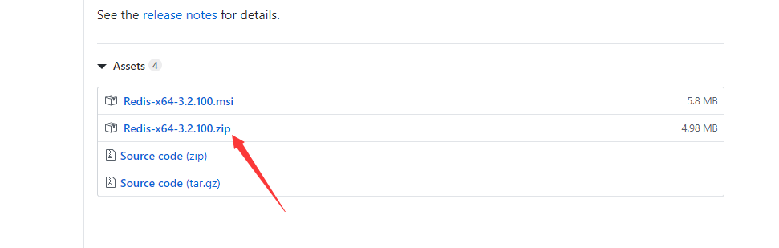
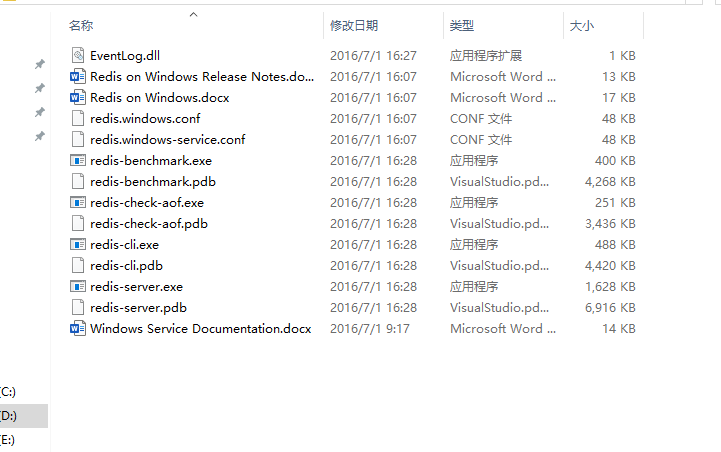
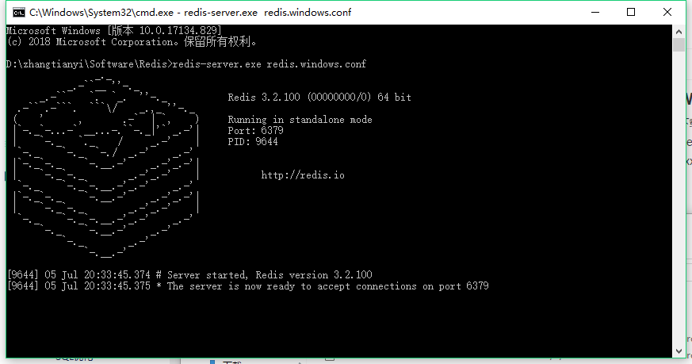
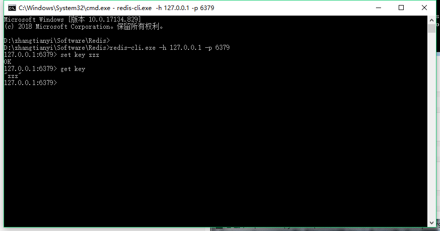
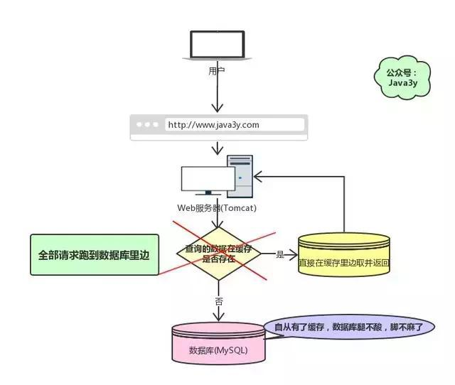
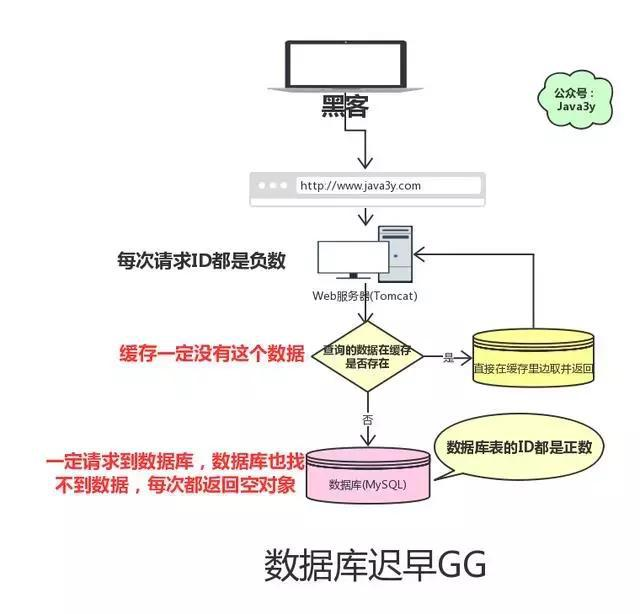

## **一、Redis 安装**

### **1.1 Window 下安装**

下载地址：https://github.com/MSOpenTech/redis/releases。

Redis 支持 32 位和 64 位。这个需要根据你系统平台的实际情况选择，这里我们下载 Redis-x64-xxx.zip压缩包到 C 盘，解压后，将文件夹重新命名为 redis。



打开文件



在当前位置打开cmd，输入，启动服务器

redis-server.exe redis.windows.conf



这时候另启一个 cmd 窗口，原来的不要关闭，不然就无法访问服务端了。

切换到 redis 目录下运行:

redis-cli.exe -h 127.0.0.1 -p 6379

设置键

set key zzz

取出键

get key



**windows设置redis服务**

在redis目录

```bash
redis-server --service-install redis.windows-service.conf --loglevel verbose
```

### **1.2 macos 下安装**

1.下载redis

地址：https://redis.io/download

2.安装测试

打开终端

cd /usr/local tar xzf redis-5.0.5.tar.gz cd redis-5.0.5

编译测试

sudo make test 

编译安装

sudo make install

3.启动redis服务端

redis-server

4.查看redis进程： ，把对应的pid redis 进程 杀死。以便后续的配置

ps -ef | grep -i redis kill  -9  pid

详见：

https://zhuanlan.zhihu.com/p/35945728


## 二、Redis问题

### 2.1  缓存雪崩

#### 2.1.1 什么是缓存雪崩？

如果我们的缓存挂掉了，这意味着我们的全部请求都跑去数据库了。



我们都知道Redis不可能把所有的数据都缓存起来(内存昂贵且有限)，所以Redis需要对数据设置过期时间，并采用的是惰性删除 + 定期删除两种策略对过期键删除。

如果缓存数据设置的过期时间是相同的，并且Redis恰好将这部分数据全部删光了。这就会导致在这段时间内，这些缓存同时失效，全部请求到数据库中。

这就是缓存雪崩：Redis挂掉了，请求全部走数据库。

缓存雪崩如果发生了，很可能就把我们的数据库搞垮，导致整个服务瘫痪！

#### 2.1.2 如何解决缓存雪崩？

在缓存的时候给过期时间加上一个随机值，这样就会大幅度的减少缓存在同一时间过期。

对于“Redis挂掉了，请求全部走数据库”这种情况，我们可以有以下的思路：

事发前：实现Redis的高可用(主从架构+Sentinel 或者Redis Cluster)，尽量避免Redis挂掉这种情况发生。

事发中：万一Redis真的挂了，我们可以设置本地缓存(ehcache)+限流(hystrix)，尽量避免我们的数据库被干掉(起码能保证我们的服务还是能正常工作的)

事发后：redis持久化，重启后自动从磁盘上加载数据，快速恢复缓存数据。


### 2.2 缓存穿透

#### 2.2.1  什么是缓存穿透？

缓存穿透是指查询一个一定不存在的数据。由于缓存不命中，并且出于容错考虑，如果从数据库查不到数据则不写入缓存

这将导致这个不存在的数据每次请求都要到数据库去查询，失去了缓存的意义。



这就是缓存穿透：请求的数据在缓存大量不命中，导致请求走数据库。

缓存穿透如果发生了，也可能把我们的数据库搞垮，导致整个服务瘫痪！

#### 2.2.2 如何解决缓存穿透？

解决缓存穿透也有两种方案：

由于请求的参数是不合法的(每次都请求不存在的参数)，于是我们可以使用布隆过滤器(BloomFilter)或者filter提前拦截，不合法就不让这个请求到数据库层！

当我们从数据库找不到的时候，我们也将这个空对象设置到缓存里边去。下次再请求的时候，就可以从缓存里边获取了。

这种情况我们一般会将空对象设置一个较短的过期时间。


### 2.3 缓存与数据库双写一致

#### 2.3.1 对于读操作，流程是这样的

如果我们的数据在缓存里边有，那么就直接取缓存的。

如果缓存里没有我们想要的数据，我们会先去查询数据库，然后将数据库查出来的数据写到缓存中。最后将数据返回给请求。

#### 2.3.2 什么是缓存与数据库双写一致问题？

如果仅仅查询的话，缓存的数据和数据库的数据是没问题的。但是，当我们要更新时候呢？各种情况很可能就造成数据库和缓存的数据不一致了。

这里不一致指的是：数据库的数据跟缓存的数据不一致


从理论上说，只要我们设置了键的过期时间，我们就能保证缓存和数据库的数据最终是一致的。

因为只要缓存数据过期了，就会被删除。随后读的时候，因为缓存里没有，就可以查数据库的数据，然后将数据库查出来的数据写入到缓存中。

除了设置过期时间，我们还需要做更多的措施来尽量避免数据库与缓存处于不一致的情况发生。


#### 2.3.3 缓存和数据库一致性解决方案

**1.第一种方案：采用延时双删策略**

在写库前后都进行redis.del(key)操作，并且设定合理的超时时间。

```java
public void write(String key, Object data) {
	redis.delKey(key);
	ipdataData(data);
	Thread.sleep(500);
	redis.delKey(key);
}
```

**具体的步骤就是：**

1）先删除缓存

2）再写数据库

3）休眠500毫秒

4）再次删除缓存

**那么，这个500毫秒怎么确定的，具体该休眠多久呢？**

需要评估自己的项目的读数据业务逻辑的耗时。这么做的目的，就是确保读请求结束，写请求可以删除读请求造成的缓存脏数据。

当然这种策略还要考虑redis和数据库主从同步的耗时。最后的的写数据的休眠时间：则在读数据业务逻辑的耗时基础上，加几百ms即可。比如：休眠1秒。

**设置缓存过期时间**

从理论上来说，给缓存设置过期时间，是保证最终一致性的解决方案。所有的写操作以数据库为准，只要到达缓存过期时间，则后面的读请求自然会从数据库中读取新值然后回填缓存。

**该方案的弊端**

结合双删策略+缓存超时设置，这样最差的情况就是在超时时间内数据存在不一致，而且又增加了写请求的耗时。

**2、第二种方案：异步更新缓存(基于订阅binlog的同步机制)**

**1.技术整体思路：**

MySQL binlog增量订阅消费+消息队列+增量数据更新到redis

**1）读Redis**：热数据基本都在Redis

**2）写MySQL**:增删改都是操作MySQL

**3）更新Redis数据**：MySQ的数据操作binlog，来更新到Redis

**2.Redis更新**

**1）数据操作主要分为两大块：**

- 一个是全量(将全部数据一次写入到redis)
- 一个是增量（实时更新）

这里说的是增量,指的是mysql的update、insert、delate变更数据。

**2）读取binlog后分析 ，利用消息队列,推送更新各台的redis缓存数据。**

这样一旦MySQL中产生了新的写入、更新、删除等操作，就可以把binlog相关的消息推送至Redis，Redis再根据binlog中的记录，对Redis进行更新。

其实这种机制，很类似MySQL的主从备份机制，因为MySQL的主备也是通过binlog来实现的数据一致性。

这里可以结合使用canal(阿里的一款开源框架)，通过该框架可以对MySQL的binlog进行订阅，而canal正是模仿了mysql的slave数据库的备份请求，使得Redis的数据更新达到了相同的效果。

当然，这里的消息推送工具你也可以采用别的第三方：kafka、rabbitMQ等来实现推送更新Redis。