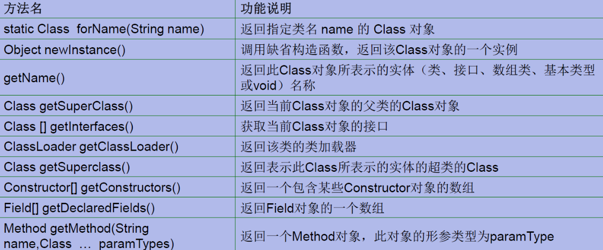
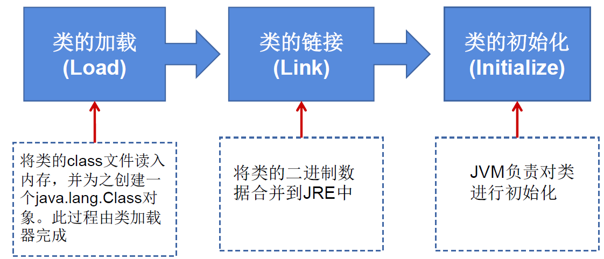
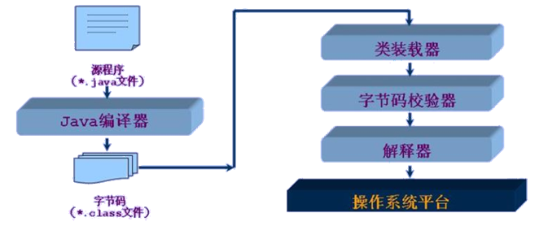
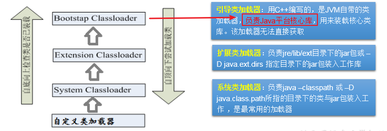
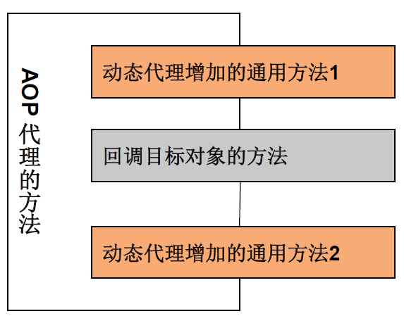

# 反射

# 一、概述

## 1.简介

- Reflection（反射)是被视为动态语言的关键，反射机制允许程序在执行期借助于Reflection API取得任何类的内部信息，并能直接操作任意对象的内部属性及方法。
- 加载完类之后，在堆内存的方法区中就产生了一个Class类型的对象（一个类只有一个Class对象），这个对象就包含了完整的类的结构信息。我们可以通过这个对象看到类的结构。这个对象就像一面镜子，透过这个镜子看到类的结构，所以，我们形象的称之为：反射。


框架 = 注解 + 反射 + 设计模式

## 2. 反射机制提供的功能

- 在运行时判断任意一个对象所属的类
- 在运行时构造任意一个类的对象
- 在运行时判断任意一个类所具有的成员变量和方法
- 在运行时获取泛型信息
- 在运行时调用任意一个对象的成员变量和方法
- 在运行时处理注解
- 生成动态代理


```java
public class ReflectionTest {

    //反射之前，对person操作
    @Test
    public void test1(){
        //1.创建person类
        Person p1 = new Person("Tom", 12);
        //2.通过对象调用其内部方法、属性
        p1.age = 10;
        System.out.println(p1.toString());
        p1.show();
        //z在person类外部，不可以通过person类的对象调用其内部私有结构
        //比如：name、showNation()以及私有构造器
    }

    //反射之后对于person操作
    @Test
    public void test2() throws Exception{
        //1.通过反射创建person类对象
        Class clazz = Person.class;
        Constructor constructor = clazz.getConstructor(String.class, int.class);
        Object obj = constructor.newInstance("Tom", 12);
        Person p = (Person)obj;
        System.out.println(p.toString());
        //2.通过反射调用其内部方法、属性
        Field age = clazz.getDeclaredField("age");
        age.set(p, 10);
        System.out.println(p.toString());
        Method show = clazz.getDeclaredMethod("show");
        show.invoke(p);
        System.out.println("******************");
        //3.调用私有构造器
        Constructor constructor1 = clazz.getDeclaredConstructor(String.class);
        constructor1.setAccessible(true);
        Person p1 = (Person) constructor1.newInstance("Jerry");
        System.out.println(p1);
        //调用私有属性
        Field name = clazz.getDeclaredField("name");
        name.setAccessible(true);
        name.set(p1, "Jack");
        System.out.println(p1);
        //调用私有方法
        Method showNation = clazz.getDeclaredMethod("showNation", String.class);
        showNation.setAccessible(true);
        String nation = (String) showNation.invoke(p1, "中国");
        System.out.println(nation);

    }
}
class Person {

    private String name;
    public int age;

    public Person(String name, int age) {
        this.name = name;
        this.age = age;
    }

    private Person(String name) {
        this.name = name;
    }

    public Person() {
    }

    public void show (){
        System.out.println("你好，你是一个好人！");
    }
    private String showNation(String nation){
        System.out.println("我的国籍是：" + nation);
        return nation;
    }

    public String getName() {
        return name;
    }

    public void setName(String name) {
        this.name = name;
    }

    public int getAge() {
        return age;
    }

    public void setAge(int age) {
        this.age = age;
    }

    @Override
    public String toString() {
        return "Person{" +
                "name='" + name + '\'' +
                ", age=" + age +
                '}';
    }
}
```

## 3. 相关API

- java.lang.Class:反射的源头
- java.lang.reflect.Method
- java.lang.reflect.Field
- java.lang.reflect.Constructor
- ....

------

# 二、Class类

## 1. Class简述

- 在Object类中定义了以下的方法，此方法将被所有子类继承：

  public final Class getClass()

- 以上的方法返回值的类型是一个Class类，此类是Java反射的源头，实际上所谓反射从程序的运行结果来看也很好理解，即可以通过对象反射求出类的名称。

- 对象使用反射后可以得到的信息：某个类的属性、方法和构造器、某个类到底实现了哪些接口。对于每个类而言，JRE都为其保留一个不变的Class类型的对象。一个Class对象包含了特定某个结构（ class/interface/enum/annotation/primitive type/void/[]）的有关信息。

  - Class本身也是一个类
  - Class对象只能由系统建立对象
  - 一个加载的类在JVM中只会有一个Class实例
  - 一个Class对象对应的是一个加载到JVM中的一个.class文件
  - 每个类的实例都会记得自己是由哪个Class实例所生成
  - 通过Class可以完整地得到一个类中的所有被加载的结构
  - Class类是Reflection的根源，针对任何你想动态加载、运行的类，唯有先获得相应的Class对象

**类的加载过程：**

- 程序经过javac.exe命令以后，会生成一个或多个字节码文件(.class结尾)。接着我们使用java.exe命令对某个字节码文件进行解释运行。相当于将某个字节码文件加载到内存中。此过程就称为类的加载。加载到内存中的类，我们就称为运行时类，此运行时类，就作为Class的一个实例。
- 换句话说，Class的实例就对应着一个运行时类。
- 加载到内存中的运行时类，会缓存一定的时间。在此时间之内，我们可以通过不同的方式来获取此运行时类。

## 2. Class类的常用方法



## 3. 获取Class实例的几种方式

1. 已知具体的类，通过类的class属性获取，该方法最为安全可靠，程序性能最高 实例：`Class clazz = String.class;`
2. 已知某个类的实例，调用该实例的getclass()方法获取Class对象 实例：`Class clazz=person.getclass();`
3. 已知一个类的全类名，且该类在类路径下，可通过Class类的静态方法forName()获取， 可能抛出 ClassNotFoundException（比较常用）实例：`Class clazz = Class.forName(String classPath)`
4. 通过类加载器 `ClassLoader cl = this.getclass().getClassLoader(); Class clazz = cl.loadClass("类的全类名");`

**代码示例**

```java
@Test
public void test3() throws  Exception{
    //方式一：调用运行时类的属性.class
    Class clazz1 = Person.class;
    System.out.println(clazz1);
    //方式二：调用运行时类的对象，调用getClass()
    Person p = new Person();
    Class clazz2 = p.getClass();
    System.out.println(clazz2);
    //方式三：调用Class的静态方法Class.forName(String classPath)
    Class clazz3 = Class.forName("cn.zty.day11.Person");
    System.out.println(clazz3);

    System.out.println(clazz1 == clazz2);//true
    System.out.println(clazz1 == clazz3);//true

    //方式四：使用类加载器：ClassLoader
    ClassLoader classLoader = ReflectionTest.class.getClassLoader();
    Class clazz4 = classLoader.loadClass("cn.zty.day11.Person");
    System.out.println(clazz3==clazz4);//true
}
```


> #### 总结：创建类的对象的方式?

- new + 构造器
- 使用类的静态方法
- 通过反射

## 4. Class实例可以代表的结构

（1）class：外部类，成员（成员内部类，静态内部类），局部内部类，匿名内部类

（2）interface：接口

（3）[]：数组

（4）enum：枚举

（5）annotation：注解[@interface](https://my.oschina.net/u/996807)

（6）primitive type：基本数据类型

（7）void

> 万事万物皆对象

**代码示例**

```java
@Test
public void test3(){
    Class<Object> c1 = Object.class;
    Class<Comparable> c2 = Comparable.class;
    Class<String[]> c3 = String[].class;
    Class<int[][]> c4 = int[][].class;
    Class<ElementType> c5 = ElementType.class;
    Class<Override> c6 = Override.class;
    Class<Integer> c7 = int.class;
    Class<Void> c8 = void.class;
    Class<Class> c9 = Class.class;

    int[] i1 = new int[10];
    int[] i2 = new int[100];
    Class<? extends int[]> c10 = i1.getClass();
    Class<? extends int[]> c11 = i2.getClass();
    // 只要数组的元素类型与维度一样，就是同一个Class
    System.out.println(c10 == c11);//true
}
```

------

# 三、类的加载

## 1. 类的加载过程

当程序主动使用某个类时，如果该类还未被加载到内存中，则系统会通过以下三个步骤对该类进行初始化。



- 加载：将class文件字节码内容加载到内存中，并将这些静态数据转换成方法区的运行时数据结构，然后生成一个代表这个类的`java.lang.Class`对象，作为方法区中类数据的访问入口（即引用地址）。所有需要访问和使用类数据只能通过这个Class对象。这个加载的过程需要类加载器参与。
- 链接：将Java类的二进制代码合并到JVM的运行状态之中的过程。
  - 验证：确保加载的类信息符合JVM规范，例如：以cafe开头，没有安全方面的问题。
  - 准备：正式为类变量(`static`)分配内存并设置类变量默认初始值的阶段，这些内存都将在方法区中进行分配。
  - 解析：虚拟机常量池内的符号引用（常量名）替换为直接引用（地址）的过程。
- 初始化：
  - 执行类构造器`<clinit>()`方法的过程。类构造器`<clinit>()`方法是由编译期自动收集类中所有类变量的赋值动作和静态代码块中的语句合并产生的。（类构造器是构造类信息的，不是构造该类对象的构造器）。
  - 当初始化一个类的时候，如果发现其父类还没有进行初始化，则需要先触发其父类的初始化。
  - 虚拟机会保证一个类的`<clinit>()`方法在多线程环境中被正确加锁和同步。

**举例**

```java
public class ClassLoadingTest{
    public static void main (String [] args){
        System.out.println(test.m);
    }
}

class test{
    static {
        m = 300;
    }
    static int m = 100;
}
//第一步：加载
//第二步：链接结束后m=0
//第三步：初始化结束后，m的值由<clinit>()方法执行决定
/*
这个test构造器<clinit>()方法由类变量的赋值和静态代码块中的语句按照顺序合并产生，类似于
<clinit>(){
m = 300;
m = 100;
}
*/
```

## 2. Java类编译、运行的执行的流程




## 3. 类的加载器的作用

- 将class文件字节码内容加载到内存中，并将这些静态数据转换成方法区的运行时数据结构，然后在堆中生成一个代表这个类的`java.lang.Class`对象，作为方法区中类数据的访问入口。
- 类缓存：标准的 JavaSE类加载器可以按要求查找类，但一旦某个类被加载到类加载器中，它将维持加载（缓存）一段时间。不过JVM垃圾回收机制可以回收这些Class对象


## 4. 类的加载器的分类



```java
@Test
public void test1(){
    //对于自定义类，使用系统类加载器进行加载
    ClassLoader classLoader = ClassLoaderTest.class.getClassLoader();
    System.out.println(classLoader);
    //调用系统类加载器的getParent()：获取扩展类加载器
    ClassLoader classLoader1 = classLoader.getParent();
    System.out.println(classLoader1);
    //调用扩展类加载器的getParent()：无法获取引导类加载器
    //引导类加载器主要负责加载java的核心类库，无法加载自定义类的。
    ClassLoader classLoader2 = classLoader1.getParent();
    System.out.println(classLoader2);

    ClassLoader classLoader3 = String.class.getClassLoader();
    System.out.println(classLoader3);

}
```

## 5. 使用Classloader加载src目录下的配置文件

```java
@Test
public void test3(){
    Properties pros = new Properties();
    //        //读取配置文件的方式一：
    //        //此时的文件默认在当前的module下。
    //        FileInputStream fis = null;
    //        try {
    //            fis = new FileInputStream("jdbc1.properties");
    //            pros.load(fis);
    //        } catch (IOException e) {
    //            e.printStackTrace();
    //        } finally {
    //            if (fis != null) {
    //                try {
    //                    fis.close();
    //                } catch (IOException e) {
    //                    e.printStackTrace();
    //                }
    //            }
    //        }

    //读取配置文件的方式二：使用ClassLoader
    //配置文件默认识别为：当前module的src下
    ClassLoader classLoader = ClassLoaderTest.class.getClassLoader();
    InputStream is = classLoader.getResourceAsStream("jdbc1.properties");
    try {
        pros.load(is);
    } catch (IOException e) {
        e.printStackTrace();
    }

    String user = pros.getProperty("username");
    String password = pros.getProperty("password");
    System.out.println("user = " + user + " password =" + password);
}
```

------

# 四、使用反射

## 1. 创建运行时类的对象

```java
@Test
public void test1() throws Exception{
    Class<Person> clazz = Person.class;
    Person obj = clazz.newInstance();
    System.out.println(obj);
}
```

`newInstance()`:调用此方法，创建对应的运行时类的对象。内部调用了运行时类的空参的构造器。

要想此方法正常的创建运行时类的对象，要求：

1. 运行时类必须提供空参的构造器
2. 空参的构造器的访问权限符合条件，一般设置为`public`。

在javabean中要求提供一个`public`的空参构造器。原因：

1. 便于通过反射，创建运行时类的对象
2. 便于子类继承此运行时类时，默认调用`super()`时，保证父类此构造器

## 2. 获取运行时类的完整结构

1. 获取所有实现接口：`public Class<?>[] getInterfaces()` 
2. 父类：`public Class<? Super T> getSuperclass()` 返回表示此Class所表示的实体（类、接口、基本类型）的父类的Class。
3. 构造器
   1. 所有`public`构造器：`public Constructor<T>[] getConstructors()`
   2. 所有构造器：`public Constructor<T>[] getDeclaredConstructors()`
   3. Constructor类方法
      1. 获取修饰符：`public int getModifiers();`
      2. 获取方法名称：`public String getName();`
      3. 获取参数类型：`public Class<?> getParameterTypes();`
4. 获取方法
   1. 所有`public`的方法：`public Method[] getMethods()`
   2. 所有方法：`public Method[] getDeclaredMethods()`
   3. Method类
      1. 获取返回值：`public Class<?> getReturnType()`
      2. 获取参数列表：`public Class<?>[] getParameterTypes()`
      3. 获取修饰符：`public int getModifiers()取得修饰符`
      4. 获取异常：`public Class<?> [] getEXceptionTypes()`
5. 获取属性
   1. 所有public的属性：`public Field[] getFields()`
   2. 所有属性：`public Field[] getDeclaredFields()`
   3. Field类
      1. 获取修饰符（整数形式）：`public int getModifiers()`
      2. 获取属性类型：`public Class<?> getType()`
      3. 获取属性名称：`public String getName()`
6. 注解
   1. 获取指定注解：`get Annotation(Class<T> annotationClass)`
   2. 获取所有注解：`getDeclaredAnnotations()`
7. 泛型
   1. 获取父类泛型：`Type getGenericSuperclass()`
   2. 泛型类型：`ParameterizedType`
   3. 获取泛型类型参数数组：`getActualTypeArguments()`
8. 包：获取类所在的包`Package getPackage()`

### 2.1  获取属性Field

```java
public class FieldTest {

    @Test
    public void test1() {
        Class<Person> clazz = Person.class;
        //获取属性结构
        //getFields():获取当前运行时类及其父类中声明为public访问权限的属性
        Field[] fields = clazz.getFields();
        for (Field field : fields) {
            System.out.println(field);
        }
        System.out.println();
        //getDeclaredFields():获取当前运行时类中声明的所有属性。（不包含父类中声明的属性）
        Field[] declaredFields = clazz.getDeclaredFields();
        for (Field field : declaredFields) {
            System.out.println(field);
        }
    }

    //权限修饰符  数据类型 变量名
    @Test
    public void test2() throws ClassNotFoundException {
        Class<?> clazz = Class.forName("cn.zty.day11.Person");
        Field[] declaredFields = clazz.getDeclaredFields();
        for (Field field : declaredFields) {
            //1.权限修饰符
            int modifiers = field.getModifiers();
            System.out.print(Modifier.toString(modifiers)+"\t");

            //2.数据类型
            Class<?> type = field.getType();
            System.out.print(type.getName()+"\t");

            //3.变量名
            String fName = field.getName();
            System.out.print(fName);

            System.out.println();
        }
    }
}
```

### 2.2  获取方法Method

```java
public class MethodTest {

    @Test
    public void test(){
        Class<Person> clazz = Person.class;
        //getMethods():获取当前运行时类及其所有父类中声明为public权限的方法
        Method[] methods = clazz.getMethods();
        for (Method method : methods) {
            System.out.println(method);
        }
        System.out.println("*************");
        //getDeclaredMethods():获取当前运行时类中声明的所有方法。（不包含父类中声明的方法）
        Method[] declaredMethods = clazz.getDeclaredMethods();
        for (Method declaredMethod : declaredMethods) {
            System.out.println(declaredMethod);
        }
    }

    @Test
    public void test2() throws Exception{
        Class<?> clazz = Class.forName("cn.zty.day11.Person");
        Method[] declaredMethods = clazz.getDeclaredMethods();
        for (Method method : declaredMethods) {
            //1.获取方法声明的注解
            Annotation[] annotations = method.getAnnotations();
            for (Annotation annotation : annotations) {
                System.out.println(annotation);
            }
            //2.权限修饰符
            System.out.println("权限修饰符：" + Modifier.toString(method.getModifiers()));
            //3.方法返回值
            System.out.println("方法返回值：" + method.getReturnType());
            //4.方法名
            System.out.println("方法名：" + method.getName());
            //5.形参列表
            Class<?>[] parameterTypes = method.getParameterTypes();
            System.out.print("形参列表：（");
            if (!(parameterTypes == null && parameterTypes.length == 0)) {
                for (int i = 0; i < parameterTypes.length; i++) {
                    if (i == parameterTypes.length - 1) {
                        System.out.print(parameterTypes[i].getName() + " args_" + i);
                        break;
                    }
                    System.out.print(parameterTypes[i].getName() + "args_" + i + ",");
                }
            }
            System.out.println("）");
            //6.异常
            Class<?>[] exceptionTypes = method.getExceptionTypes();
            System.out.print("异常：（");
            if (exceptionTypes.length > 0){
                System.out.print("throws ");
                for (int i = 0; i < exceptionTypes.length; i++) {
                    if (i==exceptionTypes.length -1){
                        System.out.print(exceptionTypes[i].getName());
                        break;
                    }
                    System.out.print(exceptionTypes[i].getName()+",");
                }
            }
            System.out.println("）");
        }
    }
}
```

### 2.3  **获取其他结构**

```java
public class OtherTest {
    /*
    获取构造器结构
     */
    @Test
    public void test1() {
        Class<Person> clazz = Person.class;
        //getConstructors():获取当前运行时类中声明为public的构造器
        Constructor<?>[] constructors = clazz.getConstructors();
        for (Constructor c :
             constructors) {
            System.out.println(c);
        }
        System.out.println("================");
        //getDeclaredConstructors():获取当前运行时类中声明的所有的构造器
        Constructor<?>[] declaredConstructors = clazz.getDeclaredConstructors();
        for (Constructor c :
             declaredConstructors) {
            System.out.println(c);
        }
    }
    /*
    获取运行时类的父类
     */
    @Test
    public void test2(){
        Class<Person> clazz = Person.class;

        Class<? super Person> superclass = clazz.getSuperclass();
        System.out.println(superclass);
    }
    /*
    获取运行时类的带泛型的父类
     */
    @Test
    public void test3(){
        Class<Person> clazz = Person.class;

        Type genericSuperclass = clazz.getGenericSuperclass();
        System.out.println(genericSuperclass);
    }
    /*
    获取运行时类的带泛型的父类的泛型
    代码：逻辑性代码  vs 功能性代码
     */
    @Test
    public void test4(){
        Class clazz = Person.class;

        Type genericSuperclass = clazz.getGenericSuperclass();
        ParameterizedType paramType = (ParameterizedType) genericSuperclass;
        //获取泛型类型
        Type[] actualTypeArguments = paramType.getActualTypeArguments();
        //        System.out.println(actualTypeArguments[0].getTypeName());
        System.out.println(((Class)actualTypeArguments[0]).getName());
    }

    /*
    获取运行时类实现的接口
     */
    @Test
    public void test5(){
        Class clazz = Person.class;

        Class[] interfaces = clazz.getInterfaces();
        for(Class c : interfaces){
            System.out.println(c);
        }

        System.out.println();
        //获取运行时类的父类实现的接口
        Class[] interfaces1 = clazz.getSuperclass().getInterfaces();
        for(Class c : interfaces1){
            System.out.println(c);
        }

    }
    /*
        获取运行时类所在的包
     */
    @Test
    public void test6(){
        Class clazz = Person.class;

        Package pack = clazz.getPackage();
        System.out.println(pack);
    }

    /*
        获取运行时类声明的注解
     */
    @Test
    public void test7(){
        Class clazz = Person.class;

        Annotation[] annotations = clazz.getAnnotations();
        for(Annotation annos : annotations){
            System.out.println(annos);
        }
    }
}
```

## 3.调用指定结构

### 3.1  调用指定属性

在反射机制中，可以直接通过Field类操作类中的属性，通过Field类提供的set()和get()方法就可以完成设置和取得属性内容的操作。

- 获取指定的属性：`public Field getField(String name)`
- 获取指定的属性（包括私有）：`public Field getDeclaredField(String name)`
- Field
  - 获取Field属性的内容：`public Object get(object obj)`
  - 设置Field属性的值：`public void set(Object obj,Object value)`

```java
@Test
public void testField() throws Exception {
    Class<Person> clazz = Person.class;

    //创建运行时类的对象
    Person p = clazz.newInstance();

    //1. getDeclaredField(String fieldName):获取运行时类中指定变量名的属性
    Field name = clazz.getDeclaredField("name");

    //2.保证当前属性是可访问的
    name.setAccessible(true);
    //3.获取、设置指定对象的此属性值
    name.set(p,"Tom");

    System.out.println(name.get(p));
}
```

### 3.2  调用指定方法

通过反射，调用类中的方法，通过Method类完成。

1. 通过Class类的`getMethod(String name,Class… parameterTypes)`方法取得一个Method对象，并设置此方法操作时所需要的参数类型。
2. 之后使用 `Object invoke(Object obj， Object[] args)`进行调用，并向方法中传递要设置的ob对象的参数信息。


> **Object invoke(object obj,Object... args)方法**

1. Object对应原方法的返回值，若原方法无返回值，此时返回null
2. 若原方法若为静态方法，此时形参Object obj可为null
3. 若原方法形参列表为空，则Object[] args为null
4. 若原方法声明为private，则需要在调用此invoke()方法前，显式调用方法对象的setAccessible(true)方法，将可访问private的方法。

> **关于setAccessible方法的使用**

- Method和Field、Constructor对象都有setAccessible()方法。
- setAccessible是启动和禁用访问安全检查的开关
- 参数值为true则指示反射的对象在使用时应该取消Java语言访问检査。
- 提高反射的效率。如果代码中必须用反射，而该句代码需要频繁的被调用，那么请设置为true. 使得原本无法访问的私有成员也可以访问
- 参数值为false则指示反射的对象应该实施Java语言访问检査。


```java
@Test
public void testMethod() throws Exception {
    Class<Person> clazz = Person.class;

    //创建运行时类的对象
    Person person = clazz.newInstance();

    /*
        1.获取指定的某个方法
        getDeclaredMethod():参数1 ：指明获取的方法的名称  参数2：指明获取的方法的形参列表
         */
    Method showNation = clazz.getDeclaredMethod("showNation", String.class);

    //2.保证当前方法是可访问的
    showNation.setAccessible(true);

    /*
        3. 调用方法的invoke():参数1：方法的调用者  参数2：给方法形参赋值的实参
        invoke()的返回值即为对应类中调用的方法的返回值。
         */
    Object returnValue = showNation.invoke(person, "CHN");
    System.out.println(returnValue);

    System.out.println("*************如何调用静态方法*****************");

    Method showDesc = clazz.getDeclaredMethod("showDesc");
    showDesc.setAccessible(true);
    //如果调用的运行时类中的方法没有返回值，则此invoke()返回null
    //Object returnVal = showDesc.invoke(null);
    Object returnVal = showDesc.invoke(Person.class);
    System.out.println(returnVal);
}
```

### 3.3  调用指定构造器

```java
@Test
public void testConstructor() throws Exception {
    Class clazz = Person.class;

    //private Person(String name)
    /*
        1.获取指定的构造器
        getDeclaredConstructor():参数：指明构造器的参数列表
         */

    Constructor constructor = clazz.getDeclaredConstructor(String.class);

    //2.保证此构造器是可访问的
    constructor.setAccessible(true);

    //3.调用此构造器创建运行时类的对象
    Person per = (Person) constructor.newInstance("Tom");
    System.out.println(per);

}
```

------

# 五、动态代理

## 1.  代理设计模式原理

使用一个代理将对象包装起来，然后用该代理对象取代原始对象。任何对原始对象的调用都要通过代理。代理对象决定是否以及何时将方法调用转到原始对象上。

- 静态代理：代理类和目标对象都是在编译期就确定下来的。
- 动态代理：程序运行时根据需要动态创建目标类的代理对象。


## 2.  静态代理

```java
/**
 * 静态代理
 */
public class StaticProxyTest {

    public static void main(String[] args) {
        //创建被代理类对象
        NikeClothFactory nike = new NikeClothFactory();
        //创建代理类对象
        ProxyClothFactory proxyClothFactory = new ProxyClothFactory(nike);
        
        proxyClothFactory.produceCloth();
    }
}

interface ClothFactory{
    void produceCloth();
}

/**
 * 代理类
 */
class ProxyClothFactory implements ClothFactory {

    private ClothFactory factory;//被代理类对象引用

    public ProxyClothFactory(ClothFactory factory) {
        this.factory = factory;
    }

    @Override
    public void produceCloth() {
        System.out.println("代理工厂做一些前置工作。。。");
        factory.produceCloth();
        System.out.println("代理工厂做一些后续工作。。。");
    }
}
/**
 * 被代理类
 */
class NikeClothFactory implements ClothFactory{

    @Override
    public void produceCloth() {
        System.out.println("NIKE工厂生产一批运动服。");
    }
}
```

## 3.动态代理

问题一：如何根据加载到内存中的被代理类，动态创建一个代理类及其对象？

问题二：当通过代理类的对象调用方法时，如何动态的去调用被代理类的同名方法？

- `Proxy.newProxyInstance()`动态创建一个代理类对象。
- 实现`InvocationHandler`接口重写`invoke()`方法, 使用反射调用被代理类的指定方法。

> 动态代理实现

1. 创建一个实现接口 InvocationHandler的类，它必须实现invoke方法，以完成代理的具体操作。
2. 创建被代理类以及接口
3. 通过Proxy的静态方法newProxyInstance(ClassLoader loader, Class<?>...interface, InvocationHandler h)创建一个接口代理
4. 通过代理类的实例调用被代理类的方法

```java
package cn.zty.day12;

import java.lang.reflect.InvocationHandler;
import java.lang.reflect.Method;
import java.lang.reflect.Proxy;

interface Human{
    String getBelief();
    void eat(String food);
}
//被代理类
class SuperMan implements Human{

    @Override
    public String getBelief() {
        return "I am SuperMan.";
    }

    @Override
    public void eat(String food) {
        System.out.println("我喜欢吃" + food);
    }
}

class ProxyFactory {
    //调用此方法返回一个代理类对象
    public static Object getProxyInstance(Object obj){//被代理类对象
        MyInvocationHandler handler = new MyInvocationHandler();
        handler.bind(obj);
        return Proxy.newProxyInstance(obj.getClass().getClassLoader(), obj.getClass().getInterfaces(), handler);
    }
}
class MyInvocationHandler implements InvocationHandler {
    private Object obj;//需要使用被代理类对象赋值
    public void bind(Object obj){
        this.obj = obj;
    }
    //当通过代理类对象调用方法a时，就会自动调用如下方法：invoke()
    //将被代理类的方法a功能声明在invoke()方法中
    @Override
    public Object invoke(Object proxy, Method method, Object[] args) throws Throwable {
        
        //method即为代理类对象调用的方法，此方法也就是作为被代理类要调用的方法
        //obj：被代理类对象
        Object returnValue = method.invoke(obj, args);
        
        return returnValue;//被代理类的invoke方法返回值及为MyInvocationHandler的invoke方法返回值
    }
}

/**
 * 动态代理
 * 问题一：如何根据加载到内存中的被代理类，动态创建一个代理类及其对象？
 *
 * 问题二：当通过代理类的对象调用方法时，如何动态的去调用被代理类的同名方法？
 *
 */
public class ProxyTest {
    public static void main(String[] args) {
        SuperMan superMan = new SuperMan();
        //代理类对象
        Human proxyInstance = (Human) ProxyFactory.getProxyInstance(superMan);
        //当通过代理类对象调用方法时，会自动调用被代理类中同名方法
        proxyInstance.getBelief();
        proxyInstance.eat("四川火锅");
        System.out.println("**********************");
        ClothFactory nikeClothFactory = (ClothFactory) ProxyFactory.getProxyInstance(new NikeClothFactory());
        nikeClothFactory.produceCloth();
    }
}
```

## 4.  动态代理与AOP



AOP代理可以在回调目标对象方法前后调用指定通用方法。

```java
package cn.zty.day12;

import java.lang.reflect.InvocationHandler;
import java.lang.reflect.Method;
import java.lang.reflect.Proxy;

interface Human{
    String getBelief();
    void eat(String food);
}
//被代理类
class SuperMan implements Human{

    @Override
    public String getBelief() {
        return "I am SuperMan.";
    }

    @Override
    public void eat(String food) {
        System.out.println("我喜欢吃" + food);
    }
}

class ProxyFactory {
    //调用此方法返回一个代理类对象
    public static Object getProxyInstance(Object obj){//被代理类对象
        MyInvocationHandler handler = new MyInvocationHandler();
        handler.bind(obj);
        return Proxy.newProxyInstance(obj.getClass().getClassLoader(), obj.getClass().getInterfaces(), handler);
    }
}
class MyInvocationHandler implements InvocationHandler {
    private Object obj;//需要使用被代理类对象赋值
    public void bind(Object obj){
        this.obj = obj;
    }
    //当通过代理类对象调用方法a时，就会自动调用如下方法：invoke()
    //将被代理类的方法a功能声明在invoke()方法中
    @Override
    public Object invoke(Object proxy, Method method, Object[] args) throws Throwable {
        HumanUtil humanUtil = new HumanUtil();
        humanUtil.method1();
        //method即为代理类对象调用的方法，此方法也就是作为被代理类要调用的方法
        //obj：被代理类对象
        Object returnValue = method.invoke(obj, args);
        humanUtil.method2();
        return returnValue;//被代理类的invoke方法返回值及为MyInvocationHandler的invoke方法返回值
    }
}
class HumanUtil{
    public void method1(){
        System.out.println("调用通用方法1");
    }
    public void method2(){
        System.out.println("调用通用方法2");
    }
}

/**
 * 动态代理
 * 问题一：如何根据加载到内存中的被代理类，动态创建一个代理类及其对象？
 *
 * 问题二：当通过代理类的对象调用方法时，如何动态的去调用被代理类的同名方法？
 *
 */
public class ProxyTest {
    public static void main(String[] args) {
        SuperMan superMan = new SuperMan();
        //代理类对象
        Human proxyInstance = (Human) ProxyFactory.getProxyInstance(superMan);
        //当通过代理类对象调用方法时，会自动调用被代理类中同名方法
        proxyInstance.getBelief();
        proxyInstance.eat("四川火锅");
        System.out.println("**********************");
        ClothFactory nikeClothFactory = (ClothFactory) ProxyFactory.getProxyInstance(new NikeClothFactory());
        nikeClothFactory.produceCloth();
    }
}

```

