# 一、线程

------


##  概念

- 程序是为了完成特定任务，是一组指令的集合。指的是一段静态代码
- 进程是运行起来的程序，或者说是程序一次运行过程，有其生命周期
- 线程：进程可以细化为线程
  - 若一个进程同一时间并行执行多个线程，就是支持多线程的
  - 线程作为调度和执行单位，每个线程拥有独立的运行栈和程序计数器，线程切换开销小
  - 一个进程中的多个线程共享内存单元/内存地址空间

## 线程的创建和使用

1. 继承Thread类

   1. 创建一个继承于Thread类的子类
   2. 重写Thread类的run()方法
   3. 创建Thread类的子类的对象
   4. 通过此对象调用start()

   ```java
   public class ThreadTest {
       public static void main(String[] args) {
           // 3.创建子类对象
           MyTread t1 = new MyTread();
           // 4.调用start方法
           t1.start();
           // 问题一：不能直接调用run方法启动线程，此时启动的是main线程
           // t1.run();
           // 问题二：在启动一个线程不能让已经启动的线程去载此启动，需要重新new一个对象
           // t1.start();
           MyTread t2 = new MyTread();
           t2.start();
           //以下操作在main线程中
           for (int i = 0; i < 100; i++) {
               if(i%2==0){
                   System.out.println(Thread.currentThread().getName() + "***" + i);
               }
           }
       }
   }
   
   class MyTread  extends Thread{// 1.继承Thread类
       @Override
       public void run() { // 2.实现run方法
           for (int i = 0; i < 100; i++) {
               if(i%2==0){
                   System.out.println(Thread.currentThread().getName() + "***" + i);
               }
           }
       }
   }
   ```

2. 实现Runable接口

   1. 创建一个实现Runable接口的类
   2. 重写run()方法
   3. 创建实现类的对象
   4. 将此对象传入到Thread类的构造其中，创建Thread对象
   5. 通过Thread类的对象调用start()方法


> 两种方式对比

优先使用实现Runable接口

1. 实现方式比继承局限性大
2. 实现方式更适合来处理多个线程共享数据情况

## 线程的常用方法

1. start()：启动当前线程；调用当前线程的run()
2. run()：通常需要重写Thread类中此方法，将创建的线程要执行的操作写在此方法中
3. currentThread()：静态方法，返回执行当前代码的线程
4. getName()：获取当前线程的名字
5. setName()：设置当前线程的名字
6. yield()：释放当前cpu的执行权
7. join()：在线程A中调用线程B.join()，此时线程A就进入阻塞状态，直到线程B执行完以后，线程A才结束阻塞状态
8. stop()：强制结束线程生命周期（已废弃）
9. sleep(long millitime)：将当前线程休眠一段时间,在指定毫秒时间类线程是阻塞状态
10. isAlive()：判断线程是否还在生命周期内

## 线程优先级

在cpu空闲的时候，优先级高的执行概率高，并非一定优先级高就线执行。

1. MIN_PRIORITY：最小优先级 1
2. NORM_PRIORITY：默认优先级 5
3. MAX_PRIORITY：最大优先级 10

## 线程的生命周期

1. 初始化

2. 就绪（可运行）

3. 运行

4. 阻塞

5. 死亡

   

## 线程的同步

多个线程共享数据，会造成操作不完整。

1. 同步代码块

   ```java
   synchronized(同步监视器) {
   	// 需要被同步的代码	
   }
   ```

   - 操作共享数据的的代码是需要被同步的代码
   - 共享数据：多个线程共同操作的变量，比如卖车票的车票
   - 同步监视器：锁，任何一个类的对象，都可以当锁
     - 要求：多个线程必须要共用一把锁
     - 实现Runable接口的可以使用`synchronized(this) `，此时this是唯一的
     - 在继承Thread类的可以使用`synchronized(字符串/类)` 

2. 同步方法

   如果操作共享数据的代码完整的声明在一个方法中，我们不妨将此方法声明同步的。

   - 就是将代码块抽成方法并加上`synchronized`
   - 如果是实现Runable接口的类的锁就是this
   - 如果是继承Thread类的子类的锁的同步方法需要使用static

3. 死锁

   不同的线程分别占用对方需要的资源不放弃，都在等待获取对方放弃自己需要的同步资源，就形成了线程的死锁。

   出现死锁不会出现异常，不会提示，只会阻塞。

4. Lock(锁)

   - 从JDK5.0开始，通过显式定义同步锁对象来实现同步。同步锁使用Lock对象充当。

   - java.util.concurrent.locks.Lock接口时控制多个线程对共享资源进行访问的工具

   - 锁提供了对共享资源的独占访问，每次只能有一个线程对Lock对象加锁，线程开始访问共享资源之前应该先获得Lock对象

   - ReentrantLock类实现了Lock接口，它与**synchronized**相同的并发性和内存语义

   - 使用Lock

     1. 实例化一个lock

        ```java
        private Lock lock = new ReentrantLock();
        ```

        

     2. 调用lock方法，锁住资源

        ```java
        lock.lock();
        try{
            ...
        }
        ```

        在使用阻塞等待获取锁的方式中，必须在try代码块之外，并且在加锁方法与try代码块之间没有任何可能抛出异常的方法调用，避免加锁成功后，在finally中无法解锁。
        **说明一：**如果在lock方法与try代码块之间的方法调用抛出异常，那么无法解锁，造成其它线程无法成功获取锁。
        **说明二：**如果lock方法在try代码块之内，可能由于其它方法抛出异常，导致在finally代码块中，unlock对未加锁的对象解锁，它会调用AQS的tryRelease方法（取决于具体实现类），抛出IllegalMonitorStateException异常。
        **说明三：**在Lock对象的lock方法实现中可能抛出unchecked异常，产生的后果与说明二相同。

     3. 在finally中释放锁

        ```java
        finally {
            //3.在finally中解锁
            lock.unlock();
        }
        ```

        

     4. lock对象与synchronized一样都需要保证锁唯一性，如果是继承thread类的需要使用**static**

        ```java
        private static Lock lock = new ReentrantLock();
        ```

        

## 线程的通信

> 线程通信的例子：使用2个线程打印1-100：线程1线程2交替打印

```java
public class CommunitarianTest {
    public static void main(String[] args) {
        Num num = new Num();
        Thread t1 = new Thread(num, "线程1");
        Thread t2 = new Thread(num, "线程2");
        t1.start();
        t2.start();
    }
}

class Num implements Runnable{
    private int num = 1;
    private Lock lock = new ReentrantLock();
    @Override
    public void run() {
        while (true) {
            synchronized (this) {
                //            lock.lock();
                try {
                    notify();
                    if(num<=100){
                        Thread.sleep(10);
                        System.out.println(Thread.currentThread().getName()+":"+num);
                        num++;
                        wait();
                    }else{
                        break;
                    }
                }catch (Exception e){
                    e.printStackTrace();
                }finally {
//                lock.unlock();
                }
            }
        }
    }
}
```

> 涉及到三个方法

 * wait()：一旦执行此方法，当前线程就会进入阻塞状态，并释放锁
 * notify()：一旦执行此方法，就会唤醒被wait的一个线程，如果有多个线程，就会唤醒优先级高的那个
 * notifyAll()：一旦执行此方法，就会唤醒所有被wait的线程

> 说明

- 线程通信三个方法只能用在同步方法和同步代码块中

 * wait()和notify()都是this调用的
 * 三个方法定义在Object中

> 面试题：sleep()和wait()的异同

 * 相同点：一旦执行方法，都可以时当前线程进入阻塞状态

 * 不同点：

   1. 两个方法声明位置不同：Thread类中声明sleep()，Object类中声明wait()

   *  调用地方不同：sleep()可以在任何地方调用，wait()只能在同步代码块或同步方法中

   3. sleep(long m)到指定时间后变成就绪状态，wait()必须等待唤醒(**notify、notifyAll**)
   4. 关于是否释放锁：如果两个方法都使用在同步代码块或同步方法中，sleep()不会释放锁，wait()会释放锁

> 生产者/消费者经典问题

生产者(Productor)将产品交给店员(Clerk),而消费者(Customer)从店员处取走产品，店员一次最多只能持有固定数量的产品(比如20)，如果生产者试图通过生产更多的产品，店员会让生产者停一下，如果店员中有空位放产品了，在通知生产者继续生产，如果店员手里没有产品了，店员会让消费者等一下，如果有产品在通知消费者。

> 可能出现问题：

 * 生产者生产比消费者消费快，消费者会漏掉数据

 * 消费者比生产者快，消费者会取到相同的数据

   ```java
   public class ProductTest {
   
       public static void main(String[] args) {
           Clerk clerk = new Clerk();
           Thread p1 = new Thread(new Productor(clerk), "生产者1");
           Thread c1 = new Thread(new Customer(clerk), "消费者1");
           p1.start();
           c1.start();
   
       }
   }
   
   class Productor implements Runnable { // 生产者
       private Clerk clerk;
   
       public Productor(Clerk clerk) {
           this.clerk = clerk;
       }
   
       @Override
       public void run() {
           System.out.println(Thread.currentThread().getName()+"开始生产产品");
           while (true) {
               try {
                   Thread.sleep(100);
               }catch (Exception e){
                   e.printStackTrace();
               }
               clerk.addProduct();
           }
       }
   }
   class Customer implements Runnable{ // 消费者
       private Clerk clerk;
   
       public Customer(Clerk clerk) {
           this.clerk = clerk;
       }
   
       @Override
       public void run() {
           System.out.println(Thread.currentThread().getName()+"开始消费产品");
           while (true) {
               try {
                   Thread.sleep(200);
               }catch (Exception e){
                   e.printStackTrace();
               }
               clerk.subProduct();
           }
       }
   }
   class Clerk {
       private int productCount = 0;
   
       public synchronized void addProduct(){
           if(productCount<20){
               productCount++;
               System.out.println("生产者开始生产第"+productCount+"个产品");
               notify();//生产者生产完了唤醒消费者线程
           }else {
               try {
                   wait();//等待
               } catch (InterruptedException e) {
                   e.printStackTrace();
               }
           }
       }
       public synchronized void subProduct(){
           if(productCount>0){
               System.out.println("消费者开始消费第"+productCount+"个产品");
               productCount--;
               notify();
           }else {
               try {
                   wait();//等待
               } catch (InterruptedException e) {
                   e.printStackTrace();
               }
           }
       }
   }
   ```

   

## JDK5.0新增线程创建方式

### 实现Callable接口

> 与使用Runable相比，Callable功能更强大

1. 相比run()方法，可以有返回值
2. 方法可以抛出异常
3. 支持泛型返回值
4. 需要借助FutureTask类，比如获取返回结果

> Future接口

1. 可以对具体的Runable、Callable任务的执行结果进行取消、查询是否完成、获取结果等

 *  FutureTask是Future接口的唯一实现类
 *  FutureTask同时实现Runable接口和Future接口。它即作为Runable被线程执行，又可以作为Future得到Callable的返回值

> 操作步骤

 *  1.创建一个实现Callable接口的实现类
 *  2.重写call()方法，向线程需要操作的代码写在call()方法中
 *  3.创建Callable接口实现类的对象
 *  4.将Callable接口实现类的对象传入FutureTask构造器中，创建一个FutureTask的对象
 *  5.将FutureTask的对象传入Thread构造器，创建Thread对象，调用start()方法
 *  6.获取call()方法返回值

```java
public class CallableTest {

    public static void main(String[] args) {
        Call call = new Call();//3.创建Callable接口实现类的对象
        FutureTask futureTask = new FutureTask<>(call);//4.将Callable接口实现类的对象传入FutureTask构造器中，创建一个FutureTask的对象
        new Thread(futureTask).start();//启动线程,5.将FutureTask的对象传入Thread构造器，创建Thread对象，调用start()方法
        try { // futuretask.get方法的返回值就是重写call()方法的返回值,6.获取call()方法返回值
            Object sum = futureTask.get();
            System.out.println(sum);
        }  catch (Exception e) {
            e.printStackTrace();
        }

    }
}
class Call implements Callable{//1.创建一个实现Callable接口的实现类

    @Override
    public Object call() throws Exception {//2.重写call()方法，向线程需要操作的代码写在call()方法中
        int sum = 0;
        for (int i = 1; i <= 100; i++) {
            if(i%2==0){
                System.out.println(i);
                sum+=i;
            }
        }
        return sum;
    }
}
```


### 使用线程池

> 问题：经常创建和销毁、使用量特别大的资源，比如并发情况下的线程，对性能影响很大

如果我们能提前创建好多个线程，放入线程池中，使用的时候直接获取，使用完毕就放回池中。可以避免频繁创建销毁线程、实现重复利用。类似公交车、地铁。

> 优点

1. 提高响应速度（减少创建新线程的时间）
2. 降低资源消耗（重复利用线程池中的线程，无需每次都创建）
3. 便于线程管理
   - corePoolSize：核心池的大小
   - maximumPoolSize：最大线程数
   - keepAliveTime：线程无任务最大存在时间

>  线程池创建线程
>
>  ExecutorService和Executors
>
>  ExecutorService：真正的线程池接口，常见子类ThreadPoolExecutor

 *  1.void execute(Runnable command)：执行任务/命令，没有返回值，一般用来执行Runable
 *  2.<T> Future<T> submit(Callable<T> task)：执行任务/命令，有返回值，一般执行Callable
 *  3.void shutdown()：关闭连接池

> Executors：工具类，线程池工厂类，用于创建返回不同类型的线程池

 *         Executors.newCachedThreadPool()：创建一个可根据需要创建新线程的线程池
 *         Executors.newFixedThreadPool()：创建一个可重用固定线程数的线程池
 *         Executors.newSingleThreadExecutor()：创建一个只有一个线程的线程池
 *         Executors.newScheduledThreadPool()：创建一个线程池，可以安排延迟执行或者定期执行

> 使用线程池

1. 提供指定线程数量的线程池
2. 执行指定线程的操作，需要提供实现Runable接口或者Callable的实现类
3. 关闭连接池

```java
public class ThreadPoolTest {

    public static void main(String[] args) {
        //1.提供指定线程数量的线程池
        ExecutorService service = Executors.newFixedThreadPool(10);
        //设置线程池的属性
//        ((ThreadPoolExecutor) service).setCorePoolSize(10);

        //2.执行指定线程的操作，需要提供实现Runable接口或者Callable的实现类
        service.execute(new NumberThread());//适合适用于Runable
        service.submit(new NumberThread2());//适合适用于Callable

        service.shutdown();//关闭连接池

    }
}
class NumberThread implements Runnable {

    @Override
    public void run() {
        for (int i = 0; i <= 100; i++) {
            if(i%2==0){
                System.out.println(Thread.currentThread().getName()+":"+i);
            }
        }
    }
}
class NumberThread2 implements Callable {

    @Override
    public Object call() throws Exception {
        int sum = 0;
        for (int i = 0; i <= 100; i++) {
            if(i%2==0){
                System.out.println(Thread.currentThread().getName()+":"+i);
                sum+=i;
            }
        }
        return sum;
    }
}
```

> 注意

线程池不允许使用Executors去创建，而是通过ThreadPoolExecutor的方式，这样的处理方式让写的同学更加明确线程池的运行规则，规避资源耗尽的风险。 说明：Executors返回的线程池对象的弊端如下：

 * 1）FixedThreadPool和SingleThreadPool:

   允许的请求队列长度为Integer.MAX_VALUE，可能会堆积大量的请求，从而导致OOM。

 * 2）CachedThreadPool:

   允许的创建线程数量为Integer.MAX_VALUE，可能会创建大量的线程，从而导致OOM

```java
 ExecutorService service = new ThreadPoolExecutor(10, 20, 0L, TimeUnit.MILLISECONDS,
                new LinkedBlockingQueue<Runnable>() );
```

#### **1. 为什么使用线程池**

诸如 Web 服务器、数据库服务器、文件服务器或邮件服务器之类的许多服务器应用程序都面向处理来自某些远程来源的大量短小的任务。请求以某种方式到达服务器，这种方式可能是通过网络协议（例如 HTTP、FTP 或 POP）、通过 JMS 队列或者可能通过轮询数据库。不管请求如何到达，服务器应用程序中经常出现的情况是：单个任务处理的时间很短而请求的数目却是巨大的。

构建服务器应用程序的一个简单模型是：每当一个请求到达就创建一个新线程，然后在新线程中为请求服务。实际上对于原型开发这种方法工作得很好，但如果试图部署以这种方式运行的服务器应用程序，那么这种方法的严重不足就很明显。每个请求对应一个线程（thread-per-request）方法的不足之一是：为每个请求创建一个新线程的开销很大；为每个请求创建新线程的服务器在创建和销毁线程上花费的时间和消耗的系统资源要比花在处理实际的用户请求的时间和资源更多。

除了创建和销毁线程的开销之外，活动的线程也消耗系统资源。在一个 JVM 里创建太多的线程可能会导致系统由于过度消耗内存而用完内存或“切换过度”。为了防止资源不足，服务器应用程序需要一些办法来限制任何给定时刻处理的请求数目。

线程池为线程生命周期开销问题和资源不足问题提供了解决方案。通过对多个任务重用线程，线程创建的开销被分摊到了多个任务上。其好处是，因为在请求到达时线程已经存在，所以无意中也消除了线程创建所带来的延迟。这样，就可以立即为请求服务，使应用程序响应更快。而且，通过适当地调整线程池中的线程数目，也就是当请求的数目超过某个阈值时，就强制其它任何新到的请求一直等待，直到获得一个线程来处理为止，从而可以防止资源不足。

#### **2. 使用线程池的风险**

虽然线程池是构建多线程应用程序的强大机制，但使用它并不是没有风险的。用线程池构建的应用程序容易遭受任何其它多线程应用程序容易遭受的所有并发风险，诸如同步错误和死锁，它还容易遭受特定于线程池的少数其它风险，诸如与池有关的死锁、资源不足和线程泄漏。

##### **2.1 死锁**

任何多线程应用程序都有死锁风险。当一组进程或线程中的每一个都在等待一个只有该组中另一个进程才能引起的事件时，我们就说这组进程或线程 死锁了。死锁的最简单情形是：线程 A 持有对象 X 的独占锁，并且在等待对象 Y 的锁，而线程 B 持有对象 Y 的独占锁，却在等待对象 X 的锁。除非有某种方法来打破对锁的等待（Java 锁定不支持这种方法），否则死锁的线程将永远等下去。

虽然任何多线程程序中都有死锁的风险，但线程池却引入了另一种死锁可能，在那种情况下，所有池线程都在执行已阻塞的等待队列中另一任务的执行结果的任务，但这一任务却因为没有未被占用的线程而不能运行。当线程池被用来实现涉及许多交互对象的模拟，被模拟的对象可以相互发送查询，这些查询接下来作为排队的任务执行，查询对象又同步等待着响应时，会发生这种情况。

##### **2.2 资源不足**

线程池的一个优点在于：相对于其它替代调度机制（有些我们已经讨论过）而言，它们通常执行得很好。但只有恰当地调整了线程池大小时才是这样的。线程消耗包括内存和其它系统资源在内的大量资源。除了 Thread 对象所需的内存之外，每个线程都需要两个可能很大的执行调用堆栈。除此以外，JVM 可能会为每个 Java 线程创建一个本机线程，这些本机线程将消耗额外的系统资源。最后，虽然线程之间切换的调度开销很小，但如果有很多线程，环境切换也可能严重地影响程序的性能。

如果线程池太大，那么被那些线程消耗的资源可能严重地影响系统性能。在线程之间进行切换将会浪费时间，而且使用超出比您实际需要的线程可能会引起资源匮乏问题，因为池线程正在消耗一些资源，而这些资源可能会被其它任务更有效地利用。除了线程自身所使用的资源以外，服务请求时所做的工作可能需要其它资源，例如JDBC 连接、套接字或文件。这些也都是有限资源，有太多的并发请求也可能引起失效，例如不能分配 JDBC 连接。

##### **2.3 并发错误**

线程池和其它排队机制依靠使用 wait() 和 notify() 方法，这两个方法都难于使用。如果编码不正确，那么可能丢失通知，导致线程保持空闲状态，尽管队列中有工作要处理。使用这些方法时，必须格外小心。而最好使用现有的、已经知道能工作的实现，例如 util.concurrent 包。

##### **2.4 线程泄漏**

各种类型的线程池中一个严重的风险是线程泄漏，当从池中除去一个线程以执行一项任务，而在任务完成后该线程却没有返回池时，会发生这种情况。发生线程泄漏的一种情形出现在任务抛出一个 RuntimeException 或一个 Error 时。如果池类没有捕捉到它们，那么线程只会退出而线程池的大小将会永久减少一个。当这种情况发生的次数足够多时，线程池最终就为空，而且系统将停止，因为没有可用的线程来处理任务。

有些任务可能会永远等待某些资源或来自用户的输入，而这些资源又不能保证变得可用，用户可能也已经回家了，诸如此类的任务会永久停止，而这些停止的任务也会引起和线程泄漏同样的问题。如果某个线程被这样一个任务永久地消耗着，那么它实际上就被从池除去了。对于这样的任务，应该要么只给予它们自己的线程，要么只让它们等待有限的时间。

##### **2.5 请求过载**

仅仅是请求就压垮了服务器，这种情况是可能的。在这种情形下，我们可能不想将每个到来的请求都排队到我们的工作队列，因为排在队列中等待执行的任务可能会消耗太多的系统资源并引起资源缺乏。在这种情形下决定如何做取决于您自己；在某些情况下，您可以简单地抛弃请求，依靠更高级别的协议稍后重试请求，您也可以用一个指出服务器暂时很忙的响应来拒绝请求。

#### **3.** **有效使用线程池的准则**

只要您遵循几条简单的准则，线程池可以成为构建服务器应用程序的极其有效的方法：

不要对那些同步等待其它任务结果的任务排队。这可能会导致上面所描述的那种形式的死锁，在那种死锁中，所有线程都被一些任务所占用，这些任务依次等待排队任务的结果，而这些任务又无法执行，因为所有的线程都很忙。

在为时间可能很长的操作使用合用的线程时要小心。如果程序必须等待诸如 I/O 完成这样的某个资源，那么请指定最长的等待时间，以及随后是失效还是将任务重新排队以便稍后执行。这样做保证了：通过将某个线程释放给某个可能成功完成的任务，从而将最终取得某些进展。

理解任务。要有效地调整线程池大小，您需要理解正在排队的任务以及它们正在做什么。它们是 CPU 限制的（CPU-bound）吗？它们是 I/O 限制的（I/O-bound）吗？您的答案将影响您如何调整应用程序。如果您有不同的任务类，这些类有着截然不同的特征，那么为不同任务类设置多个工作队列可能会有意义，这样可以相应地调整每个池。

#### **4. 线程池的大小设置**

调整线程池的大小基本上就是避免两类错误：线程太少或线程太多。幸运的是，对于大多数应用程序来说，太多和太少之间的余地相当宽。

请回忆：在应用程序中使用线程有两个主要优点，尽管在等待诸如 I/O 的慢操作，但允许继续进行处理，并且可以利用多处理器。在运行于具有 N 个处理器机器上的计算限制的应用程序中，在线程数目接近 N 时添加额外的线程可能会改善总处理能力，而在线程数目超过 N 时添加额外的线程将不起作用。事实上，太多的线程甚至会降低性能，因为它会导致额外的环境切换开销。

线程池的最佳大小取决于可用处理器的数目以及工作队列中的任务的性质。若在一个具有 N 个处理器的系统上只有一个工作队列，其中全部是计算性质的任务，在线程池具有 N 或 N+1 个线程时一般会获得最大的 CPU 利用率。

对于那些可能需要等待 I/O 完成的任务（例如，从套接字读取 HTTP 请求的任务），需要让池的大小超过可用处理器的数目，因为并不是所有线程都一直在工作。通过使用概要分析，您可以估计某个典型请求的等待时间（WT）与服务时间（ST）之间的比例。如果我们将这一比例称之为 WT/ST，那么对于一个具有 N 个处理器的系统，需要设置大约 N*(1+WT/ST) 个线程来保持处理器得到充分利用。

处理器利用率不是调整线程池大小过程中的唯一考虑事项。随着线程池的增长，您可能会碰到调度程序、可用内存方面的限制，或者其它系统资源方面的限制，例如套接字、打开的文件句柄或数据库连接等的数目。

#### **5. 常用的几种线程池**

##### **5.1 newCachedThreadPool**

创建一个可缓存线程池，如果线程池长度超过处理需要，可灵活回收空闲线程，若无可回收，则新建线程。

这种类型的线程池特点是：

- 工作线程的创建数量几乎没有限制(其实也有限制的,数目为Interger. MAX_VALUE), 这样可灵活的往线程池中添加线程。
- 如果长时间没有往线程池中提交任务，即如果工作线程空闲了指定的时间(默认为1分钟)，则该工作线程将自动终止。终止后，如果你又提交了新的任务，则线程池重新创建一个工作线程。
- 在使用CachedThreadPool时，一定要注意控制任务的数量，否则，由于大量线程同时运行，很有会造成系统瘫痪。

示例代码如下：

```java
public class ThreadPoolExecutorTest {
    public static void main(String[] args) {
        ExecutorService cachedThreadPool = Executors.newCachedThreadPool();
        for (int i = 0; i < 10; i++) {
            final int index = i;
            try {
                Thread.sleep(index * 1000);
            } catch (InterruptedException e) {
                e.printStackTrace();
            }
            cachedThreadPool.execute(new Runnable() {
                public void run() {
                    System.out.println(index);
                }
            });
        }
    }
}
```


##### **5.2 newFixedThreadPool**

创建一个指定工作线程数量的线程池。每当提交一个任务就创建一个工作线程，如果工作线程数量达到线程池初始的最大数，则将提交的任务存入到池队列中。

FixedThreadPool是一个典型且优秀的线程池，它具有线程池提高程序效率和节省创建线程时所耗的开销的优点。但是，在线程池空闲时，即线程池中没有可运行任务时，它不会释放工作线程，还会占用一定的系统资源。

示例代码如下：

```java
public class ThreadPoolExecutorTest {
    public static void main(String[] args) {
        ExecutorService fixedThreadPool = Executors.newFixedThreadPool(3);
        for (int i = 0; i < 10; i++) {
            final int index = i;
            fixedThreadPool.execute(new Runnable() {
                public void run() {
                    try {
                        System.out.println(index);
                        Thread.sleep(2000);
                    } catch (InterruptedException e) {
                        e.printStackTrace();
                    }
                }
            });
        }
    }
}
```

因为线程池大小为3，每个任务输出index后sleep 2秒，所以每两秒打印3个数字。

定长线程池的大小最好根据系统资源进行设置如Runtime.getRuntime().availableProcessors()。

 

##### **5.3 newSingleThreadExecutor**

创建一个单线程化的Executor，即只创建唯一的工作者线程来执行任务，它只会用唯一的工作线程来执行任务，保证所有任务按照指定顺序(FIFO, LIFO, 优先级)执行。如果这个线程异常结束，会有另一个取代它，保证顺序执行。单工作线程最大的特点是可保证顺序地执行各个任务，并且在任意给定的时间不会有多个线程是活动的。

示例代码如下：

```java
public class ThreadPoolExecutorTest {
    public static void main(String[] args) {
        ExecutorService singleThreadExecutor = Executors.newSingleThreadExecutor();
        for (int i = 0; i < 10; i++) {
            final int index = i;
            singleThreadExecutor.execute(new Runnable() {
                public void run() {
                    try {
                        System.out.println(index);
                        Thread.sleep(2000);
                    } catch (InterruptedException e) {
                        e.printStackTrace();
                    }
                }
            });
        }
    }
}
```


##### **5.4 newScheduleThreadPool**

创建一个定长的线程池，而且支持定时的以及周期性的任务执行，支持定时及周期性任务执行。

延迟3秒执行，延迟执行示例代码如下：

```JAVA
public class ThreadPoolExecutorTest {
    public static void main(String[] args) {
        ScheduledExecutorService scheduledThreadPool = Executors.newScheduledThreadPool(5);
        scheduledThreadPool.schedule(new Runnable() {
            public void run() {
                System.out.println("delay 3 seconds");
            }
        }, 3, TimeUnit.SECONDS);
    }
}
```

表示延迟1秒后每3秒执行一次，定期执行示例代码如下：

```java
public class ThreadPoolExecutorTest {
    public static void main(String[] args) {
        ScheduledExecutorService scheduledThreadPool = Executors.newScheduledThreadPool(5);
        scheduledThreadPool.scheduleAtFixedRate(new Runnable() {
            public void run() {
                System.out.println("delay 1 seconds, and excute every 3 seconds");
            }
        }, 1, 3, TimeUnit.SECONDS);
    }
}
```

------

# 二、Volatitle关键字

------


> Java的volatile关键字用于标记一个变量“应当存储在主存”。更确切地说，每次读取volatile变量，都应该从主存读取，而不是从CPU缓存读取。每次写入一个volatile变量，应该写到主存中，而不是仅仅写到CPU缓存。

> volatile关键字的特性

- 内存可见性
- 禁止指令重排列
- 不保证原子性

> 什么是内存可见性？

Java虚拟机规范试图定义一种Java内存模型（JMM）,来屏蔽掉各种硬件和操作系统的内存访问差异，让Java程序在各种平台上都能达到一致的内存访问效果。


Java内存模型是通过变量修改后将新值同步回主内存，在变量读取前从主内存刷新变量值，将主内存作为传递媒介。可举例说明内存可见性的过程。


本地内存A和B有主内存中共享变量x的副本，初始值都为0。线程A执行之后把x更新为1，存放在本地内存A中。当线程A和线程B需要通信时，线程A首先会把本地内存中x=1值刷新到主内存中，主内存中的x值变为1。随后，线程B到主内存中去读取更新后的x值，线程B的本地内存的x值也变为了1。

**最后再说可见性：可见性是指当一个线程修改了共享变量的值，其他线程能够立即得知这个修改。**

无论普通变量还是volatile变量都是如此，只不过**volatile变量保证新值能够立马同步到主内存**，使用时也立即从主内存刷新，保证了多线程操作时变量的可见性。而普通变量不能够保证。

> JMM的其他特性

- 原子性：即一个操作或一系列是不可中断的。即使是在多个线程的情况下，操作一旦开始，就不会被其他线程干扰。

  比如，对于一个静态变量int x两条线程同时对其赋值，线程A赋值为1，而线程B赋值为2，不管线程如何运行，最终x的值要么是1，要么是2，线程A和线程B间的操作是没有干扰的，这就是原子性操作，不可被中断的。

- 有序性：是指对于单线程的执行代码，执行是按顺序依次进行的。但在多线程环境中，则可能出现乱序现象，因为在编译过程会出现“指令重排”，重排后的指令与原指令的顺序未必一致。

  因此，上面归纳的前半句指的是线程内保证串行语义执行，后半句则指“**指令重排现**”象和“**工作内存与主内存同步延迟**”现象。

  在Java内存模型中有序性可归纳为这样一句话：如果在本线程内观察，所有操作都是有序的，如果在一个线程中观察另一个线程，所有操作都是无序的。

> 指令重排

CPU和编译器为了提升程序执行的效率，会按照一定的规则允许进行指令优化。但代码逻辑之间是存在一定的先后顺序，并发执行时按照不同的执行逻辑会得到不同的结果。

举个例说明多线程中可能出现的重排现象：

```java
class ReorderExample {  
    int a = 0;  
    boolean flag = false;  

    public void write() {  
        a = 1;                   //1  
        flag = true;             //2  
    }  

    Public void read() {  
        if (flag) {                //3  
            int i =  a * a;        //4  
            ……  
        }  
    }  
}  
```

在上面的代码中，单线程执行时，read方法能够获得flag的值进行判断，获得预期结果。但在多线程的情况下就可能出现不同的结果。比如，当线程A进行write操作时，由于指令重排，write方法中的代码执行顺序可能会变成下面这样：

也就是说可能会先对flag赋值，然后再对a赋值。这在单线程中并不影响最终输出的结果。

但如果与此同时，B线程在调用read方法，那么就有可能出现flag为true但a还是0，这时进入第4步操作的结果就为0，而不是预期的1了。


而volatile关键词修饰的变量，会禁止指令重排的操作，从而在一定程度上避免了多线程中的问题。

> volatile能保证原子性吗？

volatile保证了可见性和有序性（禁止指令重排），那么能否保证原子性呢？

volatile不能保证原子性，它只是对单个volatile变量的读/写具有原子性，但是对于类似a ++这样的复合操作就无法保证了。

```java
int a = 10; //1
a++; //2
int b=a; //3
a = a+1; //4
```

上面这四个语句中只**有第1个语句是原子操作**，将10赋值给线程工作内存的变量a,而语句2（a++），实际上包含了三个操作：1. 读取变量a的值；2：对a进行加一的操作；3.将计算后的值再赋值给变量a，而这三个操作无法构成原子操作。对语句3,4的分析同理可得这两条语句不具备原子性。

当然，[java内存模型](https://www.jianshu.com/p/d52fea0d6ba5)中定义了8中操作都是原子的，不可再分的。


针对这种情况，只能使用synchronized、Lock或并发包下的atomic的原子操作类。

> 刚提到synchronized，能说说它们之间的区别吗

- volatile本质是在告诉JVM当前变量在寄存器（工作内存）中的值是不确定的，需要从主存中读取；synchronized则是锁定当前变量，只有当前线程可以访问该变量，其他线程被阻塞住。
- volatile仅能使用在变量级别；synchronized则可以使用在变量、方法和类级别的；
- volatile仅能实现变量的修改可见性，不能保证原子性；而synchronized则可以保证变量的修改可见性和原子性；
- volatile不会造成线程的阻塞；synchronized可能会造成线程的阻塞。
- volatile标记的变量不会被编译器优化；synchronized标记的变量可以被编译器优化。

> 还能举出其他例子说明volatile的作用吗

可举单例模式的实现，典型的双重检查锁定（DCL）

1. 先说下new Object()在底层是几个步骤

   1. memory=allocate()分配对象的内存空间。
   2. createInstance()初始化对象
   3. instance=memory 设置instance指向刚分配的内存

2. 为什么需要volatile

   因为JVM指令重排序。
   若3.和2.被重排序换位置了，那结果是先分配内存空间，然后指向，最后初始化对象。那么我们这时候虽然是有synchronize，但是两次进入都发现没有初始化对象，因为他指向内存分配的空间了，尚未初始化对象。

```java
//双重检查
public class LazySingleton3 {
	//使用volatile禁止JVM指令重排
	private volatile static LazySingleton3 INSTANCE;
	private LazySingleton3() {

	}

	public static LazySingleton3 getInstance() {
		if (INSTANCE == null) {
			synchronized(INSTANCE) {
				if(INSTANCE == null) {
					INSTANCE = new LazySingleton3();
				}
			}
		}
		return INSTANCE;
	}
}
```

------

# 三、Java各种锁

------

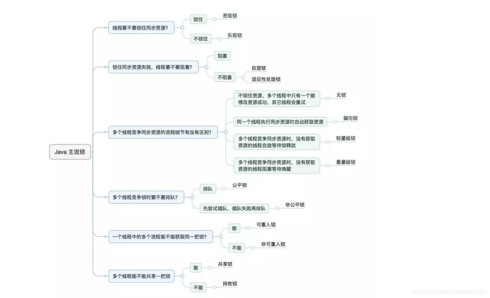

## 1. 乐观锁 VS 悲观锁[#](https://www.cnblogs.com/jyroy/p/11365935.html#idx_0)

乐观锁与悲观锁是一种广义上的概念，体现了看待线程同步的不同角度。在Java和数据库中都有此概念对应的实际应用。

先说概念。对于同一个数据的并发操作，悲观锁认为自己在使用数据的时候一定有别的线程来修改数据，因此在获取数据的时候会先加锁，确保数据不会被别的线程修改。Java中，synchronized关键字和Lock的实现类都是悲观锁。

而乐观锁认为自己在使用数据时不会有别的线程修改数据，所以不会添加锁，只是在更新数据的时候去判断之前有没有别的线程更新了这个数据。如果这个数据没有被更新，当前线程将自己修改的数据成功写入。如果数据已经被其他线程更新，则根据不同的实现方式执行不同的操作（例如报错或者自动重试）。

乐观锁在Java中是通过使用无锁编程来实现，最常采用的是CAS算法，Java原子类中的递增操作就通过CAS自旋实现的。

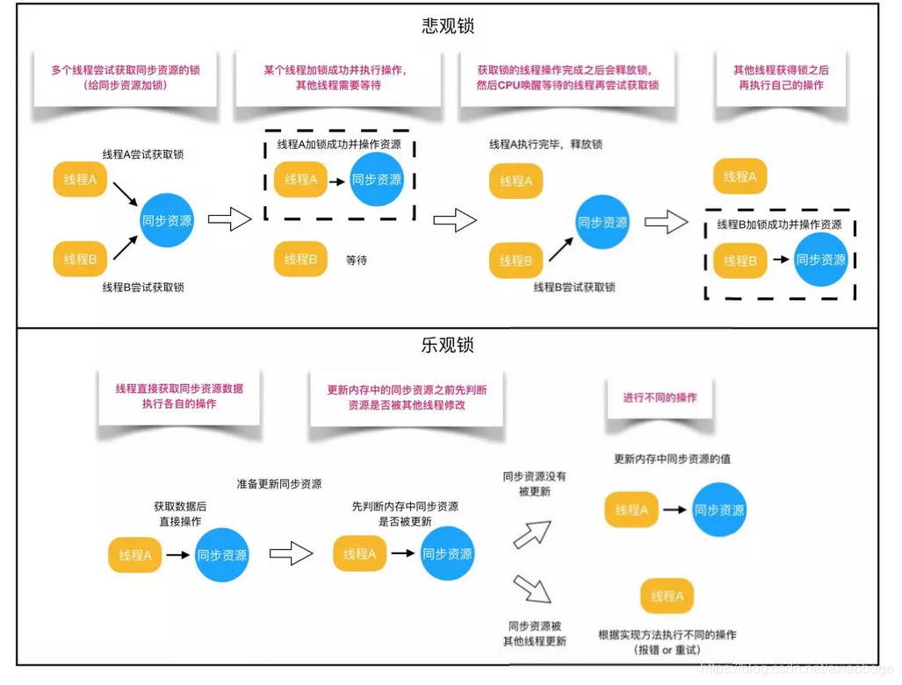

 

根据从上面的概念描述我们可以发现：

- 悲观锁适合写操作多的场景，先加锁可以保证写操作时数据正确。
- 乐观锁适合读操作多的场景，不加锁的特点能够使其读操作的性能大幅提升。

光说概念有些抽象，我们来看下乐观锁和悲观锁的调用方式示例：

 

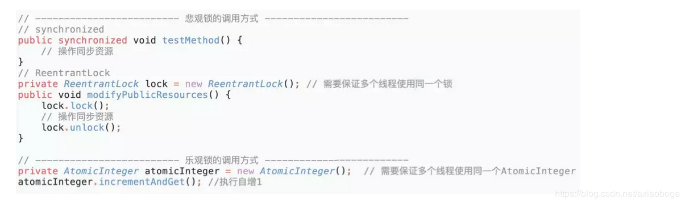

通过调用方式示例，我们可以发现悲观锁基本都是在显式的锁定之后再操作同步资源，而乐观锁则直接去操作同步资源。那么，为何乐观锁能够做到不锁定同步资源也可以正确的实现线程同步呢？我们通过介绍乐观锁的主要实现方式 “CAS” 的技术原理来为大家解惑。

CAS全称 Compare And Swap（比较与交换），是一种无锁算法。在不使用锁（没有线程被阻塞）的情况下实现多线程之间的变量同步。java.util.concurrent包中的原子类就是通过CAS来实现了乐观锁。

CAS算法涉及到三个操作数：

- 需要读写的内存值 V。
- 进行比较的值 A。
- 要写入的新值 B。

当且仅当 V 的值等于 A 时，CAS通过原子方式用新值B来更新V的值（“比较+更新”整体是一个原子操作），否则不会执行任何操作。一般情况下，“更新”是一个不断重试的操作。

之前提到java.util.concurrent包中的原子类，就是通过CAS来实现了乐观锁，那么我们进入原子类AtomicInteger的源码，看一下AtomicInteger的定义：

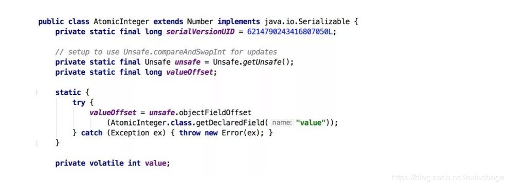

 

根据定义我们可以看出各属性的作用：

- unsafe： 获取并操作内存的数据。
- valueOffset： 存储value在AtomicInteger中的偏移量。
- value： 存储AtomicInteger的int值，该属性需要借助volatile关键字保证其在线程间是可见的。

接下来，我们查看AtomicInteger的自增函数incrementAndGet()的源码时，发现自增函数底层调用的是unsafe.getAndAddInt()。但是由于JDK本身只有Unsafe.class，只通过class文件中的参数名，并不能很好的了解方法的作用，所以我们通过OpenJDK 8 来查看Unsafe的源码：

 

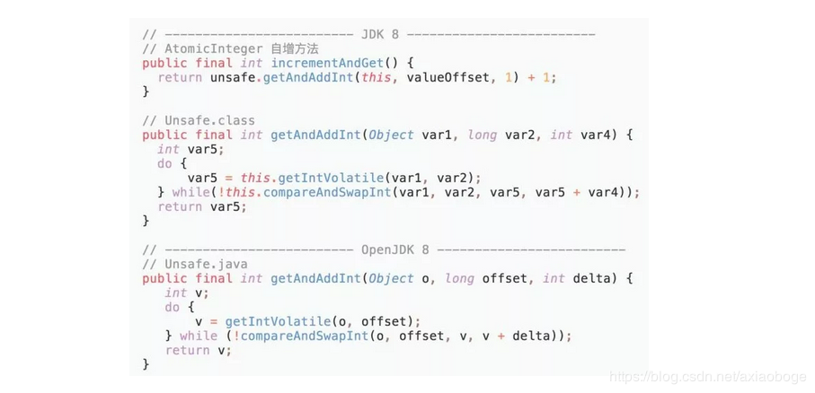

根据OpenJDK 8的源码我们可以看出，getAndAddInt()循环获取给定对象o中的偏移量处的值v，然后判断内存值是否等于v。如果相等则将内存值设置为 v + delta，否则返回false，继续循环进行重试，直到设置成功才能退出循环，并且将旧值返回。整个“比较+更新”操作封装在compareAndSwapInt()中，在JNI里是借助于一个CPU指令完成的，属于原子操作，可以保证多个线程都能够看到同一个变量的修改值。

后续JDK通过CPU的cmpxchg指令，去比较寄存器中的 A 和 内存中的值 V。如果相等，就把要写入的新值 B 存入内存中。如果不相等，就将内存值 V 赋值给寄存器中的值 A。然后通过Java代码中的while循环再次调用cmpxchg指令进行重试，直到设置成功为止。

CAS虽然很高效，但是它也存在三大问题，这里也简单说一下：

\1. ABA问题。CAS需要在操作值的时候检查内存值是否发生变化，没有发生变化才会更新内存值。但是如果内存值原来是A，后来变成了B，然后又变成了A，那么CAS进行检查时会发现值没有发生变化，但是实际上是有变化的。ABA问题的解决思路就是在变量前面添加版本号，每次变量更新的时候都把版本号加一，这样变化过程就从“A－B－A”变成了“1A－2B－3A”。

JDK从1.5开始提供了AtomicStampedReference类来解决ABA问题，具体操作封装在compareAndSet()中。compareAndSet()首先检查当前引用和当前标志与预期引用和预期标志是否相等，如果都相等，则以原子方式将引用值和标志的值设置为给定的更新值。

\2. 循环时间长开销大。CAS操作如果长时间不成功，会导致其一直自旋，给CPU带来非常大的开销。

\3. 只能保证一个共享变量的原子操作。对一个共享变量执行操作时，CAS能够保证原子操作，但是对多个共享变量操作时，CAS是无法保证操作的原子性的。

Java从1.5开始JDK提供了AtomicReference类来保证引用对象之间的原子性，可以把多个变量放在一个对象里来进行CAS操作。

## 2. 自旋锁 VS 适应性自旋锁[#](https://www.cnblogs.com/jyroy/p/11365935.html#idx_1)

在介绍自旋锁前，我们需要介绍一些前提知识来帮助大家明白自旋锁的概念。

阻塞或唤醒一个Java线程需要操作系统切换CPU状态来完成，这种状态转换需要耗费处理器时间。如果同步代码块中的内容过于简单，状态转换消耗的时间有可能比用户代码执行的时间还要长。

在许多场景中，同步资源的锁定时间很短，为了这一小段时间去切换线程，线程挂起和恢复现场的花费可能会让系统得不偿失。如果物理机器有多个处理器，能够让两个或以上的线程同时并行执行，我们就可以让后面那个请求锁的线程不放弃CPU的执行时间，看看持有锁的线程是否很快就会释放锁。

而为了让当前线程“稍等一下”，我们需让当前线程进行自旋，如果在自旋完成后前面锁定同步资源的线程已经释放了锁，那么当前线程就可以不必阻塞而是直接获取同步资源，从而避免切换线程的开销。这就是自旋锁。

 

 

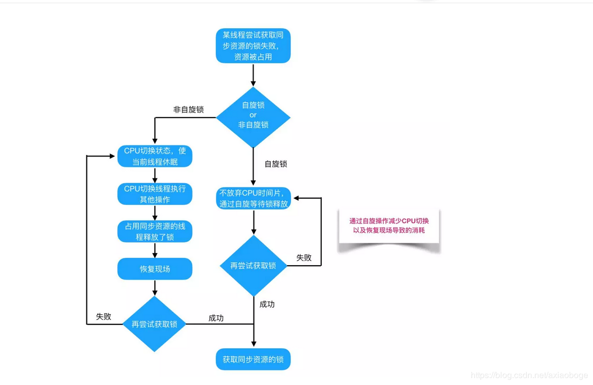

自旋锁本身是有缺点的，它不能代替阻塞。自旋等待虽然避免了线程切换的开销，但它要占用处理器时间。如果锁被占用的时间很短，自旋等待的效果就会非常好。反之，如果锁被占用的时间很长，那么自旋的线程只会白浪费处理器资源。所以，自旋等待的时间必须要有一定的限度，如果自旋超过了限定次数（默认是10次，可以使用-XX:PreBlockSpin来更改）没有成功获得锁，就应当挂起线程。

自旋锁的实现原理同样也是CAS，AtomicInteger中调用unsafe进行自增操作的源码中的do-while循环就是一个自旋操作，如果修改数值失败则通过循环来执行自旋，直至修改成功。

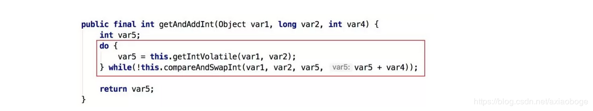

自旋锁在JDK1.4.2中引入，使用-XX:+UseSpinning来开启。JDK 6中变为默认开启，并且引入了自适应的自旋锁（适应性自旋锁）。

自适应意味着自旋的时间（次数）不再固定，而是由前一次在同一个锁上的自旋时间及锁的拥有者的状态来决定。如果在同一个锁对象上，自旋等待刚刚成功获得过锁，并且持有锁的线程正在运行中，那么虚拟机就会认为这次自旋也是很有可能再次成功，进而它将允许自旋等待持续相对更长的时间。如果对于某个锁，自旋很少成功获得过，那在以后尝试获取这个锁时将可能省略掉自旋过程，直接阻塞线程，避免浪费处理器资源。

在自旋锁中 另有三种常见的锁形式:TicketLock、CLHlock和MCSlock，本文中仅做名词介绍，不做深入讲解，感兴趣的同学可以自行查阅相关资料。

## 3. 无锁 VS 偏向锁 VS 轻量级锁 VS 重量级锁[#](https://www.cnblogs.com/jyroy/p/11365935.html#idx_2)

这四种锁是指锁的状态，专门针对synchronized的。在介绍这四种锁状态之前还需要介绍一些额外的知识。

首先为什么Synchronized能实现线程同步？

在回答这个问题之前我们需要了解两个重要的概念：“Java对象头”、“Monitor”。

Java对象头

synchronized是悲观锁，在操作同步资源之前需要给同步资源先加锁，这把锁就是存在Java对象头里的，而Java对象头又是什么呢？

我们以Hotspot虚拟机为例，Hotspot的对象头主要包括两部分数据：Mark Word（标记字段）、Klass Pointer（类型指针）。

Mark Word：默认存储对象的HashCode，分代年龄和锁标志位信息。这些信息都是与对象自身定义无关的数据，所以Mark Word被设计成一个非固定的数据结构以便在极小的空间内存存储尽量多的数据。它会根据对象的状态复用自己的存储空间，也就是说在运行期间Mark Word里存储的数据会随着锁标志位的变化而变化。

Klass Point：对象指向它的类元数据的指针，虚拟机通过这个指针来确定这个对象是哪个类的实例。

Monitor

Monitor可以理解为一个同步工具或一种同步机制，通常被描述为一个对象。每一个Java对象就有一把看不见的锁，称为内部锁或者Monitor锁。

Monitor是线程私有的数据结构，每一个线程都有一个可用monitor record列表，同时还有一个全局的可用列表。每一个被锁住的对象都会和一个monitor关联，同时monitor中有一个Owner字段存放拥有该锁的线程的唯一标识，表示该锁被这个线程占用。

现在话题回到synchronized，synchronized通过Monitor来实现线程同步，Monitor是依赖于底层的操作系统的Mutex Lock（互斥锁）来实现的线程同步。

如同我们在自旋锁中提到的“阻塞或唤醒一个Java线程需要操作系统切换CPU状态来完成，这种状态转换需要耗费处理器时间。如果同步代码块中的内容过于简单，状态转换消耗的时间有可能比用户代码执行的时间还要长”。这种方式就是synchronized最初实现同步的方式，这就是JDK 6之前synchronized效率低的原因。这种依赖于操作系统Mutex Lock所实现的锁我们称之为“重量级锁”，JDK 6中为了减少获得锁和释放锁带来的性能消耗，引入了“偏向锁”和“轻量级锁”。

所以目前锁一共有4种状态，级别从低到高依次是：无锁、偏向锁、轻量级锁和重量级锁。锁状态只能升级不能降级。

通过上面的介绍，我们对synchronized的加锁机制以及相关知识有了一个了解，那么下面我们给出四种锁状态对应的的Mark Word内容，然后再分别讲解四种锁状态的思路以及特点：


无锁

无锁没有对资源进行锁定，所有的线程都能访问并修改同一个资源，但同时只有一个线程能修改成功。

无锁的特点就是修改操作在循环内进行，线程会不断的尝试修改共享资源。如果没有冲突就修改成功并退出，否则就会继续循环尝试。如果有多个线程修改同一个值，必定会有一个线程能修改成功，而其他修改失败的线程会不断重试直到修改成功。上面我们介绍的CAS原理及应用即是无锁的实现。无锁无法全面代替有锁，但无锁在某些场合下的性能是非常高的。

偏向锁

偏向锁是指一段同步代码一直被一个线程所访问，那么该线程会自动获取锁，降低获取锁的代价。

在大多数情况下，锁总是由同一线程多次获得，不存在多线程竞争，所以出现了偏向锁。其目标就是在只有一个线程执行同步代码块时能够提高性能。

当一个线程访问同步代码块并获取锁时，会在Mark Word里存储锁偏向的线程ID。在线程进入和退出同步块时不再通过CAS操作来加锁和解锁，而是检测Mark Word里是否存储着指向当前线程的偏向锁。引入偏向锁是为了在无多线程竞争的情况下尽量减少不必要的轻量级锁执行路径，因为轻量级锁的获取及释放依赖多次CAS原子指令，而偏向锁只需要在置换ThreadID的时候依赖一次CAS原子指令即可。

偏向锁只有遇到其他线程尝试竞争偏向锁时，持有偏向锁的线程才会释放锁，线程不会主动释放偏向锁。偏向锁的撤销，需要等待全局安全点（在这个时间点上没有字节码正在执行），它会首先暂停拥有偏向锁的线程，判断锁对象是否处于被锁定状态。撤销偏向锁后恢复到无锁（标志位为“01”）或轻量级锁（标志位为“00”）的状态。

偏向锁在JDK 6及以后的JVM里是默认启用的。可以通过JVM参数关闭偏向锁：-XX:-UseBiasedLocking=false，关闭之后程序默认会进入轻量级锁状态。

轻量级锁

是指当锁是偏向锁的时候，被另外的线程所访问，偏向锁就会升级为轻量级锁，其他线程会通过自旋的形式尝试获取锁，不会阻塞，从而提高性能。

在代码进入同步块的时候，如果同步对象锁状态为无锁状态（锁标志位为“01”状态，是否为偏向锁为“0”），虚拟机首先将在当前线程的栈帧中建立一个名为锁记录（Lock Record）的空间，用于存储锁对象目前的Mark Word的拷贝，然后拷贝对象头中的Mark Word复制到锁记录中。

拷贝成功后，虚拟机将使用CAS操作尝试将对象的Mark Word更新为指向Lock Record的指针，并将Lock Record里的owner指针指向对象的Mark Word。

如果这个更新动作成功了，那么这个线程就拥有了该对象的锁，并且对象Mark Word的锁标志位设置为“00”，表示此对象处于轻量级锁定状态。

如果轻量级锁的更新操作失败了，虚拟机首先会检查对象的Mark Word是否指向当前线程的栈帧，如果是就说明当前线程已经拥有了这个对象的锁，那就可以直接进入同步块继续执行，否则说明多个线程竞争锁。

若当前只有一个等待线程，则该线程通过自旋进行等待。但是当自旋超过一定的次数，或者一个线程在持有锁，一个在自旋，又有第三个来访时，轻量级锁升级为重量级锁。

重量级锁

升级为重量级锁时，锁标志的状态值变为“10”，此时Mark Word中存储的是指向重量级锁的指针，此时等待锁的线程都会进入阻塞状态。

整体的锁状态升级流程如下：


综上，偏向锁通过对比Mark Word解决加锁问题，避免执行CAS操作。而轻量级锁是通过用CAS操作和自旋来解决加锁问题，避免线程阻塞和唤醒而影响性能。重量级锁是将除了拥有锁的线程以外的线程都阻塞。

## 4. 公平锁 VS 非公平锁[#](https://www.cnblogs.com/jyroy/p/11365935.html#idx_3)

公平锁是指多个线程按照申请锁的顺序来获取锁，线程直接进入队列中排队，队列中的第一个线程才能获得锁。公平锁的优点是等待锁的线程不会饿死。缺点是整体吞吐效率相对非公平锁要低，等待队列中除第一个线程以外的所有线程都会阻塞，CPU唤醒阻塞线程的开销比非公平锁大。

非公平锁是多个线程加锁时直接尝试获取锁，获取不到才会到等待队列的队尾等待。但如果此时锁刚好可用，那么这个线程可以无需阻塞直接获取到锁，所以非公平锁有可能出现后申请锁的线程先获取锁的场景。非公平锁的优点是可以减少唤起线程的开销，整体的吞吐效率高，因为线程有几率不阻塞直接获得锁，CPU不必唤醒所有线程。缺点是处于等待队列中的线程可能会饿死，或者等很久才会获得锁。

直接用语言描述可能有点抽象，这里作者用从别处看到的一个例子来讲述一下公平锁和非公平锁。

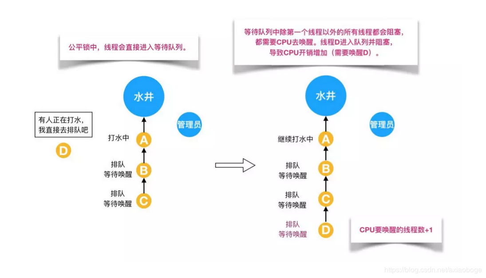

 

如上图所示，假设有一口水井，有管理员看守，管理员有一把锁，只有拿到锁的人才能够打水，打完水要把锁还给管理员。每个过来打水的人都要管理员的允许并拿到锁之后才能去打水，如果前面有人正在打水，那么这个想要打水的人就必须排队。管理员会查看下一个要去打水的人是不是队伍里排最前面的人，如果是的话，才会给你锁让你去打水；如果你不是排第一的人，就必须去队尾排队，这就是公平锁。

但是对于非公平锁，管理员对打水的人没有要求。即使等待队伍里有排队等待的人，但如果在上一个人刚打完水把锁还给管理员而且管理员还没有允许等待队伍里下一个人去打水时，刚好来了一个插队的人，这个插队的人是可以直接从管理员那里拿到锁去打水，不需要排队，原本排队等待的人只能继续等待。如下图所示：


接下来我们通过ReentrantLock的源码来讲解公平锁和非公平锁。

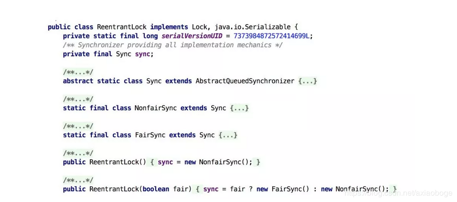

根据代码可知，ReentrantLock里面有一个内部类Sync，Sync继承AQS（AbstractQueuedSynchronizer），添加锁和释放锁的大部分操作实际上都是在Sync中实现的。它有公平锁FairSync和非公平锁NonfairSync两个子类。ReentrantLock默认使用非公平锁，也可以通过构造器来显示的指定使用公平锁。

下面我们来看一下公平锁与非公平锁的加锁方法的源码:

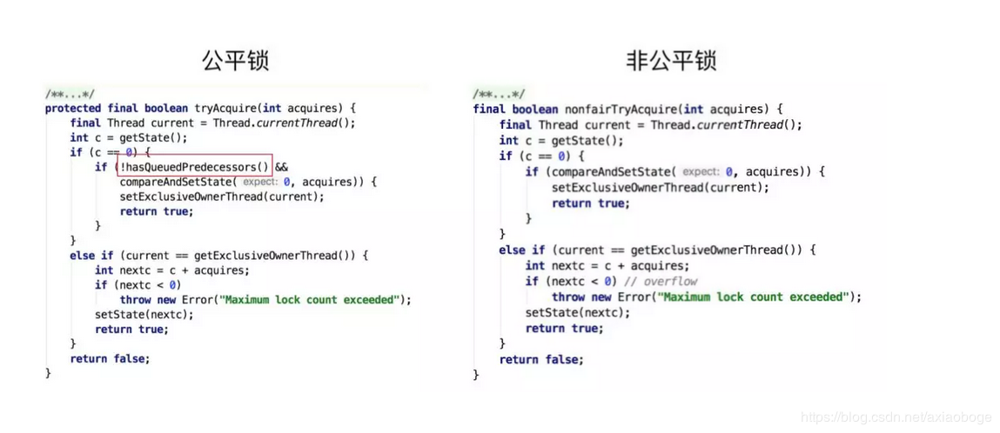

 

 

通过上图中的源代码对比，我们可以明显的看出公平锁与非公平锁的lock()方法唯一的区别就在于公平锁在获取同步状态时多了一个限制条件：hasQueuedPredecessors()。

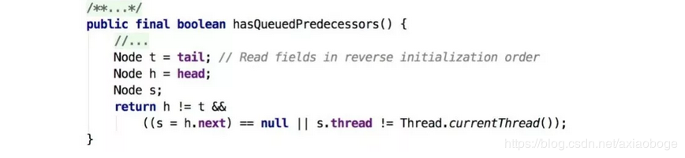

 

再进入hasQueuedPredecessors()，可以看到该方法主要做一件事情：主要是判断当前线程是否位于同步队列中的第一个。如果是则返回true，否则返回false。

综上，公平锁就是通过同步队列来实现多个线程按照申请锁的顺序来获取锁，从而实现公平的特性。非公平锁加锁时不考虑排队等待问题，直接尝试获取锁，所以存在后申请却先获得锁的情况。

## 5. 可重入锁 VS 非可重入锁[#](https://www.cnblogs.com/jyroy/p/11365935.html#idx_4)

可重入锁又名递归锁，是指在同一个线程在外层方法获取锁的时候，再进入该线程的内层方法会自动获取锁（前提锁对象得是同一个对象或者class），不会因为之前已经获取过还没释放而阻塞。Java中ReentrantLock和synchronized都是可重入锁，可重入锁的一个优点是可一定程度避免死锁。下面用示例代码来进行分析：

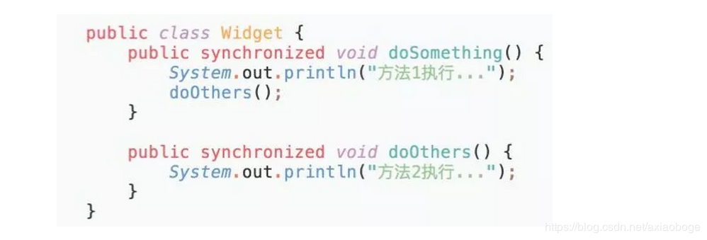

在上面的代码中，类中的两个方法都是被内置锁synchronized修饰的，doSomething()方法中调用doOthers()方法。因为内置锁是可重入的，所以同一个线程在调用doOthers()时可以直接获得当前对象的锁，进入doOthers()进行操作。

如果是一个不可重入锁，那么当前线程在调用doOthers()之前需要将执行doSomething()时获取当前对象的锁释放掉，实际上该对象锁已被当前线程所持有，且无法释放。所以此时会出现死锁。

而为什么可重入锁就可以在嵌套调用时可以自动获得锁呢？我们通过图示和源码来分别解析一下。

还是打水的例子，有多个人在排队打水，此时管理员允许锁和同一个人的多个水桶绑定。这个人用多个水桶打水时，第一个水桶和锁绑定并打完水之后，第二个水桶也可以直接和锁绑定并开始打水，所有的水桶都打完水之后打水人才会将锁还给管理员。这个人的所有打水流程都能够成功执行，后续等待的人也能够打到水。这就是可重入锁。

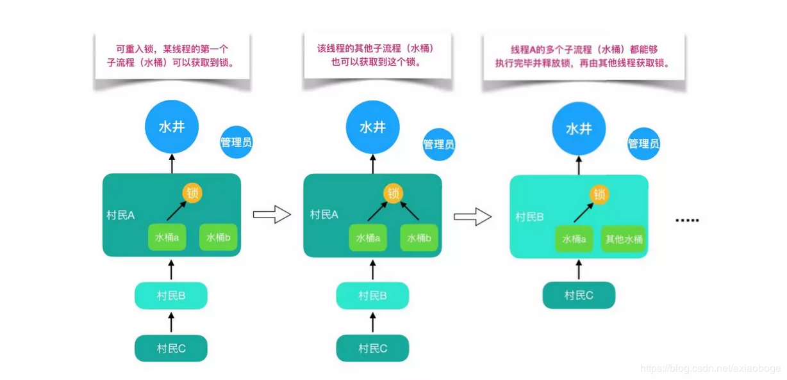

但如果是非可重入锁的话，此时管理员只允许锁和同一个人的一个水桶绑定。第一个水桶和锁绑定打完水之后并不会释放锁，导致第二个水桶不能和锁绑定也无法打水。当前线程出现死锁，整个等待队列中的所有线程都无法被唤醒。

 

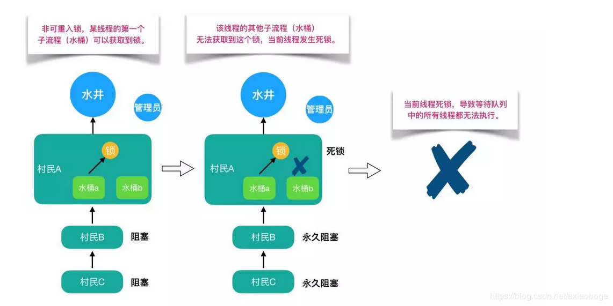

之前我们说过ReentrantLock和synchronized都是重入锁，那么我们通过重入锁ReentrantLock以及非可重入锁NonReentrantLock的源码来对比分析一下为什么非可重入锁在重复调用同步资源时会出现死锁。

首先ReentrantLock和NonReentrantLock都继承父类AQS，其父类AQS中维护了一个同步状态status来计数重入次数，status初始值为0。

当线程尝试获取锁时，可重入锁先尝试获取并更新status值，如果status == 0表示没有其他线程在执行同步代码，则把status置为1，当前线程开始执行。如果status != 0，则判断当前线程是否是获取到这个锁的线程，如果是的话执行status+1，且当前线程可以再次获取锁。而非可重入锁是直接去获取并尝试更新当前status的值，如果status != 0的话会导致其获取锁失败，当前线程阻塞。

释放锁时，可重入锁同样先获取当前status的值，在当前线程是持有锁的线程的前提下。如果status-1 == 0，则表示当前线程所有重复获取锁的操作都已经执行完毕，然后该线程才会真正释放锁。而非可重入锁则是在确定当前线程是持有锁的线程之后，直接将status置为0，将锁释放。

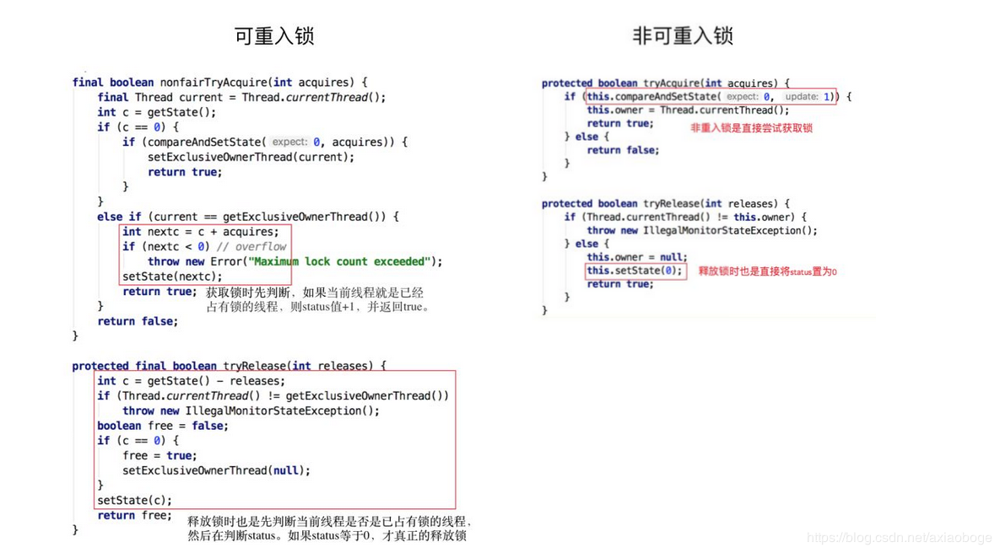

## 6. 独享锁 VS 共享锁[#](https://www.cnblogs.com/jyroy/p/11365935.html#idx_5)

独享锁和共享锁同样是一种概念。我们先介绍一下具体的概念，然后通过ReentrantLock和ReentrantReadWriteLock的源码来介绍独享锁和共享锁。

独享锁也叫排他锁，是指该锁一次只能被一个线程所持有。如果线程T对数据A加上排它锁后，则其他线程不能再对A加任何类型的锁。获得排它锁的线程即能读数据又能修改数据。JDK中的synchronized和JUC中Lock的实现类就是互斥锁。

共享锁是指该锁可被多个线程所持有。如果线程T对数据A加上共享锁后，则其他线程只能对A再加共享锁，不能加排它锁。获得共享锁的线程只能读数据，不能修改数据。

独享锁与共享锁也是通过AQS来实现的，通过实现不同的方法，来实现独享或者共享。

下图为ReentrantReadWriteLock的部分源码：

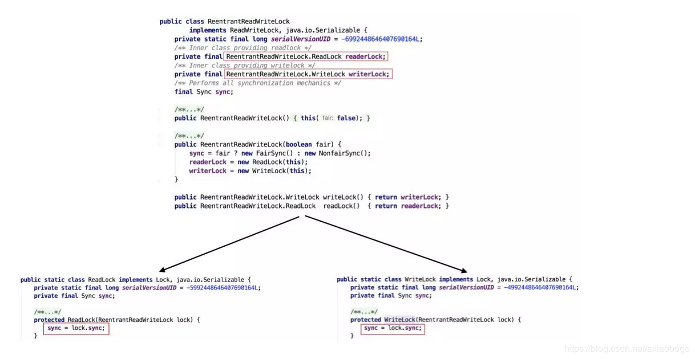

 

我们看到ReentrantReadWriteLock有两把锁：ReadLock和WriteLock，由词知意，一个读锁一个写锁，合称“读写锁”。再进一步观察可以发现ReadLock和WriteLock是靠内部类Sync实现的锁。Sync是AQS的一个子类，这种结构在CountDownLatch、ReentrantLock、Semaphore里面也都存在。

在ReentrantReadWriteLock里面，读锁和写锁的锁主体都是Sync，但读锁和写锁的加锁方式不一样。读锁是共享锁，写锁是独享锁。读锁的共享锁可保证并发读非常高效，而读写、写读、写写的过程互斥，因为读锁和写锁是分离的。所以ReentrantReadWriteLock的并发性相比一般的互斥锁有了很大提升。

那读锁和写锁的具体加锁方式有什么区别呢？在了解源码之前我们需要回顾一下其他知识。

在最开始提及AQS的时候我们也提到了state字段（int类型，32位），该字段用来描述有多少线程获持有锁。

在独享锁中这个值通常是0或者1（如果是重入锁的话state值就是重入的次数），在共享锁中state就是持有锁的数量。但是在ReentrantReadWriteLock中有读、写两把锁，所以需要在一个整型变量state上分别描述读锁和写锁的数量（或者也可以叫状态）。于是将state变量“按位切割”切分成了两个部分，高16位表示读锁状态（读锁个数），低16位表示写锁状态（写锁个数）。如下图所示：


了解了概念之后我们再来看代码，先看写锁的加锁源码：

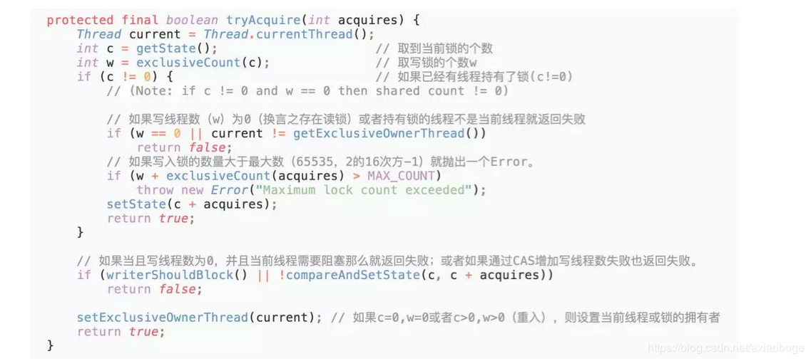

- 这段代码首先取到当前锁的个数c，然后再通过c来获取写锁的个数w。因为写锁是低16位，所以取低16位的最大值与当前的c做与运算（ int w = exclusiveCount(c); ），高16位和0与运算后是0，剩下的就是低位运算的值，同时也是持有写锁的线程数目。
- 在取到写锁线程的数目后，首先判断是否已经有线程持有了锁。如果已经有线程持有了锁（c!=0），则查看当前写锁线程的数目，如果写线程数为0（即此时存在读锁）或者持有锁的线程不是当前线程就返回失败（涉及到公平锁和非公平锁的实现）。
- 如果写入锁的数量大于最大数（65535，2的16次方-1）就抛出一个Error。
- 如果当且写线程数为0（那么读线程也应该为0，因为上面已经处理c!=0的情况），并且当前线程需要阻塞那么就返回失败；如果通过CAS增加写线程数失败也返回失败。
- 如果c=0，w=0或者c>0，w>0（重入），则设置当前线程或锁的拥有者，返回成功！

tryAcquire()除了重入条件（当前线程为获取了写锁的线程）之外，增加了一个读锁是否存在的判断。如果存在读锁，则写锁不能被获取，原因在于：必须确保写锁的操作对读锁可见，如果允许读锁在已被获取的情况下对写锁的获取，那么正在运行的其他读线程就无法感知到当前写线程的操作。

因此，只有等待其他读线程都释放了读锁，写锁才能被当前线程获取，而写锁一旦被获取，则其他读写线程的后续访问均被阻塞。写锁的释放与ReentrantLock的释放过程基本类似，每次释放均减少写状态，当写状态为0时表示写锁已被释放，然后等待的读写线程才能够继续访问读写锁，同时前次写线程的修改对后续的读写线程可见。

接着是读锁的代码：

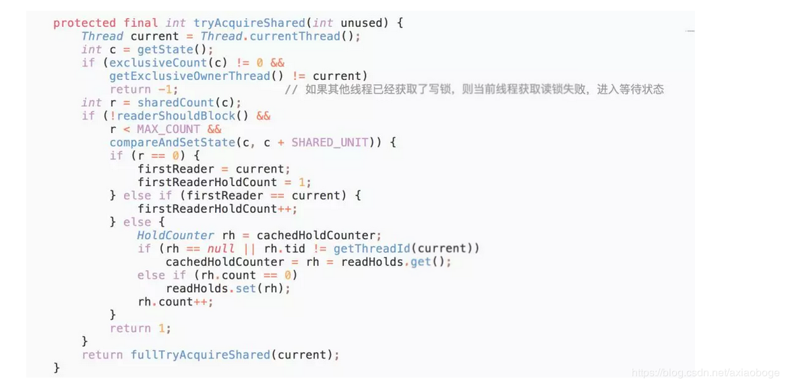

可以看到在tryAcquireShared(int unused)方法中，如果其他线程已经获取了写锁，则当前线程获取读锁失败，进入等待状态。如果当前线程获取了写锁或者写锁未被获取，则当前线程（线程安全，依靠CAS保证）增加读状态，成功获取读锁。读锁的每次释放（线程安全的，可能有多个读线程同时释放读锁）均减少读状态，减少的值是“1<<16”。所以读写锁才能实现读读的过程共享，而读写、写读、写写的过程互斥。

此时，我们再回头看一下互斥锁ReentrantLock中公平锁和非公平锁的加锁源码：

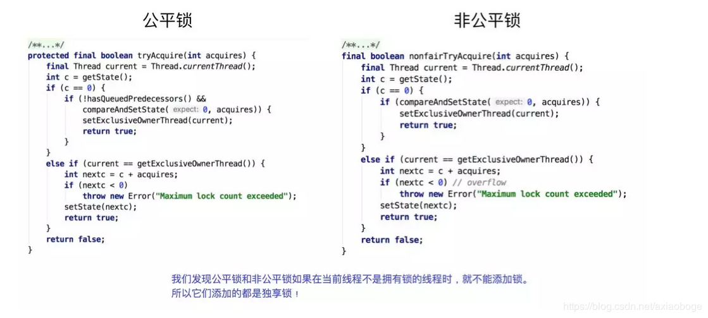

 

我们发现在ReentrantLock虽然有公平锁和非公平锁两种，但是它们添加的都是独享锁。根据源码所示，当某一个线程调用lock方法获取锁时，如果同步资源没有被其他线程锁住，那么当前线程在使用CAS更新state成功后就会成功抢占该资源。而如果公共资源被占用且不是被当前线程占用，那么就会加锁失败。所以可以确定ReentrantLock无论读操作还是写操作，添加的锁都是都是独享锁。