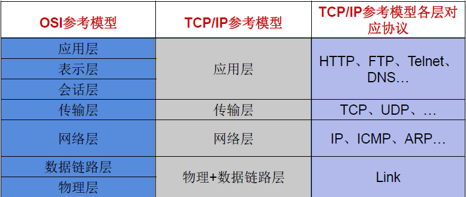
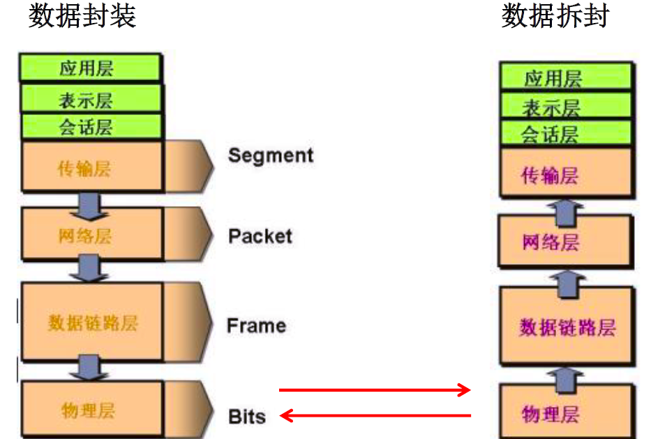
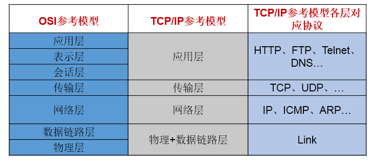
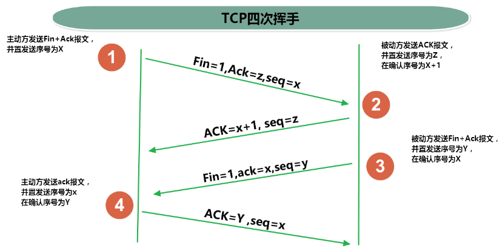
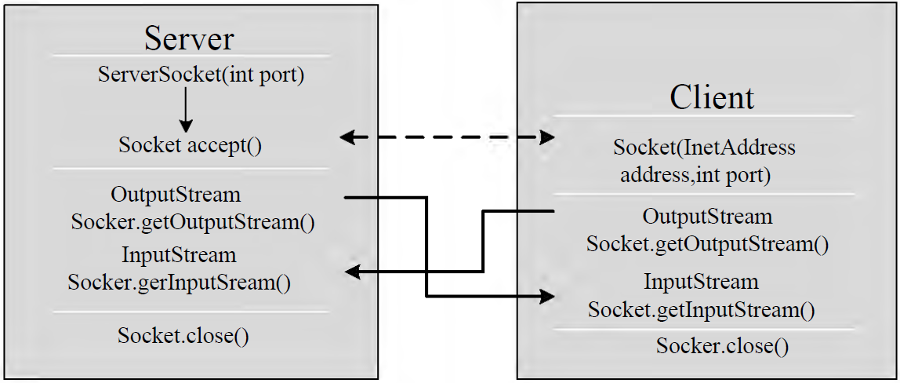

# Java网络编程

# 一、概述

1. 计算机网络：
   - 把分布在不同地理区域的计算机与专门的外部设备用通信线路互连成一个规模大、功能强的网络系统，从而使众多的计算机可以方便地互相传递信息共享硬件、软件、数据信息等资源。
2. 网络编程的目的: 直接或间接地通过网络协议与其它计算机实现数据交换，进行通讯
3. 实现网络通信需要解决的两个问题:
   - 如何准确地定位网络上一台或多台主机；定位主机上的特定的应用
   - 找到主机后如何可靠高效地进行数据传输

# 二、网络通信要素

- 解决问题一：IP和端口号
- 解决问题二：提供网络通信协议：TCP/IP参考模型（应用层、传输层、网络层、物理+数据链路层）

## **1.网络通讯协议**



## **2.通讯过程**



## 3.  IP和端口号

### 3.1  IP

- IP:唯一的标识 Internet 上的计算机（通信实体）
- 在Java中使用InetAddress类代表IP
- IP分类：IPv4 和 IPv6 ; 万维网 和 局域网
- 域名: 通过域名解析服务器将域名解析为IP地址 www.baidu.com www.mi.com www.jd.com

- 域名解析：域名容易记忆，当在连接网络时输入一个主机的域名后，域名服务器(DNS)负责将域名转化成IP地址，这样才能和主机建立连接。
- 本地回路地址：127.0.0.1 对应着：localhost

### 3.2 端口号

用于标识正在计算机上运行的进程。

- 要求：不同的进程不同的端口号
- 范围：被规定为一个 16 位的整数 0~65535。
- 分类：
  - 公认端口：0~1023.被预先定义的服务通信占用（如：HTTP占用端口80，FTP占用端口21，TeInet占用端口23）。
  - 注册端口：1024~49151.分配给用户进程或应用程序。（如：Tomcat占用端口8080，MSQL占用端口3306，Oracle占用端口1521等）。
  - 动态私有端口：49152~65535。

### 3.3 InetAddress类

此类的一个对象就代表着一个具体的IP地址

#### 3.2.1实例化

getByName(String host) /getLocalHost()

#### 3.2.2常用方法

getHostName() / getHostAddress()


```java
public class InetAddressTest {
    public static void main(String[] args) {
        try {
            //File file = new File("hello.txt");
            InetAddress inet1 = InetAddress.getByName("192.168.10.14");

            System.out.println(inet1);

            InetAddress inet2 = InetAddress.getByName("www.baidu.com");
            System.out.println(inet2);

            InetAddress inet3 = InetAddress.getByName("127.0.0.1");
            System.out.println(inet3);

            //获取本地ip
            InetAddress inet4 = InetAddress.getLocalHost();
            System.out.println(inet4);

            //getHostName()
            System.out.println(inet2.getHostName());
            //getHostAddress()
            System.out.println(inet2.getHostAddress());

        } catch (UnknownHostException e) {
            e.printStackTrace();
        }
    }
```

## 4. 通信要素二：网络通信协议

### 4.1分层模型



### 4.2 TCP和UDP的区别

**TCP协议**：

- 使用TCP协议前，须先建立TCP连接，形成传输数据通道
- 传输前，采用“三次握手”方式，点对点通信，是可靠的
- TCP协议进行通信的两个应用进程：客户端、服务端。
- 在连接中可进行大数据量的传输
- 传输完毕，需释放已建立的连接，效率低

**UDP协议：**

- 将数据、源、目的封装成数据包，不需要建立连接
- 每个数据报的大小限制在64K内
- 发送不管对方是否准备好，接收方收到也不确认，故是不可靠的
- 可以广播发送
- 发送数据结束时无需释放资源，开销小，速度快

### 4.3 TCP三次握手和四次挥手




## 5. 套接字Socket

端口号与IP地址的组合得出一个网络套接字：Socket

- 利用套接字(Socket)开发网络应用程序早已被广泛的采用，以至于成为事实上的标准。
- 网络上具有唯一标识的P地址和端口号组合在一起才能构成唯一能识别的标识符套接字。
- 通信的两端都要有 Socket，是两台机器间通信的端点。
- 网络通信其实就是 Socket间的通信
- Socket允许程序把网络连接当成一个流，数据在两个Socket间通过IO传输。
- 一般主动发起通信的应用程序属客户端，等待通信请求的为服务端
- Socket分类
  - 流套接字(stream socket)：使用TCP提供可依赖的字节流服务
  - 数据报套接字(datagram socket)：使用UDP提供“尽力而为”的数据报服务


# 三、TCP网络编程

Java语言的基于套接字Socket编程分为客户端和服务端

**基于TCP的Socket通信模型**



## 1.基于Socke的TCP编程

### 1.1客户端Socket的工作过程

- 创建Socket：根据指定服务端的P地址或端口号构造Sσcket类对象。若服务器端响应，则建立客户端到服务器的通信线路。若连接失败，会出现异常。
- 打开连接到 Socket的输入出流：使用getInputstream()方法获得输入流，使用getOutputStream()方法获得输出流，进行数据传输
- 按照一定的协议对Socket进行读/写操作：通过输入流读取服务器放入线路的信息（但不能读取自己放入线路的信息），通过输出流将信息写入线程
- 关闭 Socket：断开客户端到服务器的连接，释放线路

**说明**：

- 客户端程序可以使用Socket类创建对象，创建的同时会自动向服务器方发起连接。
- Socket的构造器是：
  - Socket(String host，int port) throws UnknownHostException，EXCeption：向服务器（域名是host,端口号为port）发起TCP连接，若成功，则创建Socket对象，否则抛出异常。
  - Socket(InetAddress address，int port)throws IOException：根据InetAddress对象所表示的IP地址以及端口号port发起连接
- 客户端建立 socketAtClient对象的过程就是向服务器发出套接字连接请求

### 1.2 服务器端Socket的工作过程：

- 调用ServerSocket(int port)：创建一个服务器端套接字，并绑定到指定端口上。用于监听客户端的请求。
- 调用accept0()：监听连接请求，如果客户端请求连接，则接受连接，返回通信套接字对象。
- 调用该Socket类对象的getOutputStream()和getInputStream()：获取输出流和输入流，开始网络数据的发送和接收。
- 关闭 ServerSocket和Socket对象：客户端访问结束，关闭通信套接字。

**说明：**

- ServerSocket对象负责等待客户端请求建立套接字连接，类似邮局某个窗口中的业务员。也就是说，服务器必须事先建立一个等待客户请求建立套接字连接的 Server Socket对象。
- 所谓“接收”客户的套接字请求，就是 accept()方法会返回一个Socket对象

### 1.3 代码示例

例子1：客户端发送信息给服务端，服务端将数据显示在控制台上

```java
public class TCPTest1 {

    //客户端
    @Test
    public void client()  {
        Socket socket = null;
        OutputStream os = null;
        try {
            //1.创建Socket对象，指明服务器端的ip和端口号
            InetAddress inet = InetAddress.getByName("192.168.14.100");
            socket = new Socket(inet,8899);
            //2.获取一个输出流，用于输出数据
            os = socket.getOutputStream();
            //3.写出数据的操作
            os.write("你好，我是客户端mm".getBytes());
        } catch (IOException e) {
            e.printStackTrace();
        } finally {
            //4.资源的关闭
            if(os != null){
                try {
                    os.close();
                } catch (IOException e) {
                    e.printStackTrace();
                }

            }
            if(socket != null){
                try {
                    socket.close();
                } catch (IOException e) {
                    e.printStackTrace();
                }

            }
        }
    }
    
    //服务端
    @Test
    public void server()  {

        ServerSocket ss = null;
        Socket socket = null;
        InputStream is = null;
        ByteArrayOutputStream baos = null;
        try {
            //1.创建服务器端的ServerSocket，指明自己的端口号
            ss = new ServerSocket(8899);
            //2.调用accept()表示接收来自于客户端的socket
            socket = ss.accept();
            //3.获取输入流
            is = socket.getInputStream();

            //不建议这样写，可能会有乱码
            //        byte[] buffer = new byte[1024];
            //        int len;
            //        while((len = is.read(buffer)) != -1){
            //            String str = new String(buffer,0,len);
            //            System.out.print(str);
            //        }
            //4.读取输入流中的数据
            baos = new ByteArrayOutputStream();
            byte[] buffer = new byte[5];
            int len;
            while((len = is.read(buffer)) != -1){
                baos.write(buffer,0,len);
            }

            System.out.println(baos.toString());

            System.out.println("收到了来自于：" + socket.getInetAddress().getHostAddress() + "的数据");

        } catch (IOException e) {
            e.printStackTrace();
        } finally {
            if(baos != null){
                //5.关闭资源
                try {
                    baos.close();
                } catch (IOException e) {
                    e.printStackTrace();
                }
            }
            if(is != null){
                try {
                    is.close();
                } catch (IOException e) {
                    e.printStackTrace();
                }
            }
            if(socket != null){
                try {
                    socket.close();
                } catch (IOException e) {
                    e.printStackTrace();
                }
            }
            if(ss != null){
                try {
                    ss.close();
                } catch (IOException e) {
                    e.printStackTrace();
                }
            }

        }
   }
}
```

例题2：客户端发送文件给服务端，服务端将文件保存在本地。

```java
public class TCPTest2 {

    /*
    这里涉及到的异常，应该使用try-catch-finally处理
     */
    @Test
    public void client() throws IOException {
        //1.
        Socket socket = new Socket(InetAddress.getByName("127.0.0.1"),9090);
        //2.
        OutputStream os = socket.getOutputStream();
        //3.
        FileInputStream fis = new FileInputStream(new File("beauty.jpg"));
        //4.
        byte[] buffer = new byte[1024];
        int len;
        while((len = fis.read(buffer)) != -1){
            os.write(buffer,0,len);
        }
        //5.
        fis.close();
        os.close();
        socket.close();
    }

    /*
    这里涉及到的异常，应该使用try-catch-finally处理
     */
    @Test
    public void server() throws IOException {
        //1.
        ServerSocket ss = new ServerSocket(9090);
        //2.
        Socket socket = ss.accept();
        //3.
        InputStream is = socket.getInputStream();
        //4.
        FileOutputStream fos = new FileOutputStream(new File("beauty1.jpg"));
        //5.
        byte[] buffer = new byte[1024];
        int len;
        while((len = is.read(buffer)) != -1){
            fos.write(buffer,0,len);
        }
        //6.
        fos.close();
        is.close();
        socket.close();
        ss.close();

    }
}
```

例题3：从客户端发送文件给服务端，服务端保存到本地。并返回“发送成功”给客户端。

```java
public class TCPTest3 {

    /*
        这里涉及到的异常，应该使用try-catch-finally处理
         */
    @Test
    public void client() throws IOException {
        //1.
        Socket socket = new Socket(InetAddress.getByName("127.0.0.1"),9090);
        //2.
        OutputStream os = socket.getOutputStream();
        //3.
        FileInputStream fis = new FileInputStream(new File("beauty.jpg"));
        //4.
        byte[] buffer = new byte[1024];
        int len;
        while((len = fis.read(buffer)) != -1){
            os.write(buffer,0,len);
        }
        //关闭数据的输出
        socket.shutdownOutput();

        //5.接收来自于服务器端的数据，并显示到控制台上
        InputStream is = socket.getInputStream();
        ByteArrayOutputStream baos = new ByteArrayOutputStream();
        byte[] bufferr = new byte[20];
        int len1;
        while((len1 = is.read(buffer)) != -1){
            baos.write(buffer,0,len1);
        }

        System.out.println(baos.toString());

        //6.
        fis.close();
        os.close();
        socket.close();
        baos.close();
    }

    /*
    这里涉及到的异常，应该使用try-catch-finally处理
     */
    @Test
    public void server() throws IOException {
        //1.
        ServerSocket ss = new ServerSocket(9090);
        //2.
        Socket socket = ss.accept();
        //3.
        InputStream is = socket.getInputStream();
        //4.
        FileOutputStream fos = new FileOutputStream(new File("beauty2.jpg"));
        //5.
        byte[] buffer = new byte[1024];
        int len;
        while((len = is.read(buffer)) != -1){
            fos.write(buffer,0,len);
        }

        System.out.println("图片传输完成");

        //6.服务器端给予客户端反馈
        OutputStream os = socket.getOutputStream();
        os.write("你好，美女，照片我已收到，非常漂亮！".getBytes());

        //7.
        fos.close();
        is.close();
        socket.close();
        ss.close();
        os.close();

    }
}
```

# 四、UDP网络编程

## 1. 简述

- 类DatagramSocket和DatagramPacket实现了基于UDP协议网络程序。
- UDP数据报通过数据报套接字DatagramSocket发送和接收，系统不保证UDP数据报一定能够安全送到目的地，也不能确定什么时候可以抵达。
- DatagramPacket对象封装了UDP数据报，在数据报中包含了发送端的IP地址和端口号以及接收端的IP地址和端口号
- UDP协议中每个数据报都给出了完整的地址信息，因此无须建立发送方和接收方的连接。如同发快递包裹一样。

## 2. DatagramSocket类常用方法


## 3. DatagramSocket类的使用

流程：

1. DatagramSocket与DatagramPacket
2. 建立发送端，接收端
3. 建立数据包
4. 调用 Socket的发送、接收方法
5. 关闭 Socket

注意：发送端与接收端是两个独立的运行程序

**代码示例：**

```java
public class UDPTest {

    //发送端
    @Test
    public void sender() throws IOException {

        DatagramSocket socket = new DatagramSocket();


        String str = "我是UDP方式发送的导弹";
        byte[] data = str.getBytes();
        InetAddress inet = InetAddress.getLocalHost();
        DatagramPacket packet = new DatagramPacket(data,0,data.length,inet,9090);

        socket.send(packet);

        socket.close();

    }
    //接收端
    @Test
    public void receiver() throws IOException {

        DatagramSocket socket = new DatagramSocket(9090);

        byte[] buffer = new byte[100];
        DatagramPacket packet = new DatagramPacket(buffer,0,buffer.length);

        socket.receive(packet);

        System.out.println(new String(packet.getData(),0,packet.getLength()));

        socket.close();
    }
}
```

# 五、URL编程

- URL(Uniform Resource Locator)：统一资源定位符，它表示Internet上某一资源的地址。
- 它是一种具体的URI，即URL可以用来标识一个资源，而且还指明了如何locate这个资源。
- 通过URL我们可以访问 Internet上的各种网络资源，比如最常见的www，ftp站点。浏览器通过解析给定的URL可以在网络上查找相应的文件或其他资源
- URL的基本结构由5部分组成: <传输协议>：//<主机名>：<端口号>/<文件名>#片段名？参数列表 例如： http://192.168.1.100:8080/helloworld/indexjsp#a?username=shkstart&password=123 #片段名：即锚点，例如看小说，直接定位到章节 参数列表格式：参数名=参数值&参数名=参数值...

## 1. URL类

### 1.1 构造器

为了表示URL，java.net中实现了类URL。我们可以通过下面的构造器来初始化一个URL对象

- public URL(String spec)：通过一个表示URL地址的字符串可以构造一个URL对象。 例如：URL url = new URL（"http://www.baidu.com/");
- public URL(URL context,String spec）：通过基URL和相对URL构造一个URL对象 例如： URL downloadeUrl = new URL（url,"download.html");
- public URL(String protocol,String host,String file); 例如：new URL("http","www.baidu.com",80,"download.html");
- public URL(String protocol,String host,int port,String file); 例如：new URL("http","www.baidu.com",80,"download.html");

注意：URL类的构造器都声明抛出非运行时异常，必须要对这一异常进行处理，通常是用try-catch语句进行捕获。

### 1.2 方法

- public String getProtocol( ) 获取该URL的协议名
- public String getHost( ) 获取该URL的主机名
- public String getPort( ) 获取该URL的端口号
- public String getPath( ) 获取该URL的文件路径
- public String getFile( ) 获取该URL的文件名
- public String getQuery( ) 获取该URL的查询名

**代码示例**

```java
public class URLTest {

    public static void main(String[] args) {

        try {

            URL url = new URL("http://localhost:8080/examples/beauty.jpg?username=Tom");

//            public String getProtocol(  )     获取该URL的协议名
            System.out.println(url.getProtocol());
//            public String getHost(  )           获取该URL的主机名
            System.out.println(url.getHost());
//            public String getPort(  )            获取该URL的端口号
            System.out.println(url.getPort());
//            public String getPath(  )           获取该URL的文件路径
            System.out.println(url.getPath());
//            public String getFile(  )             获取该URL的文件名
            System.out.println(url.getFile());
//            public String getQuery(   )        获取该URL的查询名
            System.out.println(url.getQuery());
        } catch (MalformedURLException e) {
            e.printStackTrace();
        }

    }
}
```

例子：通过URL下载

```java
public class URLTest1 {

    public static void main(String[] args) {

        HttpURLConnection urlConnection = null;
        InputStream is = null;
        FileOutputStream fos = null;
        try {
            URL url = new URL("http://localhost:8080/examples/beauty.jpg");

            urlConnection = (HttpURLConnection) url.openConnection();

            urlConnection.connect();

            is = urlConnection.getInputStream();
            fos = new FileOutputStream("beauty3.jpg");

            byte[] buffer = new byte[1024];
            int len;
            while((len = is.read(buffer)) != -1){
                fos.write(buffer,0,len);
            }

            System.out.println("下载完成");
        } catch (IOException e) {
            e.printStackTrace();
        } finally {
            //关闭资源
            if(is != null){
                try {
                    is.close();
                } catch (IOException e) {
                    e.printStackTrace();
                }
            }
            if(fos != null){
                try {
                    fos.close();
                } catch (IOException e) {
                    e.printStackTrace();
                }
            }
            if(urlConnection != null){
                urlConnection.disconnect();
            }
        }
    }
}
```