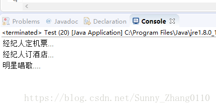
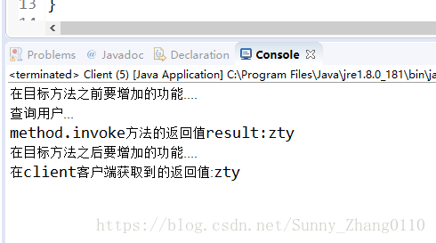
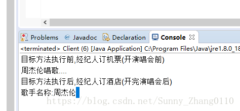

# 代理模式

**什么是代理模式?应用场景**

对原有的模块的功能进行扩展(增加或者增强功能),而又不想修改模块代码,可以考虑使用代理模式

**代理模式三种:**

## 一、JDK静态代理

核心作用:

​    通过代理,控制对象访问,可以再调用目标之前,增强某些功能

实现:

   静态代理需要定义接口或者父类,被代理的对象和代理对象共同实现相同的接口或者是继承相同的父类

   代理对象需要维护一个被代理对象的引用

简单的例子:

   被代理对象(委托对象):明星(周杰伦)

   代理对象:周杰伦的经纪人

```java
//接口
public interface Base {
	void doSomething();
}
```

```java
//明星类
public class Star implements Base{
	@Override
	public void doSomething() {
		System.out.println("明星唱歌....");
	}
}
```

```java
public class Agent implements Base{
	//代理类维护一个委托类的引用
	private Star star = new Star();
	@Override
	public void doSomething() {
		//经纪人附加功能
		System.out.println("经纪人定机票...");
		System.out.println("经纪人订酒店...");
		//经纪人调用star唱歌功能
		star.doSomething();
	}
}
```

```java
public class Test {
	public static void main(String[] args) {
		Agent ag = new Agent();
		ag.doSomething();
	}
}
```



明星唱歌的功能被经纪人扩展了,增强了,可以定机票订酒店,经纪人调用明星去唱歌,所有业务都是经纪人来洽谈,明星只负责唱歌

原则:

代理类和委托类行为相似(实现同一个接口)

代理增强了委托类的行为(代理类拥有委托类的实例)

缺点:

因为代理对象需要与目标对象实现一样的接口,所以会有很多代理类,类太多.同时,一旦接口增加方法,目标对象与代理对象都要维护(都需要实现相同的方法)


## 二、JDK动态代理

**运行的时候, 动态生成代理**

**实现:**

  **Java.lang.reflect.Proxy:**

  **作用:生成代理类和对象**

  **Java.lang.reflect.InvocationHandler(处理器接口):**

  **可以通过invoke方法对目标进行调用**

**JDK实现代理只需要使用newProxyInstance方法,但是该方法需要接收三个参数,完整的写法是:**

**static Object newProxyInstance(ClassLoader loader, Class<?>[] interfaces,InvocationHandler h )**

**注意该方法是在Proxy类中是静态方法,且接收的三个参数依次为:**

  **1.ClassLoader loader,:指定当前目标对象使用类加载器,获取加载器的方法是固定的**

  **2.Class<?>[] interfaces,:目标对象实现的接口的类型,使用泛型方式确认类型**

  **3.InvocationHandler h:事件处理,执行目标对象的方法时,会触发事件处理器的方法,会把当前执行目标对象的方法作为参数传入**

**注意:jdk动态代理要求委托类必须有接口.但是不要求代理类实现为委托类的接口**

**jdk动态代理**

   **1.委托类(目标对象)必须要有接口**

   **2.代理类不需要和委托类实现相同的接口 或者代理工厂实现InvocationHandler**

   **3.在代理类内部要维护一个引用Object target, 只是声明了一个变量, 并没有赋值**

   **4.将target参数作为代理工厂的有参构造函数()**

   

   **5.通过jdk提供的Proxy对象创建代理对象并返回**

​     **Proxy.newProxyInstance(classloader, target的接口, Invocationhandler)**

​     

​     

   **缺点:**

​     **目标类必须要有接口**

**UserDao(操作数据库处理用户的接口)**

```java
public interface UserDao {
	void addUser();
	void deleteUser();
	void updateUser();
	String queryUser(int id);
}
```

**UserDaoImpl(实现类)**

```java
public class UserDaoImpl implements UserDao {
	@Override
	public void addUser() {
		System.out.println("添加用户...");
	}
	@Override
	public void deleteUser() {
		System.out.println("删除用户...");
	}
	@Override
	public void updateUser() {
		System.out.println("修改用户...");
	}
	@Override
	public String queryUser(int id) {
		System.out.println("查询用户...");
		return "zty";
	}
}
```

**ProxyFactory(用于返回Proxy实例的工厂)**

```java
public class ProxyFactory implements InvocationHandler {
	/**
	 * 1.不需要和委托类实现相同接口, 需要维护一个Object类型的引用
	 * 2.将target作为有参构造函数的参数
	 * 3.通过Proxy创建代理对象
	 */
	//维护一个目标类的引用
	private Object target;
	//有参构造器,将委托类做参数传入
	public ProxyFactory(Object target) {
		this.target = target;
	}
	// 返回一个Proxy的实例用于创建代理类对象
	public Object getProxyInstance() {
		/*
		 *	该方法的三个参数:1.类加载器,固定写法,目标类的classloader
		 *				2.目标类要实现的接口集合,反射模板的getInterfaces获取集合
		 *				3.InvocationHandler接口的一个实例  
		 */
		return Proxy.newProxyInstance(target.getClass().getClassLoader(), 
				target.getClass().getInterfaces(), 
				this);
	}
	//对代理实例的操作,添加功能
	@Override
	public Object invoke(Object proxy, Method method, Object[] args) throws Throwable {
		//method是目标要执行的方法,args是形参列表
		System.out.println("在目标方法之前要增加的功能....");
		//通过反射调用目标方法(此时执行的是queryUser),result为方法执行的返回值("zhangsan")
		Object result = method.invoke(target, args);
		System.out.println("method.invoke方法的返回值result:"+result);
		System.out.println("在目标方法之后要增加的功能....");
		return result;
	}
 
}
```

**结果：**

```java
public class Client {
	public static void main(String[] args) {
		UserDao userDao = (UserDao) new ProxyFactory(new UserDaoImpl()).getProxyInstance();
		String username = userDao.queryUser(1);
		System.out.println("在client客户端获取到的返回值:"+username);
	}
}
```



## 三、3、cglib动态代理(code generator libaray)

**CGLIB动态代理功能更强大,不要求委托类必须有接口**

**而是通过继承目标类,通过目标来的子类来完成功能增强**

**Enhancer允许为非接口类型创建一个代理对象,Enhancer动态创建了给定类型的子类但是拦截了所有方法,和jdk的动态代理不同,不管目标类是否有接口都能正常工作**

**注意:目标对象不能被final修饰**

**需要导入jar包**

-    **导入jar**  

-    **cglib.jar**

-    **asm.jar**


1. **委托类有没有接口都可以**
2.    **代理类不需要和委托类实现相同的接口 或者代理工厂实现MethodInterceptor (extend CallBack)**
3. **在代理类内部要维护一个引用 Object target(代理类对象), 只是声明了一个变量, 并没有赋值**
4. **将target参数作为代理工厂的有参构造函数(),将委托类当做参数传入this.target=target**
5. **创建并返回代理对象**

​     **通过Enhancer创建代理对象**

- ​     **enhancer.setSupperClass**

- ​     **enhancer.setCallback**

- ​     **enhancer.create**

**委托类**

```java
public class SuperStar {
	public String sing(String name) {
		System.out.println(name+"唱歌....");
		return name;
	}
}
```

**CglibProxyFactory(用于返回代理对象)**

```java
public class CglibProxyFactory implements MethodInterceptor {
	/**
	 * 1.声明一个Object类型的引用 target >> 将要传递进来的目标对象
	 * 2.以这个引用作为有参构造函数的参数
	 * 3.通过Enhancer创建一个代理对象
	 */
	//维护一个目标类引用
	private Object target;
	//构造器构造将委托类当参数传入
	public CglibProxyFactory(Object target) {
		this.target = target;
	}
	public Object getProxyInstance() {
		//1.工具类,用于创建动态代理类
        Enhancer en = new Enhancer();
        //2.设置父类
        en.setSuperclass(target.getClass());
        //3.设置回调函数
        en.setCallback(this);
        //4.创建子类(代理对象),返回
        return en.create();
 
	}
	//添加代理实例的功能,返回值是委托类要执行的方法的返回值
	@Override
	public Object intercept(Object obj, Method method, Object[] args, MethodProxy arg0) throws Throwable {
		System.out.println("目标方法执行前,经纪人订机票(开演唱会前)");
		Object result = method.invoke(target, args);
		System.out.println("目标方法执行后,经纪人订酒店(开完演唱会后)");
		return result;
	}
}
```

**结果:**

```java
public class Client {
	public static void main(String[] args) {
		//创建代理实例,代理类是委托类的子类
		SuperStar ss = (SuperStar) new CglibProxyFactory(new SuperStar()).getProxyInstance();
		String name = ss.sing("周杰伦");
		System.out.println("歌手名称:"+name);
	}
}
```


