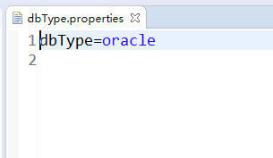
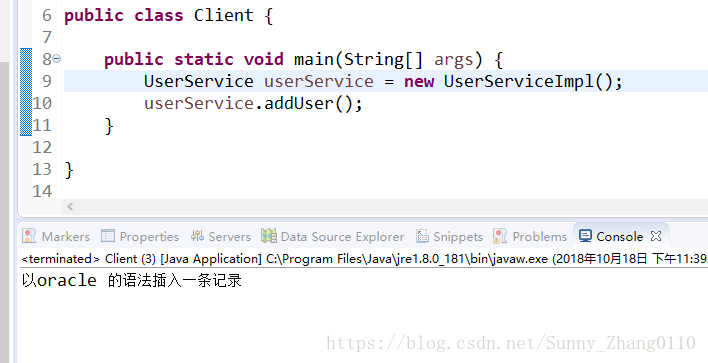

# 工厂模式

## 一、概述

工厂模式目的是让对象的创建更加的灵活和易于维护.实现了创建者和调用者的分离。

**原则:**客户类只使用服务,而不承担维护的责任。

**1  什么时候需要工厂模式?**

1.创建对象的过程比较复杂, 需要其他类的辅助, 需要大量计算,需要大量配置信息来获取等(比如connection).需要工厂模式来支持

2.当对象的实例有可能发生改变的时候

**2  工厂模式的分类:**

**简单工厂:**

用来创建同一等级(同一个接口的不同实现类)结构中的任意产品

弊端:对于增加新的产品,需要修改工厂中的逻辑。

**工厂方法:**

弥补了简单工厂模式的缺点(不完全满足开闭原则)。

工厂方法和简单工厂最大的不同在于,简单工厂只有一个工厂类,而工厂方法有一组实现了相同接口的工厂类。

**抽象工厂:**

特点:用来生产不同产品族的全部产品(对于增加新的产品,无能为力;支持增加产品族)。

产品族:一系列有特定关系的产品.比如汽车工厂的发动机,轮胎和座椅

**简单工厂和工厂方法的比较:**

**结构复杂度:**

简单工厂在结构复杂度上比较有优势,只需要一个工厂类就可以,而工厂方法随着产品的增加,工厂也会增加,类结构将会越来越复杂

**代码复杂度:**

代码复杂度和结构复杂度是互斥的,简单工厂正在结构方面相对简洁,但是在代码复杂度上比工厂模式复杂.简单工厂随着产品增多,工厂类的逻辑也越来越臃肿,而工厂方法中每个工厂只负责实例化一个产品,职责单一,代码简洁

**管理上的难度:**

从扩展性上来说,工厂方法完全满足OCP(开闭原则),即具有良好的扩展性,那是否就说明了简单工厂没有扩展性呢,答案是否定的,简单工厂同样也具有良好的扩展性,只不过扩展的时候需要修改工厂类少量的代码,尽管没有完全满足OCP,但是如果能够在合理范围内,做一点妥协,牺牲一点原则,也是可以的,具体采用哪种设计模式,需要看对应的业务场景

## 二、静态/简单工厂

解决对象的实例有可能将来要发生改变的情况

前提:

   面向接口编程

1.定义一个接口

   UserDao

​     UserDaoForMysql  访问mysql的实现类

​     UserDaoForOracle  访问oracle的实现类

   通过传入的参数决定要返回的实现类

2.定义一个工厂

   工厂中定义一个静态的get方法, 是为了返回一个UserDao类型的对象

   

3.在调用者中通过工厂的get方法来获取对象

```java
public class UserDaoFactory {
	public static UserDao getUserDao() {
		//改造参数, 以前是由外部通过参数传递进来, 决定实例化mysql 或者 oracle,改为通过读取配置文件, 手动获取
		String type = null;
		Properties properties = new Properties();
		try {
			//读取配置文件,修改时不需要修改java代码,直接修改配置文件dbType.properties
			properties.load(new FileInputStream("src/dbType.properties"));
			
			type = properties.getProperty("dbType");
		} catch (IOException e) {
			// TODO Auto-generated catch block
			e.printStackTrace();
		}
		UserDao userDao = null;
		//根据type类型来决定返回mysql 或者 oracle 的实例
		if("mysql".equals(type)) {
			userDao = new UserDaoForMysql();
		}else if("oracle".equals(type)) {
			userDao = new UserDaoForOracle();
		}
		return userDao;
	}
}
```

service层调用userDao不需要指定调用UserDao的哪个实现类,在配置文件中就指定了调用的实现类,例如下面指定调用oracle。

**配置文件:**



**service:**

```java
public class UserServiceImpl implements UserService {
	
	//service完成业务逻辑, 需要依赖于userDao的一个实例
	//等号左边声明为接口类型
	private UserDao userDao = UserDaoFactory.getUserDao();
	@Override
	public void addUser() {
		userDao.addUser();
 
	}
}
```

**结果:**



## 三、工厂方法

**1.定义产品的接口**

   UserDao

   为产品添加不同的实现类

​     UserDaoForMysqlImpl

​     UserDaoForOracleImpl

 **UserDao接口:**

```java
public interface UserDao {
	void addUser();
}
```

**UserDaoForMysqlImpl**

**UserDaoForOracleImpl**

```java
public class UserDaoForMysqlImpl implements UserDao {
	@Override
	public void addUser() {
		System.out.println("向mysql数据库插入记录");
	}
}
public class UserDaoForOracleImpl implements UserDao {
	@Override
	public void addUser() {
		System.out.println("向oracle插入一条记录");
	}
}
```

**2.定义工厂的接口**

   UserDaoFactory >> getUserDao >> 返回一个UserDao接口的实现类(mysql/oracle)

   UserDaoFactory >> UserDaoFactoryForMysql/UserDaoFactoryForOracle

   两个实现类分别用于返回 (生产)UserDaoForMysqlImpl/UserDaoForOracleImpl实现类对象

  两个工厂分别用来生产两个产品(UserDao的实现类对象)

**UserDaoFactory**

```java
public interface UserDaoFactory {
	UserDao getUserDao();
}
```

**UserDaoFactoryForMysql/UserDaoFactoryForOracle**

```java
public class UserDaoFactoryForMysql implements UserDaoFactory {
	@Override
	public UserDao getUserDao() {
		return new UserDaoForMysqlImpl();
	}
}
public class UserDaoFactoryForOralce implements UserDaoFactory {
	@Override
	public UserDao getUserDao() {
		return new UserDaoForOracleImpl();
	}
}
```

该接口定义的方法用于返回一个固定类型的对象(UserDao)

   为工厂定义实现类

   生产UserDaoForMysqlImpl的工厂

**3.在客户端首先创建工厂, 然后再从工厂中获取对象**

```java
public class Client1 {
	
	public static void main(String[] args) {
		//通过工厂获取dao对象,获取mysql
		UserDao userDao1 = new UserDaoFactoryForMysql().getUserDao();
		userDao1.addUser();
        //获取类名
		System.out.println(userDao1.getClass().getSimpleName());
		System.out.println("============");
		//通过工厂获取dao对象,获取oracle
		UserDao userDao2 = new UserDaoFactoryForOralce().getUserDao();
		userDao2.addUser();
        //获取类名
		System.out.println(userDao2.getClass().getSimpleName());
	}
}
```

**4.输出结果**


