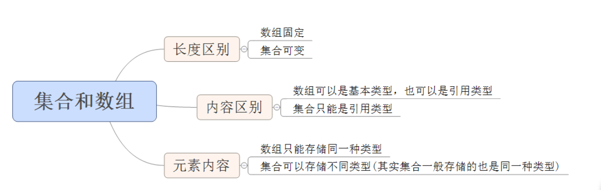
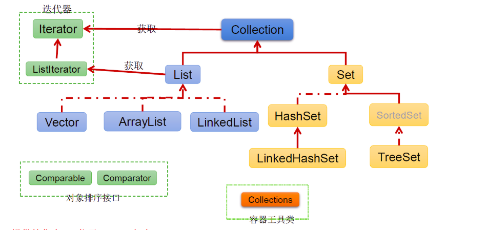
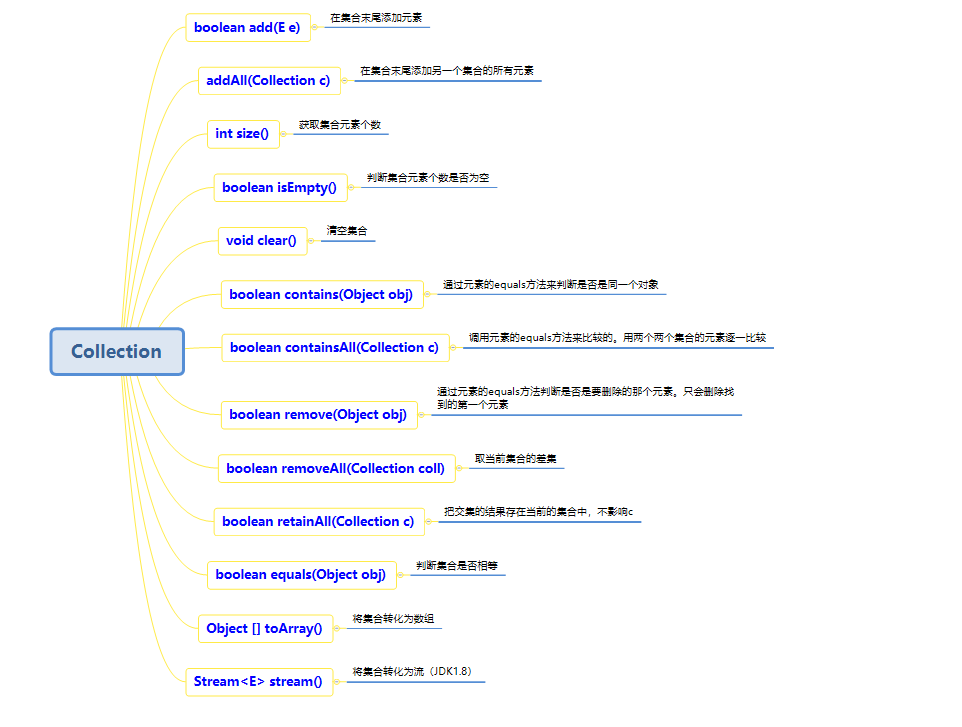
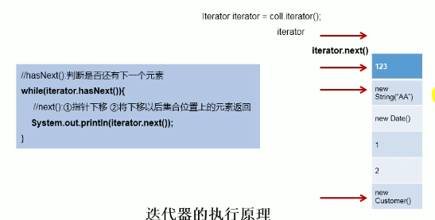
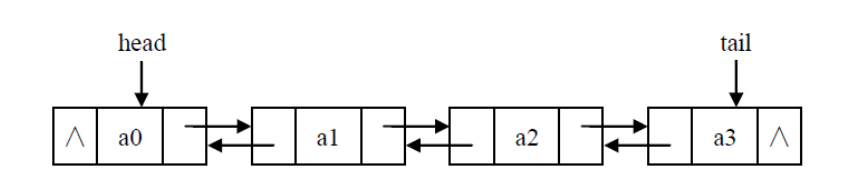
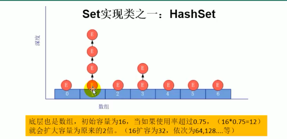
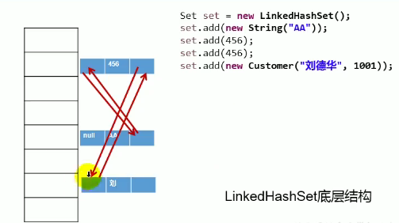
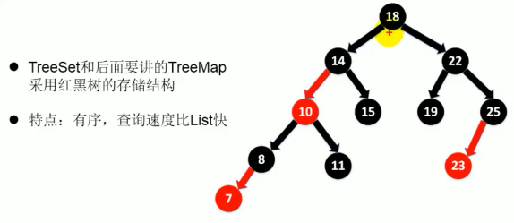
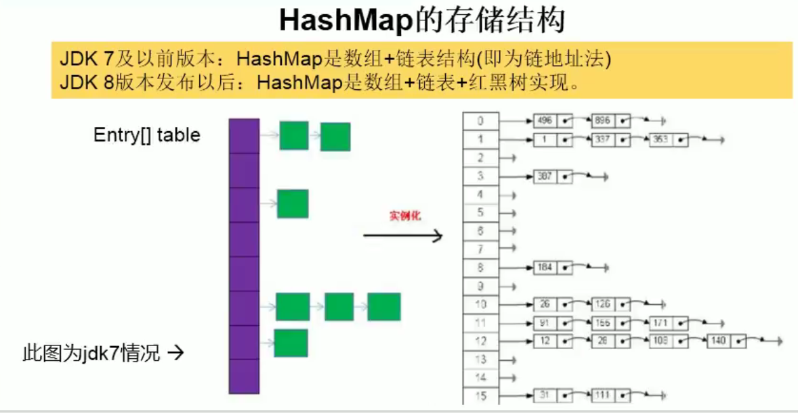

# 1. 集合框架

## 1. 1. 集合与数组存储数据概述：

集合、数组都是对多个数据进行存储操作的结构，简称Java容器。 说明：此时的存储，主要指的是内存层面的存储，不涉及到持久化的存储（.txt,.jpg,.avi，数据库中)

## 1.2.  数组和集合区别：



## 1.3. 集合的分类

- `Collection` 接口的接口 对象的集合（单列集合）
  - `List` 接口：元素按进入先后有序保存，可重复
    -  `LinkedList` 接口实现类， 链表， 插入删除， 没有同步， 线程不安全
    -  `ArrayList` 接口实现类， 数组实现， 随机访问， 没有同步， 线程不安全
    -  `Vector` 接口实现类 数组， 同步， 线程安全
    -  `Stack` 是`Vector`类的实现类
  - `Set` 接口： 仅接收一次，不可重复，并做内部排序
    - `HashSet` 使用hash表（数组）存储元素，线程不安全，可以存null值
      -  `LinkedHashSet` 链表维护元素的插入次序，作为HashSet的子类;遍历其内部数据时，可以按照添加顺序遍历;对于频繁的遍历操作，LinkedHashSet效率高于HashSet
    - `TreeSet` **底层实现为二叉树**，元素排好序

- `Map` 接口 键值对的集合 （双列集合）
  - `Hashtable` 接口实现类，同步，线程安全的，效率低；不能存储**null**的**key**和**value**
  - `HashMap` 接口实现类 ，没有同步， 线程不安全,效率高,存储**null**的**key**和**value**
    - `LinkedHashMap` 双向链表和哈希表实现，保证在遍历map元素时，可以照添加的顺序实现遍历。
  
      原因：在原的HashMap底层结构基础上，添加了一对指针，指向前一个和后一个元素。对于频繁的遍历操作，此类执行效率高于HashMap。
  - `WeakHashMap`
  - `TreeMap` 保证照添加的key-value对进行排序，实现排序遍历。此时考虑key的自然排序或定制排序 ，**底层使用红黑树**。
  - `IdentifyHashMap`

# 2. Collection接口



## 2.1. 常用方法



## 2.2. 遍历集合

```java
    @Test
    public void test2(){
        Collection coll = new ArrayList();
        coll.add(123);
        coll.add(456);
        coll.add("zzz");
        coll.add(new String("Tom"));
        coll.add(false);
        Iterator iterator = coll.iterator();//返回迭代器对象，用于集合遍历
        while (iterator.hasNext()){
            System.out.println(iterator.next());
        }
    }
```

> 迭代器原理



> 移除数据

```java
@Test
public void test3(){
    Collection coll = new ArrayList();
    coll.add(123);
    coll.add(456);
    coll.add("zzz");
    coll.add(new String(	"Tom"));
    coll.add(false);
    Iterator iterator = coll.iterator();//返回迭代器对象，用于集合遍历
    while (iterator.hasNext()){
        if("zzz".equals(iterator.next())){
       		iterator.remove();//移除指定数据
    	}
    }
}
```

> foreach遍历集合（基于迭代器实现）

```java
@Test
public void test4(){
    Collection coll = new ArrayList();
    coll.add(123);
    coll.add(456);
    coll.add("zzz");
    coll.add(new String("Tom"));
    coll.add(false);
    for (Object o : coll) {
        System.out.println(coll);
    }
}
```

## 2.3. 集合数组转化

```java
@Test
public void test5(){
    Collection coll = new ArrayList();
    coll.add(123);
    coll.add(456);
    coll.add("zzz");
    coll.add(false);
    Object[] objects = coll.toArray();//转数组
    List<Object> list = Arrays.asList(objects);//数组转集合list
}
```

## 2.4. List接口

存储序有序的、可重复的数据。

- 鉴于Java中数组用来存储数据的局限性，我们通常使用`List`替代数组
- `List`集合类中元素有序、且可重复，集合中的每个元素都有其对应的顺序索引。
- `List`容器中的元素都对应一个整数型的序号记载其在容器中的位置，可以根据序号存取容器中的元素。
- `List`接口的实现类常用的有：`ArrayList`、`LinkedList`和 `Vector`。

> 面试题：`ArrayList`、`LinkedList`和 `Vector`三者异同？

-  `LinkedList` 接口实现类， 双向链表， 插入删除效率高， 线程不安全
-  `ArrayList` 接口实现类， 数组实现， 随机访问效率高， 线程不安全
-  `Vector` 接口实现类 数组， 线程安全的`ArrayList` 
-  `Stack` 是`Vector`类的实现类

1. 相同：
   1. 三个类都实现了`List`接口，都是存储有序，可重复的数据
2. 不同：见上


### 2.4.1	ArrayList接口

> JDK 7

```java
ArrayList list = new ArrayList();
public ArrayList() {
	this(10);
}
public ArrayList(int initialCapacity) {
    super();
    if (initialCapacity < 0)
    throw new IllegalArgumentException("Illegal Capacity: "+
    initialCapacity);
    this.elementData = new Object[initialCapacity];
}
```

底层构造器创建了长度为10的Object[]数组`elementData`。

```java
public boolean add(E e) {
    ensureCapacity(size + 1);  // Increments modCount!!
    elementData[size++] = e;
    return true;
}
```

每次添加`size+1`（size初始化是0，表示list中元素个数），并且在指定索引上赋值，再看` ensureCapacity(size + 1)`。

```java
private void ensureCapacityInternal(int minCapacity) {
    modCount++;
    // overflow-conscious code
    if (minCapacity - elementData.length > 0)
    	grow(minCapacity);
}
```

当添加到`minCapacity`大于数组长度（`elementData.length`）的时候，比如是大于初始长度10，就需要对数组长度进行扩容`grow(minCapacity)`。

```java
private static final int MAX_ARRAY_SIZE = Integer.MAX_VALUE - 8;
private void grow(int minCapacity) {
    // overflow-conscious code
    int oldCapacity = elementData.length;
    int newCapacity = oldCapacity + (oldCapacity >> 1);
    if (newCapacity - minCapacity < 0)
    	newCapacity = minCapacity;
    if (newCapacity - MAX_ARRAY_SIZE > 0)
    	newCapacity = hugeCapacity(minCapacity);
    // minCapacity is usually close to size, so this is a win:
    elementData = Arrays.copyOf(elementData, newCapacity);//复制原数组到新数组
}
```

首先将`minCapacity`传入，并获取原数组长度`oldCapacity`（此时是10），在设置一个新数组长度`newCapacity`（默认为原来的1.5倍）。如果新扩容的长度`newCapacity`还是小于元素个数（`minCapacity`），那么设置新的长度为`minCapacity`。如果新长度大于**最大整数-8**，根据元素个数进行判断如果元素个数大于**最大整数-8**就将数组新长度设置为**最大整数**，如果不是就将新长度设置为**最大整数-8**，最后将原来的数组元素复制到新长度的数组中。

如果能确定元素大致个数建议使用带参构造器，避免一直扩容。

```java
public ArrayList(int initialCapacity) {
    super();
    if (initialCapacity < 0)
   		throw new IllegalArgumentException("Illegal Capacity: "+
    initialCapacity);
    this.elementData = new Object[initialCapacity];
}
```


> JDK 8

```java
private static final Object[] DEFAULTCAPACITY_EMPTY_ELEMENTDATA = {};
public ArrayList() {
	this.elementData = DEFAULTCAPACITY_EMPTY_ELEMENTDATA;
}
```

底层构造器创建了长度为0的Object[]数组`elementData`，不使用并不占用内存。

```java
public boolean add(E e) {
    ensureCapacityInternal(size + 1);  // Increments modCount!!
    elementData[size++] = e;
    return true;
}
private void ensureCapacityInternal(int minCapacity) {
	ensureExplicitCapacity(calculateCapacity(elementData, minCapacity));
}//扩容
private void ensureExplicitCapacity(int minCapacity) {
    modCount++;
    // overflow-conscious code
    if (minCapacity - elementData.length > 0)
        grow(minCapacity);//计算是否需要扩容
}
private static int calculateCapacity(Object[] elementData, int minCapacity) {
    if (elementData == DEFAULTCAPACITY_EMPTY_ELEMENTDATA) {
    	return Math.max(DEFAULT_CAPACITY, minCapacity);
    }
    return minCapacity;
}
private static final int DEFAULT_CAPACITY = 10;
```

每次添加`size+1`（size初始化是0，表示list中元素个数），并且在指定索引上赋值，再看` ensureCapacity(size + 1)`。

`ensureCapacityInternal(int minCapacity)`方法传入size（元素个数，也就是数组应该的最小长度）。如果初始数组是空数组，就设置默认长度为10，如果不是也是调用扩容` grow(minCapacity)`，扩容机制与**JDK 7**一致。

第一次调用add方法的时候才初始化一个长度为10的`ArrayList`。

### 2.4.2	LinkedList接口



```java
transient int size = 0;
transient Node<E> first;
transient Node<E> last;
private static class Node<E> {
    E item;
    Node<E> next;
    Node<E> prev;
    Node(Node<E> prev, E element, Node<E> next) {
        this.item = element;
        this.next = next;
        this.prev = prev;
    }
}
```

双向链表结构，链表就是由一个一个节点组成的，每个节点记录他的上一个节点和下一个几点，将所有节点连起来。单向链表就是每个节点只记录他的下一个节点，双向链表就是记录上一个节点和下一个节点。`first`代表链表第一个节点，`last`代表链表最后一个元素。

### 2.4.3	Vector接口

```java
private void grow(int minCapacity) {
    // overflow-conscious code
    int oldCapacity = elementData.length;
    int newCapacity = oldCapacity + ((capacityIncrement > 0) ?
    capacityIncrement : oldCapacity);
    if (newCapacity - minCapacity < 0)
    	newCapacity = minCapacity;
    if (newCapacity - MAX_ARRAY_SIZE > 0)
    	newCapacity = hugeCapacity(minCapacity);
    elementData = Arrays.copyOf(elementData, newCapacity);
}
```

`vector`扩容时候是扩容2倍，线程安全的。

### 2.4.4	常用方法

1. 增加
   - `add(Object obj)`
2. 删除
   - `remove(int index) `
   - `remove(Object obj)`
3. 修改
   - `set(int index, object ele)`
4. 查询
   - `get(int index)`
5. 插入
   - `add(int index, Object ele)`
6. 长度
   - `size()`
7. 遍历
   - `Iterator`迭代器方式
   - 增强`for`循环
   - `for`循环

## 2.5. Set接口

`Set` 接口： 仅接收一次，不可重复，并做内部排序

- `HashSet` 使用hash表（数组）存储元素，线程不安全，可以存`null`值
  -  `LinkedHashSet` 链表维护元素的插入次序，作为`HashSet`的子类;遍历其内部数据时，可以按照添加顺序遍历。对于频繁的遍历操作，`LinkedHashSet`效率高于`HashSet`。
- `TreeSet` **底层实现为紅黑树**，元素可以按照添加对象的指定属性排好序。

> 无序性和不可重复性

1. 无序性：不等于随机性，存储的数据在底层数组中并非按照数组索引顺序添加，而是根据数据的哈希值（以`HashSet`为例）。
2. 不可重复性：以`HashSet`为例，是通过`equals()`方法进行判断的，如果返回`true`，不能添加，`equals`判断依据根据**哈希值**(需要重写`hashCode()`)不同来区分是否重复。


### 2.5.1	HashSet接口

`HashSet`底层使用`HashMap`，**最终存数据都是使用数组**。底层是**数组+链表**。

我们向`HashSet`中添加元素a，

1. 首先调用元素a所在类的`hashCode()`方法，计算元素a的哈希值
2. 此时底层根据算法和哈希值计算出`HashSet`底层数组中的存放位置（索引位置），判断数组此位置上是否已经存在元素
   1. 如果位置上没有元素，则元素a添加成功
   2. 如果此位置上有其他元素b（或者以链表形式存在多个元素），则比较元素a与元素b的哈希值：
      - 如果哈希值不相同，在元素a添加成功
      - 如果哈希值相同，则需要使用`equals`方法进行比较：
        - `true`：添加元素a失败
        - `false`：添加成功
   3. 对于成功添加的有元素b的情况，元素a与已经存在指定位置上的元素b以链表的形式进行存储
      - JDK7中：元素a放到数组中，指向原来的元素
      - JDK8中：元素b在数组中，指向元素a



> 为什么重写hashCode()方法有有31

- 选择系数的时候要选择尽量大的系数。因为如果计算出来的hash地址值越大，冲突越小，查找效率越高。
- 31只占用5bits，相乘造成数据溢出的概率也小。
- 31可以由`i*31 == (i<<5)-1`来表示，提高算法效率。
- 31是一个素数，素数作用iu是如果我用一个数字乘以素数，那么结果只能呗素数本身和呗乘数还有1整除（减小冲突）。


### 2.5.2	LinkedHashSet接口

底层是`LinkedHashMap`。



添加第二个元素的时候将第二个的`prev`指向第一个元素，第一个元素的`next`指向第二个元素，在添加数据的同时，还定义了2个引用，用于指向。

### 2.5.3 TreeSet接口

底层是红黑树。



1. 向`TreeSet`中添加的数据是相同类型
2. 向`TreeSet`中添加的数据需要实现比较器（**自然排序（实现comparable接口）、定制排序（实现comparator接口）**）
   1. 自然排序，比较两个对象是否相同的标准为：`compareTo()`返回0，并不是`equals`
   2. 定制排序，比较两个对象是否相同的标准为：`comparator()`返回0，不再是`equals`

# 3. Map接口

`Map` 接口 键值对的集合 （双列集合）

- `Hashtable` 接口实现类，同步，线程安全的，效率低；不能存储`null`的**key**和**value**

- `HashMap` 接口实现类 ，没有同步， 线程不安全,效率高,存储`null`的**key**和**value**

  - `LinkedHashMap` 双向链表和哈希表实现，保证在遍历map元素时，可以照添加的顺序实现遍历。

    原因：在原的`HashMap`底层结构基础上，添加了一对指针，指向前一个和后一个元素。对于频繁的遍历操作，此类执行效率高于`HashMap`。

- `WeakHashMap`

- `TreeMap` 保证照添加的key-value对进行排序，实现排序遍历。此时考虑key的自然排序或定制排序 ，**底层使用红黑树**。

- `IdentifyHashMap`


## 3.1	HashMap的底层实现原理？

> JDK7

```java
HashMap hashMap = new HashMap();
```

在实例化以后底层创建了长度为16的一维数组`Entry[] table`。

```java
map.put(key1,value1)
```

首先调用`key1`所在类的`hashCode()`计算`key1`的哈希值,此哈希值经过算法计算以后，得到所在Entry数组中存放的位置：

1. 如果此位置上的数据为空，此时`key1-value1`（Entry对象）添加成功。
2. 如果此位置上的数据不为空（此时意味着此位置上存在一个或多个数据(链表形式)），比较`key1`和已经存在的一个或多个数据的哈希值：
   1. 如果`key1`的哈希值与已经存在的数据的哈希值都不相同，此时`key1-value1`添加成功
   2. 如果`key1`的哈希值与已经存在的数据的哈希值相同，继续调用equals()方法比较
      - 如果返回`true`，`key1-value1`添加失败
      - 如果返回`false`，`key1-value1`添加成功	
   3. 此时`key1-value1`与原来的数据以链表的形式进行存储

> JDK8

1. `new HashMap();`底层没有直接创建一个长度为16的数组
2. 底层的数组是Node[]，并非JDK7的Entry[]
3. 首次调用put()方法的时候底层创建一个长度为16的数组
4. JDK7底层：数组+链表。JDK8底层：数组+链表+**红黑树**，**当数组某一索引位置上的元素以链表形式进行存储的数据 > 8，并且数组长度 > 64的时候，此时此索引位置上所有的数据改为使用红黑树存储。**

1. HashMap和HashTable的异同？
2. CurrentHashMap与Hashtable的异同？


> JDK7的HashMap源码分析

```java
static final int DEFAULT_INITIAL_CAPACITY = 16;//默认初始长度
static final int MAXIMUM_CAPACITY = 1 << 30;//长度最大值
static final float DEFAULT_LOAD_FACTOR = 0.75f;//加载因子
public HashMap() {
    this(DEFAULT_INITIAL_CAPACITY, DEFAULT_LOAD_FACTOR);
}
public HashMap(int initialCapacity, float loadFactor) {
    if (initialCapacity < 0)//如果初始长度小于，初始化异常
        throw new IllegalArgumentException("Illegal initial capacity: " +
                                           initialCapacity);
    if (initialCapacity > MAXIMUM_CAPACITY)// 如果初始长度大于最大值，默认为最大值
        initialCapacity = MAXIMUM_CAPACITY;
    if (loadFactor <= 0 || Float.isNaN(loadFactor))//如果加载因子小于0，或者加载因子不是一个数子，抛出异常
        throw new IllegalArgumentException("Illegal load factor: " +
                                           loadFactor);

    // Find a power of 2 >= initialCapacity
    int capacity = 1;//初始化一个值为1，与初始化长度（使用无参构造就是默认16）比较，如果这个值小于初始化长度，就一直左移，直到左移后的值是大于初始化长度，保证容量大于等于我们初始化的容量，例如我们如果使用有参构造指定容量为15，那么此时真实的容量应该是16，相当于1左移4位
    while (capacity < initialCapacity)
        capacity <<= 1;

    this.loadFactor = loadFactor;//将加载因子赋值，默认是0.75
    threshold = (int)Math.min(capacity * loadFactor, MAXIMUM_CAPACITY + 1);//获取容器真实容量*0.75的值，如果超过了最大数，就去最大数1 << 30
    table = new Entry[capacity];//初始化一个长度为capacity的Entry[]数组
    useAltHashing = sun.misc.VM.isBooted() &&
        (capacity >= Holder.ALTERNATIVE_HASHING_THRESHOLD);
    init();
}
```

在使用无参构造初始化一个HashMap的时候，构造器直接创建了一个长度为16的，加载因子为0.75的。

使用put()添加键值对到map中：

```java
public V put(K key, V value) {
    if (key == null)//如果key是null，直接调用putForNullKey方法存入
    	return putForNullKey(value);
    int hash = hash(key);//如果不是null，将计算key的hash
    int i = indexFor(hash, table.length);//传入哈希值，与Entry数组的长度，计算出数据应该存放的索引
    for (Entry<K,V> e = table[i]; e != null; e = e.next) {
        /**
         * 1.先获取到索引i位置上的元素，如果是null，直接跳过循环，添加Entry到索引i位置
         * 2.如果此索引位置有值（可能有多个（链表））
         *	2.1判断两个哈希值是否相同
         *		a.如果相同，在使用==和equals判断两个元素的key是否相同
         *  2.2两个哈希值不相同
         *  如果是相同的key，那就把新的key的value替换原有的value
         */
        Object k;
        if (e.hash == hash && ((k = e.key) == key || key.equals(k))) {
            V oldValue = e.value;
            e.value = value;
            e.recordAccess(this);
            return oldValue;
        }
    }

    modCount++;
    addEntry(hash, key, value, i);
    return null;
}
final int hash(Object k) {//计算key的hash，并非是直接获取key的hashCode
    int h = 0;//初始化为0
    if (useAltHashing) {//如果此时为true，此时调用的是sun公司的计算hash的方法
        if (k instanceof String) {
            return sun.misc.Hashing.stringHash32((String) k);
        }
        h = hashSeed;
    }

    h ^= k.hashCode();//h = h ^ k.hashCode(); 先计算k的哈希值，在异或

    // This function ensures that hashCodes that differ only by
    // constant multiples at each bit position have a bounded
    // number of collisions (approximately 8 at default load factor).
    h ^= (h >>> 20) ^ (h >>> 12);
    return h ^ (h >>> 7) ^ (h >>> 4);
}
static int indexFor(int h, int length) {
    return h & (length-1);//与运算，计算出索引位置，此时计算出的不会超过数组索引长度
}
void addEntry(int hash, K key, V value, int bucketIndex) {//添加key-value到Entry[]数组中
    if ((size >= threshold) && (null != table[bucketIndex])) {//先判断元素个数是否大于真实容量*加载因子，如果已经大于临界值了，且要存放的位置非空时就扩容
        resize(2 * table.length);//扩容位2倍，扩容时候需要重写计算要存放的位置
        hash = (null != key) ? hash(key) : 0;
        bucketIndex = indexFor(hash, table.length);
    }

    createEntry(hash, key, value, bucketIndex);//无需扩容就直接添加
}
void createEntry(int hash, K key, V value, int bucketIndex) {//创建一个Entry对象
    Entry<K,V> e = table[bucketIndex];//将旧的Entry对象引用记录
    table[bucketIndex] = new Entry<>(hash, key, value, e);//将引用存入新的Entry对象，在赋值给数组指定位置，此时形成链表
    size++;
}
```



> JDK8的HashMap源码分析

```java
static final float DEFAULT_LOAD_FACTOR = 0.75f;//
public HashMap() {
	this.loadFactor = DEFAULT_LOAD_FACTOR; // 加载因子默认位0.75
}
```

初始化的时候没有创建一个长度位16的数组。

```java
transient Node<K,V>[] table;//声明一个Node[]数组
public V put(K key, V value) {//添加元素
	return putVal(hash(key), key, value, false, true);//调用putVal方法
}
final V putVal(int hash, K key, V value, boolean onlyIfAbsent,
                   boolean evict) {
    Node<K,V>[] tab; Node<K,V> p; int n, i;//初始化一个Node[]数组(不是Entry[]数组)和一个Node对象
    if ((tab = table) == null || (n = tab.length) == 0)//如果Node[]数组时null，或者长度位0
        n = (tab = resize()).length;//初始化数组
    if ((p = tab[i = (n - 1) & hash]) == null)//判断当前要存放key-value的索引位置是不是null
        tab[i] = newNode(hash, key, value, null);//如果是null直接新建一个Node对象存入
    else {//如果不是null
        Node<K,V> e; K k;//声明一个Node对象
        if (p.hash == hash && //判断索引位置上存在的原元素的哈希值与即将存入的元素的哈希值是否相同
            ((k = p.key) == key || (key != null && key.equals(k))))//如果哈希值相同，就比较key是否相同
            e = p;//如果都相同就把原来的元素p记录
        else if (p instanceof TreeNode)//如果p是一个TreeNode实例，调用putTreeVal
            e = ((TreeNode<K,V>)p).putTreeVal(this, tab, hash, key, value);
        else {//如果不相同就遍历链表结构，逐一比较
            for (int binCount = 0; ; ++binCount) {
                if ((e = p.next) == null) {//如果元素P下一个元素为null，表示该索引位置只有一个元素
                    p.next = newNode(hash, key, value, null);//此时i直接把元素p的next指定为待添加的元素
                    if (binCount >= TREEIFY_THRESHOLD - 1) // -1 for 1st
                        treeifyBin(tab, hash);
                    break;
                }
                if (e.hash == hash &&
                    ((k = e.key) == key || (key != null && key.equals(k))))
                    break;//如果链表中存在与待添加元素相同的，覆写原来的元素
                p = e;
            }
        }
        if (e != null) { // 原元素和现元素key相同，就覆盖
            V oldValue = e.value;
            if (!onlyIfAbsent || oldValue == null)
                e.value = value;
            afterNodeAccess(e);
            return oldValue;
        }
    }
    ++modCount;
    if (++size > threshold)//元素个数大于临界值，扩容
        resize();
    afterNodeInsertion(evict);
    return null;
}
static class Node<K,V> implements Map.Entry<K,V> {//Node对象实现了Entry接口,本质上还是一个Entry
    final int hash;
    final K key;
    V value;
    Node<K,V> next;

    Node(int hash, K key, V value, Node<K,V> next) {
        this.hash = hash;
        this.key = key;
        this.value = value;
        this.next = next;
    }

    public final K getKey()        { return key; }
    public final V getValue()      { return value; }
    public final String toString() { return key + "=" + value; }

    public final int hashCode() {
        return Objects.hashCode(key) ^ Objects.hashCode(value);
    }

    public final V setValue(V newValue) {
        V oldValue = value;
        value = newValue;
        return oldValue;
    }

    public final boolean equals(Object o) {
        if (o == this)
            return true;
        if (o instanceof Map.Entry) {
            Map.Entry<?,?> e = (Map.Entry<?,?>)o;
            if (Objects.equals(key, e.getKey()) &&
                Objects.equals(value, e.getValue()))
                return true;
        }
        return false;
    }
}
final Node<K,V>[] resize() {//生成数组
        Node<K,V>[] oldTab = table;
        int oldCap = (oldTab == null) ? 0 : oldTab.length;//如果是初始化那就0，如果不是初始化就是扩容前的容器容量
        int oldThr = threshold;//临界值，初始化的时候也是0
        int newCap, newThr = 0;//初始化新容量和新临界值为0
        if (oldCap > 0) {//如果不是初始化，即老数组长度大于0
            if (oldCap >= MAXIMUM_CAPACITY) {
                threshold = Integer.MAX_VALUE;
                return oldTab;
            }
            else if ((newCap = oldCap << 1) < MAXIMUM_CAPACITY &&
                     oldCap >= DEFAULT_INITIAL_CAPACITY)
                newThr = oldThr << 1; // double threshold
        }
        else if (oldThr > 0) // 临界值大于0
            newCap = oldThr;
        else {               //此时是第一次初始化的时候
            newCap = DEFAULT_INITIAL_CAPACITY;//初始化长度为16
            newThr = (int)(DEFAULT_LOAD_FACTOR * DEFAULT_INITIAL_CAPACITY);//初始化临界值为12
        }
        if (newThr == 0) {
            float ft = (float)newCap * loadFactor;
            newThr = (newCap < MAXIMUM_CAPACITY && ft < (float)MAXIMUM_CAPACITY ?
                      (int)ft : Integer.MAX_VALUE);
        }
        threshold = newThr;
        @SuppressWarnings({"rawtypes","unchecked"})
        Node<K,V>[] newTab = (Node<K,V>[])new Node[newCap];//此时就初始化长度为16的Node[]数组
        table = newTab;
        if (oldTab != null) {
            for (int j = 0; j < oldCap; ++j) {
                Node<K,V> e;
                if ((e = oldTab[j]) != null) {
                    oldTab[j] = null;
                    if (e.next == null)
                        newTab[e.hash & (newCap - 1)] = e;
                    else if (e instanceof TreeNode)
                        ((TreeNode<K,V>)e).split(this, newTab, j, oldCap);
                    else { // preserve order
                        Node<K,V> loHead = null, loTail = null;
                        Node<K,V> hiHead = null, hiTail = null;
                        Node<K,V> next;
                        do {
                            next = e.next;
                            if ((e.hash & oldCap) == 0) {
                                if (loTail == null)
                                    loHead = e;
                                else
                                    loTail.next = e;
                                loTail = e;
                            }
                            else {
                                if (hiTail == null)
                                    hiHead = e;
                                else
                                    hiTail.next = e;
                                hiTail = e;
                            }
                        } while ((e = next) != null);
                        if (loTail != null) {
                            loTail.next = null;
                            newTab[j] = loHead;
                        }
                        if (hiTail != null) {
                            hiTail.next = null;
                            newTab[j + oldCap] = hiHead;
                        }
                    }
                }
            }
        }
        return newTab;
    }
```

> 面试相关HashMap21问

### 3.1.1：HashMap 的数据结构？

A：哈希表结构（链表散列：数组+链表）实现，结合数组和链表的优点。当链表长度超过 8 时，链表转换为红黑树。

```
transient Node<K,V>\[\] table;
```


### 3.1.2：HashMap 的工作原理？

`HashMap` 底层是 hash 数组和单向链表实现，数组中的每个元素都是链表，由 Node 内部类（实现 Map.Entry接口）实现，`HashMap` 通过 put & get 方法存储和获取。

存储对象时，将 K/V 键值传给 put() 方法：

①、调用 hash(K) 方法计算 K 的 hash 值，然后结合数组长度，计算得数组下标；

②、调整数组大小（当容器中的元素个数大于 `capacity * loadfacto`r 时，容器会进行扩容`resize` 为 **2n**）；

③、i.如果 K 的 hash 值在 `HashMap` 中不存在，则执行插入，若存在，则发生碰撞；

ii.如果 K 的 hash 值在 `HashMap` 中存在，且它们两者 equals 返回 true，则更新键值对；

iii. 如果 K 的 hash 值在 `HashMap` 中存在，且它们两者 equals 返回 false，则插入链表的尾部（尾插法）或者红黑树中（树的添加方式）。

（JDK 1.7 之前使用头插法、JDK 1.8 使用尾插法）（注意：当碰撞导致链表大于 `TREEIFY_THRESHOLD = 8` 时，就把链表转换成红黑树）

获取对象时，将 K 传给 get() 方法：①、调用 `hash(K)` 方法（计算 K 的 hash 值）从而获取该键值所在链表的数组下标；②、顺序遍历链表，`equals()`方法查找相同 `Node` 链表中 K 值对应的 V 值。

`hashCode` 是定位的，存储位置；`equals`是定性的，比较两者是否相等。


### 3.1.3.当两个对象的 hashCode 相同会发生什么？

因为 `hashCode` 相同，不一定就是相等的（`equals`方法比较），所以两个对象所在数组的下标相同，"碰撞"就此发生。又因为 `HashMap` 使用链表存储对象，这个 `Node` 会存储到链表中。为什么要重写 `hashcode` 和 `equals` 方法？推荐看下。


### 3.1.4.你知道 hash 的实现吗？为什么要这样实现？

JDK 1.8 中，是通过 hashCode() 的高 16 位异或低 16 位实现的：`(h = k.hashCode()) ^ (h >>> 16)`，主要是从速度，功效和质量来考虑的，减少系统的开销，也不会造成因为高位没有参与下标的计算，从而引起的碰撞。


### 3.1.5.为什么要用异或运算符？

保证了对象的 hashCode 的 32 位值只要有一位发生改变，整个 hash() 返回值就会改变。尽可能的减少碰撞。


### 3.1.6.HashMap 的 table 的容量如何确定？loadFactor 是什么？该容量如何变化？这种变化会带来什么问题？

[①、table 数组大小是由 capacity 这个参数确定的，默认是16，也可以构造时传入，最大限制是1<<30；](http://mp.weixin.qq.com/s?__biz=MzI2MTIzMzY3Mw==&mid=2247489478&idx=4&sn=ad7321cd1948f0c8eaf955aaaa7a2046&chksm=ea5cdaa0dd2b53b67ac2b9ba12935e13cb59250180fa302bd61629968e24f8853f208790fe80&scene=21#wechat_redirect)

[②、loadFactor 是装载因子，主要目的是用来确认table 数组是否需要动态扩展，默认值是0.75，比如table 数组大小为 16，装载因子为 0.75 时，threshold 就是12，当 table 的实际大小超过 12 时，table就需要动态扩容；](http://mp.weixin.qq.com/s?__biz=MzI2MTIzMzY3Mw==&mid=2247489478&idx=4&sn=ad7321cd1948f0c8eaf955aaaa7a2046&chksm=ea5cdaa0dd2b53b67ac2b9ba12935e13cb59250180fa302bd61629968e24f8853f208790fe80&scene=21#wechat_redirect)

[③、扩容时，调用 resize() 方法，将 table 长度变为原来的两倍（注意是 table 长度，而不是 threshold）](http://mp.weixin.qq.com/s?__biz=MzI2MTIzMzY3Mw==&mid=2247489478&idx=4&sn=ad7321cd1948f0c8eaf955aaaa7a2046&chksm=ea5cdaa0dd2b53b67ac2b9ba12935e13cb59250180fa302bd61629968e24f8853f208790fe80&scene=21#wechat_redirect)

④、如果数据很大的情况下，扩展时将会带来性能的损失，在性能要求很高的地方，这种损失很可能很致命。


### 3.1.7.HashMap中put方法的过程？

答：“调用哈希函数获取**Key**对应的**hash**值，再计算其数组下标；

如果没有出现哈希冲突，则直接放入数组；如果出现哈希冲突，则以链表的方式放在链表后面；

如果链表长度超过阀值( `TREEIFY THRESHOLD==8`)，就把链表转成红黑树，链表长度低于**6**，就把红黑树转回链表;

如果结点的key已经存在，则替换其value即可；

如果集合中的键值对大于**12**，调用`resize`方法进行数组扩容。”


### 3.1.8.数组扩容的过程？

创建一个新的数组，其容量为旧数组的两倍，并重新计算旧数组中结点的存储位置。结点在新数组中的位置只有两种，原下标位置或原下标+旧数组的大小。


### 3.1.9.拉链法导致的链表过深问题为什么不用二叉查找树代替，而选择红黑树？为什么不一直使用红黑树？

之所以选择红黑树是为了解决二叉查找树的缺陷，二叉查找树在特殊情况下会变成一条线性结构（这就跟原来使用链表结构一样了，造成很深的问题），遍历查找会非常慢。推荐：面试问红黑树，我脸都绿了。

而红黑树在插入新数据后可能需要通过左旋，右旋、变色这些操作来保持平衡，引入红黑树就是为了查找数据快，解决链表查询深度的问题，我们知道红黑树属于平衡二叉树，但是为了保持“平衡”是需要付出代价的，但是该代价所损耗的资源要比遍历线性链表要少，所以当长度大于8的时候，会使用红黑树，如果链表长度很短的话，根本不需要引入红黑树，引入反而会慢。


### 3.1.10.说说你对红黑树的见解？

- 每个节点非红即黑
- 根节点总是黑色的
- 如果节点是红色的，则它的子节点必须是黑色的（反之不一定）
- 每个叶子节点都是黑色的空节点（NIL节点）
- 从根节点到叶节点或空子节点的每条路径，必须包含相同数目的黑色节点（即相同的黑色高度）


### 3.1.11.jdk8中对HashMap做了哪些改变？

在java 1.8中，如果链表的长度超过了8，那么链表将转换为红黑树。（桶的数量必须大于64，小于64的时候只会扩容）

发生`hash`碰撞时，java 1.7 会在链表的头部插入，而java 1.8会在链表的尾部插入

在java 1.8中，`Entry`被`Node`替代(换了一个马甲。

### 3.1.12.HashMap，LinkedHashMap，TreeMap 有什么区别？

`HashMap` 参考其他问题；

`LinkedHashMap` 保存了记录的插入顺序，在用 `Iterator` 遍历时，先取到的记录肯定是先插入的；遍历比 `HashMap` 慢；

`TreeMap` 实现 `SortMap` 接口，能够把它保存的记录根据键排序（默认按键值升序排序，也可以指定排序的比较器）


### 3.1.13.HashMap & TreeMap & LinkedHashMap 使用场景？

一般情况下，使用最多的是 HashMap。

`HashMap`：在 Map 中插入、删除和定位元素时；

`TreeMap`：在需要按自然顺序或自定义顺序遍历键的情况下；

`LinkedHashMap`：在需要输出的顺序和输入的顺序相同的情况下。


### 3.1.14.HashMap 和 HashTable 有什么区别？

①、`HashMap` 是线程不安全的，`HashTable` 是线程安全的；

②、由于线程安全，所以 `HashTable` 的效率比不上 `HashMap`；

③、`HashMap`最多只允许一条记录的键为`null`，允许多条记录的值为`null`，而 `HashTable`不允许；

④、`HashMap` 默认初始化数组的大小为16，`HashTable` 为 11，前者扩容时，扩大两倍，后者扩大两倍+1；

⑤、`HashMap` 需要重新计算 `hash` 值，而 `HashTable` 直接使用对象的 `hashCode`


### 3.1.15.Java 中的另一个线程安全的与 HashMap 极其类似的类是什么？同样是线程安全，它与 HashTable 在线程同步上有什么不同？

`ConcurrentHashMap` 类（是 Java并发包 `java.util.concurrent` 中提供的一个线程安全且高效的 `HashMap` 实现）。

`HashTable` 是使用 `synchronize` 关键字加锁的原理（就是对对象加锁）；

而针对 `ConcurrentHashMap`，在 JDK 1.7 中采用 分段锁的方式；JDK 1.8 中直接采用了**CAS（无锁算法）+ synchronized**。


### 3.1.16.HashMap & ConcurrentHashMap 的区别？

除了加锁，原理上无太大区别。另外，`HashMap` 的键值对允许有`null`，但是`ConCurrentHashMap` 都不允许。


### 3.1.17.为什么 ConcurrentHashMap 比 HashTable 效率要高？

`HashTable` 使用一把锁（锁住整个链表结构）处理并发问题，多个线程竞争一把锁，容易阻塞；

ConcurrentHashMap

- JDK 1.7 中使用分段锁（**ReentrantLock + Segment + HashEntry**），相当于把一个 `HashMap` 分成多个段，每段分配一把锁，这样支持多线程访问。锁粒度：基于 Segment，包含多个 `HashEntry`。

- JDK 1.8 中使用 **CAS + synchronized + Node + 红黑树**。锁粒度：`Node`（首结

  点）（实现 `Map.Entry`）。锁粒度降低了。


### 3.1.18.针对 ConcurrentHashMap 锁机制具体分析（JDK 1.7 VS JDK 1.8）

JDK 1.7 中，采用分段锁的机制，实现并发的更新操作，底层采用数组+链表的存储结构，包括两个核心静态内部类 `Segment` 和 `HashEntry`。

①、Segment 继承 `ReentrantLock`（重入锁） 用来充当锁的角色，每个 `Segment` 对象守护每个散列映射表的若干个桶；

②、`HashEntry` 用来封装映射表的键-值对；

③、每个桶是由若干个 `HashEntry` 对象链接起来的链表


JDK 1.8 中，采用**Node + CAS + Synchronized**来保证并发安全。取消类 Segment，直接用 table 数组存储键值对；当 `HashEntry` 对象组成的链表长度超过 `TREEIFY_THRESHOLD` 时，链表转换为红黑树，提升性能。底层变更为数组 + 链表 + 红黑树。


### 3.1.19.ConcurrentHashMap 在 JDK 1.8 中，为什么要使用内置锁 synchronized 来代替重入锁 ReentrantLock？

①、粒度降低了；

②、JVM 开发团队没有放弃 `synchronized`，而且基于 JVM 的 `synchronized` 优化空间更大，更加自然。

③、在大量的数据操作下，对于 JVM 的内存压力，基于 API 的 `ReentrantLock` 会开销更多的内存。


### 3.1.20.ConcurrentHashMap 简单介绍？

**①、重要的常量：**

`private transient volatile int sizeCtl;`

当为负数时，-1 表示正在初始化，-N 表示 N - 1 个线程正在进行扩容；

当为 0 时，表示 `table` 还没有初始化；

当为其他正数时，表示初始化或者下一次进行扩容的大小。

**②、数据结构：**

`Node` 是存储结构的基本单元，继承 `HashMap` 中的 `Entry`，用于存储数据；

`TreeNode` 继承 `Node`，但是数据结构换成了二叉树结构，是红黑树的存储结构，用于红黑树中存储数据；

`TreeBin` 是封装 `TreeNode` 的容器，提供转换红黑树的一些条件和锁的控制。

**③、存储对象时（put() 方法）：**

如果没有初始化，就调用 `initTable()` 方法来进行初始化；

如果没有 `hash` 冲突就直接 `CAS` 无锁插入；

如果需要扩容，就先进行扩容；

如果存在 `hash` 冲突，就加锁来保证线程安全，两种情况：一种是链表形式就直接遍历

到尾端插入，一种是红黑树就按照红黑树结构插入；

如果该链表的数量大于阀值 8，就要先转换成红黑树的结构，`break` 再一次进入循环

如果添加成功就调用 `addCount()` 方法统计 `size`，并且检查是否需要扩容。

**④、扩容方法 transfer()：默认容量为 16，扩容时，容量变为原来的两倍。**

`helpTransfer()`：调用多个工作线程一起帮助进行扩容，这样的效率就会更高。

**⑤、获取对象时（get()方法）：**

计算 `hash` 值，定位到该 `table` 索引位置，如果是首结点符合就返回；

如果遇到扩容时，会调用标记正在扩容结点 `ForwardingNode.find()`方法，查找该结点，匹配就返回；

以上都不符合的话，就往下遍历结点，匹配就返回，否则最后就返回 null。


### 3.1.21.ConcurrentHashMap 的并发度是什么？

程序运行时能够同时更新 `ConccurentHashMap` 且不产生锁竞争的最大线程数。默认为 **16**，且可以在构造函数中设置。

当用户设置并发度时，`ConcurrentHashMap` 会使用大于等于该值的最小2幂指数作为实际并发度（假如用户设置并发度为17，实际并发度则为32）


## 3.2 LinkedHashMap

```java
static class Entry<K,V> extends HashMap.Node<K,V> {
    Entry<K,V> before, after;
    Entry(int hash, K key, V value, Node<K,V> next) {
    	super(hash, key, value, next);
    }
}
```

`LinkedHashMap`是`HashMap`的子类，在生成`Entry`对象的时候多了2个属性，包括before、after，代表链表的上一个元素和下一个元素。


## 3.3 遍历map的方式

```java
@Test
public void test03(){
    Map map = new HashMap<>();
    map.put("1","1");
    map.put("2","2");
    map.put("3","3");
    //1.遍历key集合
    Set<String> keySet = map.keySet();
    for (String key : keySet) {
        System.out.println("key:" + key + ",value:" + map.get(key));
    }
    //2.遍历values
    Collection<String> values = map.values();
    for (String value : values) {
        System.out.println( "value:" + value);
    }
    //3.EntrySet
    Set<Map.Entry<String, String>> entrySet = map.entrySet();
    for (Map.Entry<String, String> enrty : entrySet) {
        System.out.println("key:" + enrty.getKey() + ",value:" + enrty.getValue());
    }
    //4.迭代器
    Iterator<Map.Entry<String, String>> iterator = map.entrySet().iterator();
    while (iterator.hasNext()){
        Map.Entry<String, String> entry = iterator.next();
        System.out.println("key= " + entry.getKey() + " and value= " + entry.getValue());
    }
    System.out.println(map);
}
```


# 4.Collections工具类

`Collections`是操作`collection`和`map`的工具类。

# 5.数据结构


